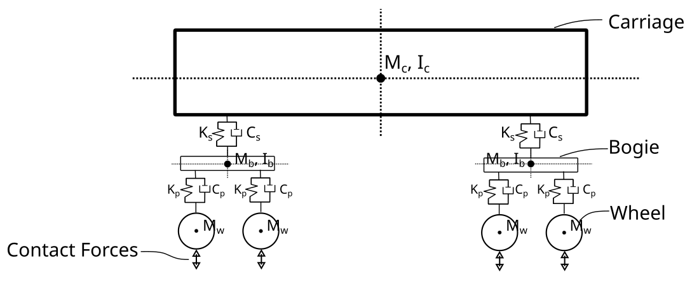

Formulation
===========

This page summarizes the mathematical and numerical methods used by STEM to simulate
railway-induced ground vibrations.
STEM performs the numerical analysis of the train-track-soil system using the finite element method (FEM)
and is powered by `Kratos Multiphysics <https://github.com/KratosMultiphysics/Kratos>`_.

Governing equation
------------------
STEM solves the dynamic equilibrium equation, following a Lagrangian formulation (small-strain).
The governing finite element equation to be solved is:

  .. math::
          \mathbf{M}\mathbf{a} + \mathbf{C}\mathbf{v} + \mathbf{K}\mathbf{u} = \mathbf{F_{ext}}\left( t \right)

\noindent where :math:`\mathbf{M}` is the mass :math:`\mathbf{C}` is the damping, :math:`\mathbf{K}` is the
stiffness matrices of the entire system, :math:`\mathbf{F_{ext}}` denotes the vector of the external forces and
:math:`\mathbf{a}`, :math:`\mathbf{v}`, :math:`\mathbf{u}` are, respectively, the acceleration, the velocity and
the displacement in the nodes.

Spatial discretisation
----------------------
The spatial discretisation of the problem is performed using the finite element method (FEM).
The geometry of the problem is built using `gmsh <http://gmsh.info/>`_ and the mesh is generated
and exported to Kratos mdpa format.

STEM supports several types of elements:

- Beam elements (for 2D and 3D problems):

  * Euler-Bernoulli beam elements (2 nodes).

- 2D plane strain elements:

  * First order triangle elements (3 nodes per element)
  * Second order triangle elements (6 nodes per element)

- 3D solid elements:

  * First order tetrahedral elements (4 nodes per element)
  * Second order tetrahedral elements (10 nodes per element)

Time integration and solution strategies
----------------------------------------
The system of equations is solved in the time domain.
A range of solution strategies are supported, including:

* Implicit and explicit time integration schemes.
* Nonlinear solution strategies (Newton-Raphson, line search, arc length).

For linear systems, it is recommended to use a custom explicit integration scheme based on the Newmark method, `LinearNewtonRaphsonStrategy`.
This integration scheme takes advantage of the linear nature of the problem, and it is formulated explicitly.
The main advantage of using an explicit integration scheme is that it does not require the assembly and
factorisation of the system matrices, which becomes computationally expensive for large problems.

In STEM there is the option to perform dynamic or quasi-static analyses.
In the quasi-static case, the governing equation is reduced to:

  .. math::
          \mathbf{K}\mathbf{u} = \mathbf{F_{ext}}\left( t \right)

In this case, the system of equations is solved at each time step.

To solve the linear system of equations of type:

  .. math::
          \mathbf{A}\mathbf{x} = \mathbf{b},

STEM has several linear solvers available, including:

- LU decomposition
- Conjugate Gradient
- Algebraic Multigrid Iterative

The LU decomposition is a direct solver, which is suitable for small problems.
The Conjugate Gradient and Algebraic Multigrid Iterative solvers are iterative solvers, which are suitable for
large problems.
The iterative solvers can use a preconditioner to improve the convergence rate, and they are recommended for
large problems.
In STEM the default preconditioner is the Jacobi preconditioner, which is a simple diagonal preconditioner
that can be used for symmetric positive definite systems.

Boundary conditions
-------------------
STEM support different types of boundary conditions, including:

- Dirichlet boundary conditions (fixed boundary condition)
- Neumann boundary conditions (velocity boundary condition)
- Absorbing boundaries :cite:`Lysmer_Kuhlemeyer_1969`

Loads
-----
STEM supports different types of loads, including:

- Point, line and surface loads

All the loads can be defined as time-dependent, and they can be applied to structural elements or soil.
All the loads can be defined as moving loads.

For STEM is of importance to be able to model the train-track interaction, which is the main source of the
dynamic loading in the problem of railway-induced ground vibrations.
To model the train-track interaction force STEM uses point moving loads, in combination with the UVEC (see :ref:`uvec_form`).

Constitutive models
===================
STEM supports linear elastic material models.
Non-linear material models can be implemented by the user and integrated into STEM through the
UMAT interface (see :doc:`API_definition`).

.. _linear_elastic_material:

Linear elastic material
----------------------
The default material model for STEM analysis is the linear elastic material model.
In STEM a material is defined by specifying the material formulation and the linear elastic material parameters.

Currently STEM supports the `OnePhaseSoil` material formulation. This formulation is used to model the soil
as a single phase material, and it is defined by the following parameters:

- Density of the solid phase :math:`\rho_s`
- Porosity :math:`n`
- Is_drained (boolean flag to indicate if the soil is drained or not)

The linear elastic material requires the following parameters for the `OnePhaseSoil` formulation:

- Young's modulus :math:`E`
- Poisson's ratio :math:`\nu`

In STEM is always assumed that the soil is `OnePhaseSoil` and that the solutions 'is drained'.
This means that the soil is modelled as a single phase material and that the pore water
pressure is not considered in the analysis. This is an assumption that is commonly used in the
analysis of dynamic problems, such as railway-induced ground vibrations, and it is justified by the fact that
the time scale of the problem is much shorter than the time scale of the pore water pressure dissipation.

Typically, the density of the bulk material is available from site investigations.
The bulk density consists of the density of the solid phase and the density of the fluid phase,
and it can be calculated as:

.. math::
    \rho = (1-n)\rho_s + n\rho_f

where :math:`\rho_f` is the density of the fluid phase (water).
Because in STEM the soil is modelled as a drained single phase material this equation simplies to:

.. math::
    \rho = (1-n)\rho_s

If the user has the bulk density and wants to use it as input, the porosity can be set to
zero and the density of the solid phase can be set as the bulk density.

To model soil layers below ground water table, since the soil is modelled as a drained single phase material,
the Poisson ratio of the soil layer should be set to 0.495. This means that the material is imcompressible,
i.e. cannot experience volumetric deformation and this accurately mimics the saturated behaviour of soil, subjected
to dynamic loading, in the short term (before pore water pressure dissipation occurs).

.. _uvec_form:
Train-track model
=================
The train and the train-track interaction model can be modelled by a user-defined vehicle model (UVEC)
as described in :doc:`API_definition`.
STEM provides a default train and train-track interaction model.

Vehicle model
--------------
The train is modelled as a 2D mass-spring-damper system, with 10 degrees of freedom, that consists of a car body,
bogies, suspension systems and wheels :cite:`Zhai_Sun_1994`.
This model takes advantage of the system's symmetry by simulating only half of the train, with symmetry boundary
conditions applied to the central plane.
The figure shows the schematic of the train model.

   STEM train model

The railway track consists of rail, railpad and sleeper.
The rail is modelled as a Euler-Bernoulli beam element.
The railpad is modelled as a spring-damper element, which provides the stiffness and damping of the railpad.
The sleeper can either be modelled as a concentrated mass, or a volume element, depending on the level of
detail required by the user.

Interaction model
-----------------

The vehicle and track systems are coupled through contact forces that occur at the interface between
the wheels and the rails. These forces are determined using the non-linear Hertzian contact theory
for metals :cite:`Timoshenko_1951`:

.. math::
    F_{j}=k_\text{c} \ \delta_j^{1.5},

where :math:`k_\text{c}` is the Hertzian stiffness coefficient and :math:`\delta_j` is the indentation for wheel
:math:`j`. The indentation :math:`\delta_j` is calculated as:

.. math::
    \delta_j = u_{\text{w},j}-u_{\text{r},j},

where :math:`u_{\text{w},j}` is the displacement of wheel :math:`j` and :math:`u_{\text{r},j}` is the displacement
of the rail at the position of wheel :math:`j`.

Irregularities model
--------------------
The vertical irregularities presented in the rail are expressed following the methodology presented
in :cite:`Zhang_2001`. The power spectral density (PSD) of the rail irregularities :math:`S(\Omega)`
is used to produce the samples of the irregularities.

.. math::
    S(\Omega) = \frac{2 \pi A_v \Omega^{2}_{c}}{(\Omega^2 + \Omega_c^2)\Omega^2}

where :math:`\Omega` the wave number, :math:`A_v` the rail irregularity parameter and :math:`\Omega_c`
is the critical wavenumber. These two parameters define the quality of the railway track :cite:`Lei_Noda_2002`.

The sample of rail irregularities can be produced by inverse Fourier transform shown as follows:

\begin{equation}
    r(x) = \sum^{N}_{n=1} \sqrt{4 S(\omega_n) \Delta \omega} \cos(\omega_n x - \theta_n)
    \label{eq:irr2}
\end{equation}

where :math:`\omega_n`, is a circular frequency within the interval in which the PSD function is defined,
 :math:`\theta_n`, a random phase angle uniformly distributed from 0 to :math:`2\pi`, and
 :math:`\Delta \omega` is defined as he total number of frequency increments :math:`N` in the range of the
 circular frequency.

The parameter :math:`A_v` can be estimated based on the track quality :cite:`Lei_Noda_2002`.

.. table:: Track quality classification and corresponding Av values
    :widths: 50 50

    +-----------------+------------------------+
    | Line grade      | Av Value (m² rad / m)  |
    +=================+========================+
    | 1 (very poor)   | 1.2107e-4              |
    +-----------------+------------------------+
    | 2               | 1.0181e-4              |
    +-----------------+------------------------+
    | 3               | 0.6816e-4              |
    +-----------------+------------------------+
    | 4               | 0.5376e-4              |
    +-----------------+------------------------+
    | 5               | 0.2095e-4              |
    +-----------------+------------------------+
    | 6 (very good)   | 0.0339e-4              |
    +-----------------+------------------------+

.. References
.. ----------
.. For background on soil/structural dynamics and train-track interaction:

.. - :cite:`Verruijt_2010` — Soil dynamics fundamentals.
.. - :cite:`Biggs_1964` — Structural dynamics.
.. - :cite:`Zhang_2001`, :cite:`Lei_Noda_2002`, :cite:`Kabo_2006` — Examples of vehicle-track interaction modelling.

.. See :doc:`bibliography` for the complete list.
