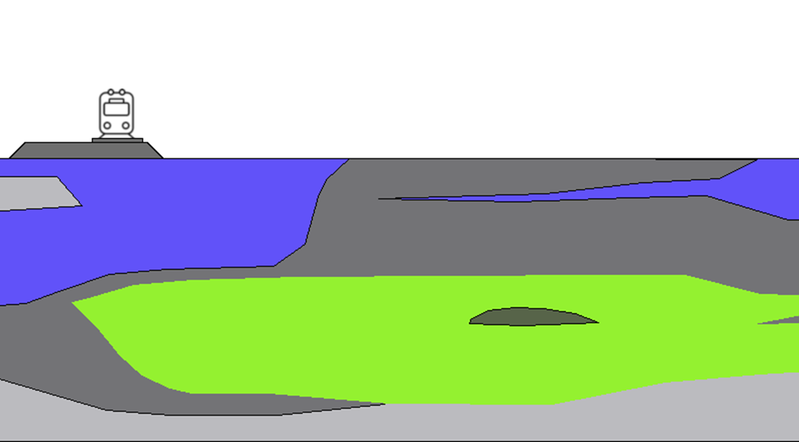

STEM
====
STEM is an open-source calculation model that is developed to compute the impact of
mitigation techniques on railway induced vibrations.

In STEM the train-track interaction and the propagation of the vibrations through the subsurface
are simulated. The model is able to compute the vibration levels at the ground surface taking into account
the presence of irregularities in the track geometry, the type of train and train speed, and the spatial variability
of the track and soil properties.

   Scope of the STEM model

The STEM model is based on the finite element method and it is powered by
`Kratos Multiphysics <https://github.com/KratosMultiphysics/Kratos>`_.

User guide
==========

Background information
......................
STEM is a numerical model based on the finite element method.
It is recommended to have a basic understanding of the finite element theory before using STEM.

STEM is build in Python. It is recommended to have a basic understanding of Python before using STEM.
For new users of Python, the following resources are recommended:

* `Python beginners guide <https://wiki.python.org/moin/BeginnersGuide>`_

Alternatively, you can follow one of the many online free courses, for example (the STEM team is not
affiliated to any of these courses):

* `Introduction to Python <https://www.udacity.com/course/introduction-to-python--ud1110>`_
* `Programming for Everybody <https://www.coursera.org/learn/python>`_

To use STEM it is convenient to use an IDE (Integrated Development Environment) for Python. The STEM team
recommends to use `PyCharm <https://www.jetbrains.com/pycharm/>`_ or `Visual Studio Code <https://code.visualstudio.com/>`_.
More information can be found in the following links:

* `VS Code in Python <https://code.visualstudio.com/docs/languages/python>`_
* `PyCharm in Python <https://www.jetbrains.com/help/pycharm/quick-start-guide.html>`_

To visualise the results STEM makes use of `ParaView <https://www.paraview.org/>`_. It is recommended to have a basic
understanding of ParaView before using STEM. The following resources are recommended:

* `ParaView tutorials <https://www.paraview.org/tutorials/>`_

STEM Installation
.................
To install STEM you need to install the following items:

* :ref:`python_stem`

* :ref:`parav`

Optionally, you can install `gmsh <https://gmsh.info/>`_ to visualise the mesh.

Tutorials
.........

* :ref:`tutorial1`

* :ref:`tutorial2`

* :ref:`tutorial3`

* :ref:`tutorial4`

* :ref:`tutorial5`

STEM interface definitions
==========================
STEM has interface definitions to interact with the model, and allow the extension of the model and the use
of different train and material models:

   * :ref:`uvec`

   * :ref:`umat`

How to contribute
=================
If you want contribute to STEM please follow the steps defined in :doc:`contributions`.

STEM team
=========
STEM is a research programme that results from a collaboration between the following partners:

* `ProRail <https://www.prorail.nl>`_
* `Deltares <https://www.deltares.nl>`_
* `TNO <https://www.tno.nl>`_
* `TU Delft <https://www.tudelft.nl>`_

The :doc:`authors`.

Package documentation
=====================

The :doc:`stem` documentation.

.. References
.. ==========

.. :doc:`bibliography` in STEM.