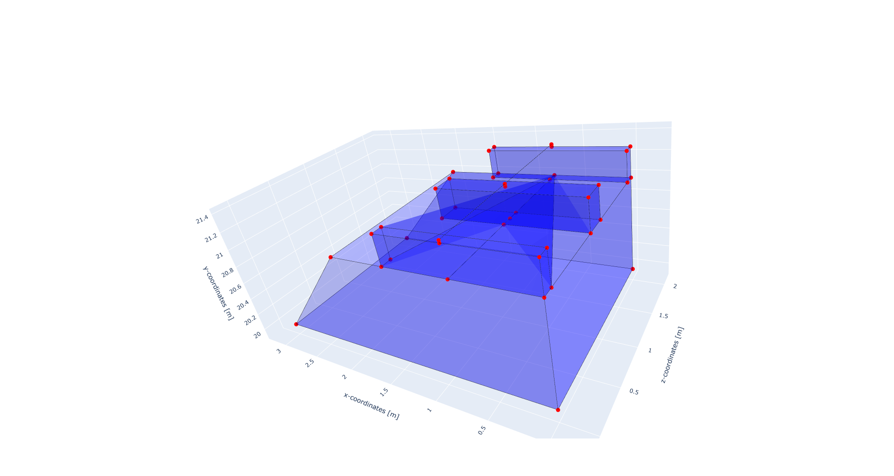
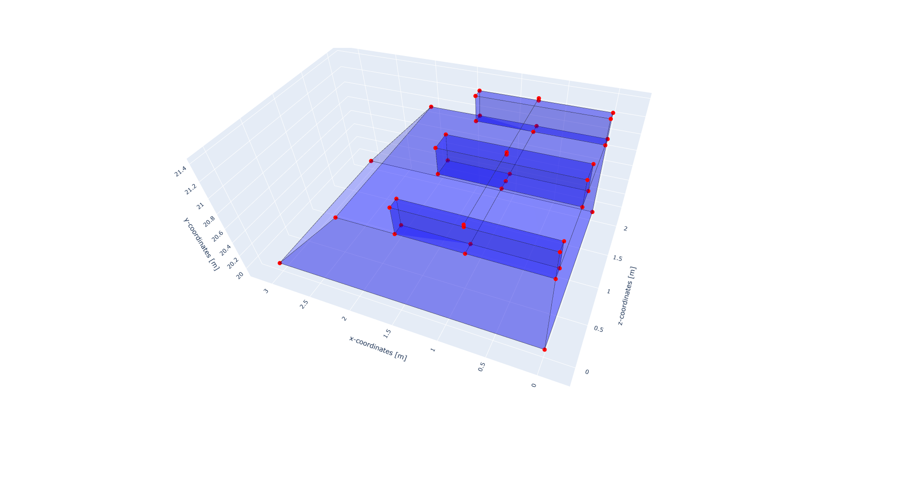

Known issues
===========

Installation fails due to long paths
------------------------------------
On Windows, when installing STEM as a developer (directly from GitHub),
the installation may fail due to long paths.
This is a known issue with Python and Windows, and it can be resolved by enabling long path support in Windows.
The error message will look like this:

.. code-block::

    ...

    error: unable to create file applications/GeoMechanicsApplication/tests/test_thermal_element/test_thermal_heat_flux_line_element/test_thermal_point_flux_2D5N/test_thermal_point_flux_2D5N.mdpa: Filename too long
    error: unable to create file applications/GeoMechanicsApplication/tests/test_thermal_element/test_thermal_heat_flux_line_element/test_thermal_point_flux_3D2N/test_thermal_point_flux_3D2N.mdpa: Filename too long
    error: unable to create file applications/GeoMechanicsApplication/tests/test_thermal_element/test_thermal_heat_flux_line_element/test_thermal_point_flux_3D3N/test_thermal_point_flux_3D3N.mdpa: Filename too long
    fatal: cannot create directory at 'applications/GeoMechanicsApplication/tests/test_thermal_element/test_transient_thermal_fixed_temperature/test_transient_thermal_fixed_temperature_2D10N': Filename too long
    warning: Clone succeeded, but checkout failed.
    You can inspect what was checked out with 'git status'
    and retry with 'git restore --source=HEAD :/'

    error: subprocess-exited-with-error

    × git clone --filter=blob:none --quiet https://github.com/StemVibrations/Kratos 'C:\Users\AppData\Local\Temp\pip-install-lem8mdif\stemkratos_84611cbc1687425a80e37d069d67d4b9' did not run successfully.
    │ exit code: 128
    ╰─> See above for output.

    note: This error originates from a subprocess, and is likely not a problem with pip.
    error: subprocess-exited-with-error

    × git clone --filter=blob:none --quiet https://github.com/StemVibrations/Kratos 'C:\Users\AppData\Local\Temp\pip-install-lem8mdif\stemkratos_84611cbc1687425a80e37d069d67d4b9' did not run successfully.
    │ exit code: 128
    ╰─> See above for output.

    note: This error originates from a subprocess, and is likely not a problem with pip.

    [notice] A new release of pip is available: 23.2.1 -> 26.1.2
    [notice] To update, run: python.exe -m pip install --upgrade pip

To solve this issue, run this command in a Command Prompt or PowerShell terminal with administrator privileges:

.. code-block::

         git config --system core.longpaths true

Linux: glibc requirement
------------------------
On Linux, the runtime requires GNU C Library (glibc) version 2.39 or newer.
This is typically needed by native dependencies used by Kratos and related tooling.

How to check your glibc version
...............................
Run one of the following in a terminal (they may differ per distro):

- ldd --version

You should see a version like "glibc 2.39" or newer.

Upgrading glibc (high-level guidance)
.....................................
It is recommended to upgrade your distribution to a release that ships glibc >= 2.39.
Most recent Linux distributions include this version or newer by default.

Notes
.....
- If you can't upgrade the host OS, consider using a Pod or Docker container that matches the required
  glibc version and provides Kratos and dependencies. You can find a Docker file to run STEM
  in the `STEM repository <https://github.com/StemVibrations/STEM/blob/main/podman/>`__.
- After upgrading, re-create your Python virtual environment to avoid binary incompatibilities.

Problem generating a geometry with volume sleepers
--------------------------------------------------
When generating a track with volume sleepers, it can happen that the geometry generation fails when the
underlying geometry contains a point which is exactly on the same coordinate as the origin point of the track generation.
The code below illustrates this issue. In this code, the origin point of the track is included in the
coordinate list of the ballast layer, which leads to a failure of the geometry generation as shown in the figure below.

.. code-block:: python

    from stem.model import Model
    from stem.soil_material import OnePhaseSoil, LinearElasticSoil, SoilMaterial, SaturatedBelowPhreaticLevelLaw
    from stem.structural_material import ElasticSpringDamper
    from stem.default_materials import DefaultMaterial

    ndim = 3
    model = Model(ndim)
    model.extrusion_length = 2

    # note that the origin point of the track is included in the ballast coordinates
    origin_point_track = (0.75, 21.0, 0.0)
    ballast_coordinates = [(0.0, 20, 0.0), (3.0, 20.0, 0.0), (2, 21, 0.0), origin_point_track, (0, 21, 0.0)]

    material_ballast = SoilMaterial("ballast",
                                    OnePhaseSoil(ndim, IS_DRAINED=True, DENSITY_SOLID=1800, POROSITY=0.0),
                                    LinearElasticSoil(YOUNG_MODULUS=200e6, POISSON_RATIO=0.3),
                                    SaturatedBelowPhreaticLevelLaw())

    model.add_soil_layer_by_coordinates(ballast_coordinates, material_ballast, "ballast_layer")

    # parameters for the track generation
    rail_parameters = DefaultMaterial.Rail_60E1_3D.value.material_parameters
    rail_pad_parameters = ElasticSpringDamper(NODAL_DISPLACEMENT_STIFFNESS=[0, 750e6, 0],
                                              NODAL_ROTATIONAL_STIFFNESS=[0, 0, 0],
                                              NODAL_DAMPING_COEFFICIENT=[0, 750e3, 0],
                                              NODAL_ROTATIONAL_DAMPING_COEFFICIENT=[0, 0, 0])

    material_sleeper = SoilMaterial("sleeper",
                                    OnePhaseSoil(ndim, IS_DRAINED=True, DENSITY_SOLID=2400, POROSITY=0.0),
                                    LinearElasticSoil(YOUNG_MODULUS=2400, POISSON_RATIO=0.2),
                                    SaturatedBelowPhreaticLevelLaw())

    sleeper_width, sleeper_height, sleeper_length  = 0.234, 0.3, 2.8 / 2
    sleeper_dimensions = [sleeper_width, sleeper_height, sleeper_length]

    direction_vector = [0, 0, 1]
    sleeper_spacing = 1
    number_of_sleepers = 3
    rail_pad_thickness = 0.025

    # generation of the track
    model.generate_straight_track(sleeper_spacing,
                                  number_of_sleepers,
                                  rail_parameters,
                                  material_sleeper,
                                  rail_pad_parameters,
                                  rail_pad_thickness,
                                  origin_point_track,
                                  direction_vector,
                                  "rail_track_1",
                                  sleeper_dimensions,
                                  origin_point_track[0])
    model.show_geometry()

This issue can be avoided by ensuring that the origin point of the track is not included in the coordinate list of the ballast layer.
In this case the ballast coordinates should be defined as follows:

.. code-block:: python

    ballast_coordinates = [(0.0, 20, 0.0), (3.0, 20.0, 0.0), (2, 21, 0.0), (0, 21, 0.0)]

This will lead to a correct generation of the geometry as shown in the figure below.

