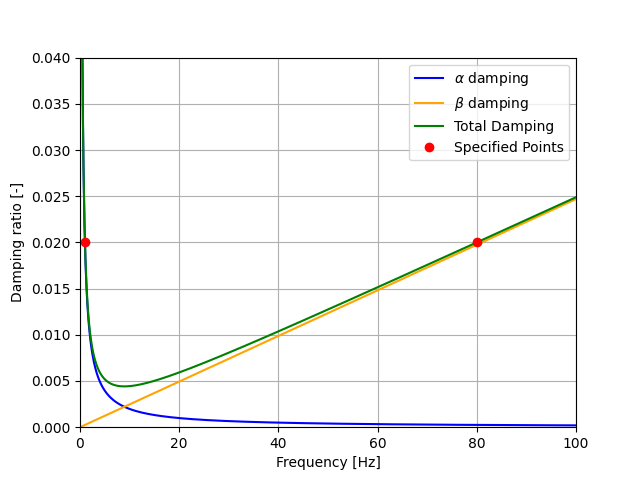

Modelling choices
=================
This page provides practical guidelines for selecting solver settings and modelling choices in STEM,
including mesh resolution, time step selection, and Rayleigh damping parameters.
These guidelines are based on common practices in computational mechanics and wave propagation problems,
and can help users configure their simulations for accuracy and efficiency.

Model initialisation
--------------------

Quasi-static initialisation followed by dynamic analysis is a common approach for simulating the
response of systems that are initially at rest or in equilibrium.

Element size
------------
For dynamic analysis, the element size should be chosen to adequately resolve the wave propagation in the model.
A common rule of thumb is to use at least 10 elements per wavelength for first-order elements and
5-10 elements per wavelength for second-order elements.

The wavelength, :math:`\lambda`, can be estimated from the shear wave speed, :math:`c_{s}`, and the maximum
frequency of interest :math:`f_{max}` as:

.. math::

   \lambda = \frac{c_s}{f_{max}}.

The maximum element size, :math:`h`, can then be estimated as:

.. math::

   h \lesssim \frac{c_{s}}{n_{\lambda} f_{max}}

where :math:`n_{\lambda}` is the number of elements per wavelength.
In practice, the choice of element size may also be influenced by other factors such as the geometry of the model,
the material properties, and the computational resources available.

Time step selection
-------------------
In STEM it is recommended to use the Newmark time integration scheme (formulated explicitly).
Two common guidelines for selecting the time step are:

- Frequency condition: the time step should be small enough to accurately resolve the highest
  sinusoidal frequency of interest in the response, typically by ensuring that each period of that
  frequency is represented by a sufficient number of time steps (e.g., 10 points per cycle) to
  avoid numerical dispersion and phase error.

.. math::

   \Delta t \lesssim \frac{1}{n_t f_{max}}

where :math:`n_t` is the number of time steps per period (e.g., 5-10) to ensure accuracy.

- Courant condition: the time step must be sufficiently small such that numerical information does not propagate
  faster than the physical wave speed of the system. This means that the time step should be less than a critical
  value proportional to the smallest element size divided by the highest wave speed (compression wave speed :math:`c_p`).

.. math::

   \Delta t \lesssim \frac{h}{n_c c_{p}}

where :math:`n_c` is a safety factor (e.g., 5-10) to ensure accuracy.

The more restrictive of these two conditions should be used to ensure stability and accuracy in the simulation

Rayleigh damping parameters
---------------------------
STEM offers the possibility of including Rayleigh damping in the model, which is commonly used in dynamic
finite element analyses to represent material and numerical dissipation.
The damping matrix is defined as a linear combination of the mass, :math:`\mathbf{M}`, and
stiffness, :math:`\mathbf{K}`, matrices:

.. math::

   \mathbf{C} = \alpha \mathbf{M} + \beta \mathbf{K}

where :math:`\alpha` is the mass-proportional damping coefficient and :math:`\beta` is the stiffness-proportional
damping coefficient. This figure illustrates the frequency-dependent damping ratio for Rayleigh damping.

The mass-proportional damping introduces increasing attenuation at low frequencies.
The stiffness-proportional damping introduces increasing attenuation at high frequencies and may lead to
excessive numerical dissipation.

To determine the Rayleigh damping coefficients (:math:`\alpha` and :math:`\beta` - in STEM called
``rayleigh_m`` and ``rayleigh_k``), it is common to specify
target damping ratios (:math:`\zeta_1` and :math:`\zeta_2`) at two frequencies of interest
(:math:`\omega_1` and :math:`\omega_2`), and then solve for the coefficients that achieve
those damping ratios at those frequencies.

.. math::
   \begin{aligned}
      \frac{1}{2} \left( \frac{\alpha}{\omega_1} + \beta \omega_1 \right) = \zeta_1 \\
      \frac{1}{2} \left( \frac{\alpha}{\omega_2} + \beta \omega_2 \right) = \zeta_2
   \end{aligned}

A helper function to compute the Rayleigh damping coefficients from target damping ratios and frequencies
follows:

.. code-block:: python

   import numpy as np

   def damping_Rayleigh(f1: float, d1: float, f2: float, d2: float) -> tuple[float, float]:
       """
       Rayleigh damping coefficients calculation

       Args:
          f1 (float): frequency 1 (Hz)
          d1 (float): damping ratio at frequency 1
          f2 (float): frequency 2 (Hz)
          d2 (float): damping ratio at frequency 2

       Returns:
          tuple[float, float]: alpha (mass-proportional), beta (stiffness-proportional)
       """
       if f1 == f2:
          raise SystemExit('Frequencies for the Rayleigh damping are the same.')

       # damping matrix
       damp_mat = 1 / 2 * np.array([[1 / (2 * np.pi * f1), 2 * np.pi * f1],
                                     [1 / (2 * np.pi * f2), 2 * np.pi * f2]])

       damp_qsi = np.array([d1, d2])

       # solution
       coefs = np.linalg.solve(damp_mat, damp_qsi)

       return coefs[0], coefs[1]

   if __name__ == "__main__":
       f1 = 1  # Hz
       d1 = 0.02  # 2% damping at f1
       f2 = 80  # Hz
       d2 = 0.02  # 2% damping at f2

       alpha, beta = damping_Rayleigh(f1, d1, f2, d2)
       print(f"Rayleigh damping coefficients:\n\trayleigh_m: {alpha}\n\trayleigh_k: {beta}")

Linear solver type
------------------
STEM provides several linear solvers:
STEM has several linear solvers available, including:

- LU decomposition (direct)
- Conjugate Gradient (iterative)
- Algebraic Multigrid (iterative)

LU decomposition is best suited for small problems.
For large problems, the iterative solvers are recommended, as they scale better and can use
preconditioners to improve convergence.
STEM uses the Jacobi preconditioner by default, a simple diagonal preconditioner suitable for symmetric
positive definite systems.
