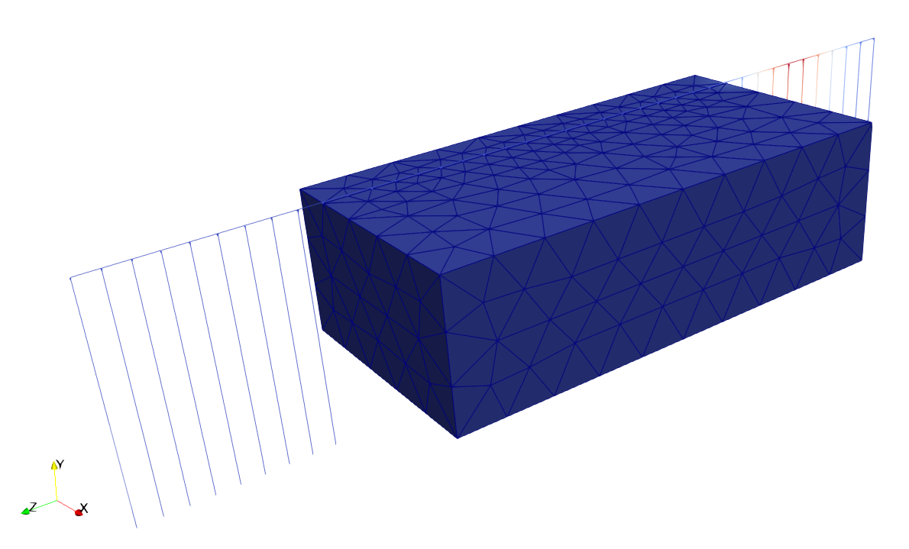

Railway track
=============

This page outlines how to define the railway track, the irregularities and rail joint in STEM.

.. _railway_track:

Railway track
--------------
To model the railway track, it is necessary to define the rail, railpad and sleepers.

Rail
....

The rail consists of a Euler-Bernoulli beam element. Since the rail properties are well-know,
STEM provides default materials for the rail, which can be used as follows:

.. code-block:: python

    from stem.default_materials import DefaultMaterial

    # Rail and sleeper parameters
    rail_parameters = DefaultMaterial.Rail_54E1_3D.value.material_parameters

STEM supports the following types of rails:

- Rail_46E3_3D
- Rail_54E1_3D
- Rail_60E1_3D

Custom rail materials can be defined as a Euler-Bernoulli beam material:

.. code-block:: python

   from stem.structural_material import StructuralMaterial, EulerBeam

   name = "custom_rail"
   beam_object = EulerBeam(ndim=3, DENSITY=7850, YOUNG_MODULUS=2.1e11, POISSON_RATIO=0.3,
                           CROSS_AREA=0.006977, I33=2.3372e-05, I22=2.787e-06, TORSIONAL_INERTIA=2.616E-05)
   rail_parameters = StructuralMaterial(name=name, material_parameters=beam_object.value.material_parameters

Railpad
.......

The railpad is modelled as a spring-damper system, which can be defined as follows:

.. code-block:: python

    from stem.structural_material import ElasticSpringDamper

    rail_pad_parameters = ElasticSpringDamper(
                            NODAL_DISPLACEMENT_STIFFNESS=[0, 750e6, 0],
                            NODAL_ROTATIONAL_STIFFNESS=[0, 0, 0],
                            NODAL_DAMPING_COEFFICIENT=[0, 750e3, 0],
                            NODAL_ROTATIONAL_DAMPING_COEFFICIENT=[0, 0, 0]
                            )

Sleepers
........
The sleeper can be modelled in two different ways, depending on the level of detail required for the analysis.
The sleeper can be either modelled as a concentrated mass or as a volume element.

The following example shows how to model the sleeper as a concentrated mass:

.. code-block:: python

    from stem.structural_material import NodalConcentrated

    sleeper_parameters = NodalConcentrated(NODAL_DISPLACEMENT_STIFFNESS=[0, 0, 0],
                                           NODAL_MASS=140,
                                           NODAL_DAMPING_COEFFICIENT=[0, 0, 0])

To model the sleeper as a volume element the sleeper material is defined as the soil material
(see :ref:`soil_material`).

.. code-block:: python

    from stem.soil_material import SoilMaterial, OnePhaseSoil, LinearElasticSoil, SaturatedBelowPhreaticLevelLaw

   soil_formulation = OnePhaseSoil(ndim, IS_DRAINED=True, DENSITY_SOLID=2400, POROSITY=0.0)
   constitutive_law = LinearElasticSoil(YOUNG_MODULUS=30e9, POISSON_RATIO=0.2)
   sleeper_parameters_soil = SoilMaterial(name="sleeper",
                                          soil_formulation=soil_formulation,
                                          constitutive_law=constitutive_law,
                                          retention_parameters=SaturatedBelowPhreaticLevelLaw())

The sleeper geometry should also be specified.

.. code-block:: python

   sleeper_height = 0.3
   sleeper_length = 2.8 / 2
   sleeper_width = 0.234
   sleeper_dimensions = [sleeper_width, sleeper_height, sleeper_length]
   distance_middle_sleeper_to_rail= 0.43

Railway track generation
.........................

The railway track is built by assembling the rail, railpad and sleepers.
Depending on the sleeper modelling strategy, the track can be generated by using the following function, for
the case of modelling the sleeper as a concentrated mass:

.. code-block:: python

   origin_point = [0.75, 3.0, 0.0]
   direction_vector = [0, 0, 1]
   n_sleepers = 0.6
   number_of_sleepers = 101
   sleeper_spacing = 0.6
   rail_pad_thickness = 0.025
   name = "track"

   model.generate_straight_track(sleeper_distance,
                                 n_sleepers,
                                 rail_parameters,
                                 sleeper_parameters,
                                 rail_pad_parameters,
                                 rail_pad_thickness,
                                 origin_point,
                                 direction_vector,
                                 name)

For the case of modelling the sleeper as a volume element, it follows (including the sleeper dimensions and the
distance between the middle of the sleeper and the rail as defined above):

.. code-block:: python

   origin_point = [0.75, 3.0, 0.0]
   direction_vector = [0, 0, 1]
   n_sleepers = 0.6
   number_of_sleepers = 101
   sleeper_spacing = 0.6
   rail_pad_thickness = 0.025
   name = "track"

   model.generate_straight_track(sleeper_distance,
                                 n_sleepers,
                                 rail_parameters,
                                 sleeper_parameters,
                                 rail_pad_parameters,
                                 rail_pad_thickness,
                                 origin_point,
                                 direction_vector,
                                 sleeper_dimensions,
                                 distance_middle_sleeper_to_rail,
                                 name)

To reduce the size of the soil domain, the railway track can be generated partially outside the model geometry
by extending it beyond the domain boundaries.
The extended part of the track is supported by a one-dimensional spring-damper system,
which represents the soil behavior using 1D elements.

An extended straight track can be generated as follows:

.. code-block:: python

   direction_vector = [0, 0, 1]
   n_sleepers = 0.6
   number_of_sleepers = 101
   sleeper_spacing = 0.6
   rail_pad_thickness = 0.025
   length_soil_equivalent_element = 5
   name = "extended_track"

   soil_equivalent_parameters = ElasticSpringDamper(NODAL_DISPLACEMENT_STIFFNESS=[0, 71e6, 0],
                                                    NODAL_ROTATIONAL_STIFFNESS=[0, 0, 0],
                                                    NODAL_DAMPING_COEFFICIENT=[0, 71e3, 0],
                                                    NODAL_ROTATIONAL_DAMPING_COEFFICIENT=[0, 0, 0])

   model.generate_extended_straight_track(n_sleepers,
                                          number_of_sleepers,
                                          rail_parameters,
                                          sleeper_parameters,
                                          rail_pad_parameters,
                                          rail_pad_thickness,
                                          origin_point,
                                          soil_equivalent_parameters,
                                          length_soil_equivalent_element,
                                          direction_vector,
                                          name)

The figure below illustrates an example of a railway track generated with an extended track section.

.. _irregularities_track:

Irregularities
--------------
The track irregularities can be applied in STEM in combination with the UVEC.
To apply irregularities to the UVEC model, the user can  define the argument `irregularities` in the UVEC
model as a dictionary with the parameters `Av` and `seed`.

The `Av` parameter is the amplitude of the irregularities and the `seed` parameter is used for reproducibility of the
random process. The irregularities are modelled following :cite:`Zhang_2001`, and the parameter `Av` can be estimated
based on the track quality :cite:`Lei_Noda_2002`.
In case that irregularities are not required, the `irregularities` argument must be set to `None`.

.. code-block:: python

   irr_parameters = {"Av": 2.095e-05, "seed": 14}

    uvec_load = UvecLoad(direction_signs=[1, 1, 1],
                        velocity=40,
                        origin=wheel_configuration,
                        uvec_parameters=uvec_parameters,
                        uvec_model=uvec,
                        train_type=TrainType.PASSENGER_HEAVY,
                        irregularities=None,
                        rail_joint=joint_parameters,
                        )

For additional details about the UVEC model, see :ref:`uvec`, and for additional details about
the track irregularities, see :ref:`irr_formulation`.

.. _rail_joints:

Rail joints
-----------
To model the rail joints, hinges can be added to the beam elements of the rail at the location of the joints.
The stiffness of the hinges can be defined based on the properties of the rail and the joint.

The irregularities of the rail joint can be modelled (see :ref:`rail_joint_formulation`) by setting the
argument `rail_joint` in the UVEC model as a dictionary with the parameters `location_joint`,
`depth_joint` and `width_joint`, which represent the location of the joint, the depth of the joint and the
width of the joint, respectively.
In case that rail joints are not required, the `rail_joint` argument must be set to `None`.

.. code-block:: python

   distance_joint = 35.75
   hinge_stiffness_y = 37.8e7
   hinge_stiffness_z = 37.8e7

   model.add_hinge_on_beam("rail_track", [(0.75, 3 + rail_pad_thickness, distance_joint)],
                           HingeParameters(hinge_stiffness_y, hinge_stiffness_z), "hinge")

   joint_parameters = {"location_joint": distance_joint,  # joint location [m]
                       "depth_joint": 0.01,  # depth of the joint [m]
                       "width_joint": 0.25,  # width of the joint [m]
                     }

    uvec_load = UvecLoad(direction_signs=[1, 1, 1],
                        velocity=40,
                        origin=wheel_configuration,
                        uvec_parameters=uvec_parameters,
                        uvec_model=uvec,
                        train_type=TrainType.PASSENGER_HEAVY,
                        irregularities=None,
                        rail_joint=joint_parameters,
                        )

.. Interface
.. ---------
