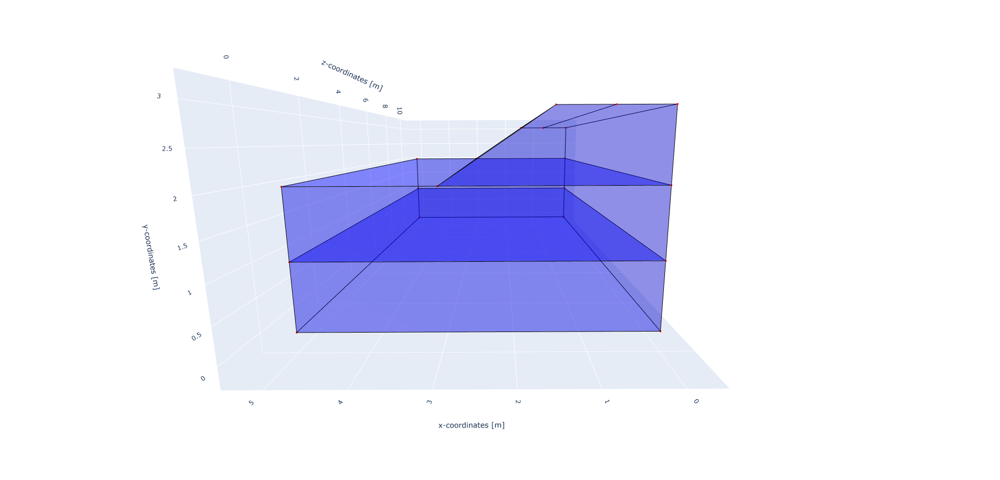
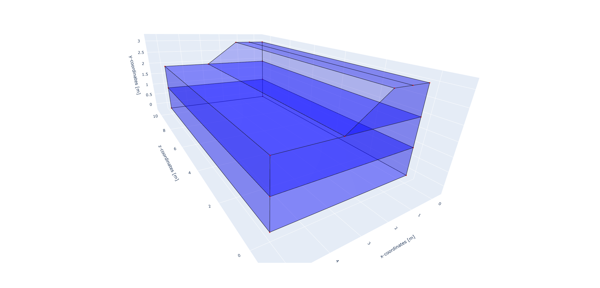
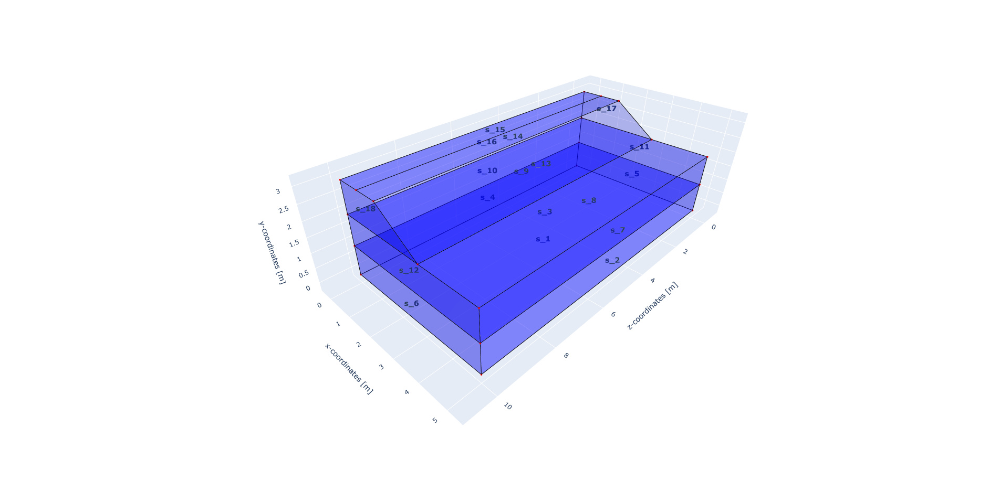

STEM tutorials
==============

.. _tutorial1:

Stationary load on a 3D field
-----------------------------
This tutorial shows step by step guide on how to set up a line load
on top of an embankment with two soil layers underneath, in a 3D model.

First the necessary packages are imported and paths are defined.

.. code-block:: python

    input_files_dir = "line_load"
    results_dir = "output_line_load"

    from stem.model import Model
    from stem.soil_material import OnePhaseSoil, LinearElasticSoil, SoilMaterial, SaturatedBelowPhreaticLevelLaw
    from stem.load import LineLoad
    from stem.boundary import DisplacementConstraint
    from stem.solver import AnalysisType, SolutionType, TimeIntegration, DisplacementConvergenceCriteria,\
         LinearNewtonRaphsonStrategy, NewmarkScheme, Amgcl, StressInitialisationType, SolverSettings, Problem
    from stem.output import NodalOutput, VtkOutputParameters, Output
    from stem.stem import Stem

    # END CODE BLOCK

For setting up the model, Model class is imported from stem.model. And for setting up the soil material, OnePhaseSoil,
LinearElasticSoil, SoilMaterial, SaturatedBelowPhreaticLevelLaw classes are imported.
In this case, there is a line load on top of the embankment. LineLoad class is imported from stem.load.
As for setting the boundary conditions, DisplacementConstraint class is imported from stem.boundary.
For setting up the solver settings, necessary classes are imported from stem.solver.
Classes needed for the output, are NodalOutput, VtkOutputParameters and Output which are imported from stem.output.
Lastly, Stem class is imported from stem.stem, in order to run the simulation.

In this step, the geometry, conditions, and material parameters for the simulation is defined.
First the dimension of the model is indicated which in this case is 3. After which the model can be initialised.

.. code-block:: python

    ndim = 3
    model = Model(ndim)

    # END CODE BLOCK

Specification of the soil material is defined afterwards.
The bottom soil layer is defined as a material with the name "soil_1".
It's a Linear elastic material model with the solid density (rho) of 2650 kg/m3,
the Young's modulus is 30e6 Pa and the Poisson's ratio is 0.2.
The soil is dry above the phreatic level and wet below the phreatic level. A porosity of 0.3 is specified.
The soil is a one-phase soil, meaning that the flow of water through the soil is not computed.

.. code-block:: python

    solid_density_1 = 2650
    porosity_1 = 0.3
    young_modulus_1 = 30e6
    poisson_ratio_1 = 0.2
    soil_formulation_1 = OnePhaseSoil(ndim, IS_DRAINED=True, DENSITY_SOLID=solid_density_1, POROSITY=porosity_1)
    constitutive_law_1 = LinearElasticSoil(YOUNG_MODULUS=young_modulus_1, POISSON_RATIO=poisson_ratio_1)
    retention_parameters_1 = SaturatedBelowPhreaticLevelLaw()
    material_soil_1 = SoilMaterial("soil_1", soil_formulation_1, constitutive_law_1, retention_parameters_1)

    # END CODE BLOCK

The second soil layer is defined as a material with the name "soil_2".
It's a Linear elastic material model with the solid density (rho) of 2550 kg/m3,
the Young's modulus is 30e6 Pa and the Poisson's ratio is 0.2.
The soil is dry above the phreatic level and wet below the phreatic level. A porosity of 0.3 is specified.
The soil is a one-phase soil, meaning that the flow of water through the soil is not computed.

.. code-block:: python

    solid_density_2 = 2550
    porosity_2 = 0.3
    young_modulus_2 = 30e6
    poisson_ratio_2 = 0.2
    soil_formulation_2 = OnePhaseSoil(ndim, IS_DRAINED=True, DENSITY_SOLID=solid_density_2, POROSITY=porosity_2)
    constitutive_law_2 = LinearElasticSoil(YOUNG_MODULUS=young_modulus_2, POISSON_RATIO=poisson_ratio_2)
    retention_parameters_2 = SaturatedBelowPhreaticLevelLaw()
    material_soil_2 = SoilMaterial("soil_2", soil_formulation_2, constitutive_law_2, retention_parameters_2)

    # END CODE BLOCK

The embankment layer on top is defined as a material with the name "embankment".
It's a Linear elastic material model with the solid density (rho) of 2650 kg/m3,
the Young's modulus is 10e6 Pa and the Poisson's ratio is 0.2.
The soil is dry above the phreatic level and wet below the phreatic level. A porosity of 0.3 is specified.
The soil is a one-phase soil, meaning that the flow of water through the soil is not computed.

 .. code-block:: python

    solid_density_3 = 2650
    porosity_3 = 0.3
    young_modulus_3 = 10e6
    poisson_ratio_3 = 0.2
    soil_formulation_3 = OnePhaseSoil(ndim, IS_DRAINED=True, DENSITY_SOLID=solid_density_3, POROSITY=porosity_3)
    constitutive_law_3 = LinearElasticSoil(YOUNG_MODULUS=young_modulus_3, POISSON_RATIO=poisson_ratio_3)
    retention_parameters_3 = SaturatedBelowPhreaticLevelLaw()
    material_embankment = SoilMaterial("embankment", soil_formulation_3, constitutive_law_3, retention_parameters_3)

    # END CODE BLOCK

The coordinates of the model are defined in the following way. Each of the layers are defined by a list of coordinates,
defined in th x-y plane. For 3D models, the x-y plane can be extruded in the z-direction. In this case, the extrusion
length is 50 m in the z-direction.

.. code-block:: python

    soil1_coordinates = [(0.0, 0.0, 0.0), (5.0, 0.0, 0.0), (5.0, 1.0, 0.0), (0.0, 1.0, 0.0)]
    soil2_coordinates = [(0.0, 1.0, 0.0), (5.0, 1.0, 0.0), (5.0, 2.0, 0.0), (0.0, 2.0, 0.0)]
    embankment_coordinates = [(0.0, 2.0, 0.0), (3.0, 2.0, 0.0), (1.5, 3.0, 0.0), (0.75, 3.0, 0.0), (0, 3.0, 0.0)]
    model.extrusion_length = 50

    # END CODE BLOCK

The geometry is shown in the figures below.

The soil layers are then added to the model in the following way. It is important that all soil layers have
a unique name.

.. code-block:: python

    model.add_soil_layer_by_coordinates(soil1_coordinates, material_soil_1, "soil_layer_1")
    model.add_soil_layer_by_coordinates(soil2_coordinates, material_soil_2, "soil_layer_2")
    model.add_soil_layer_by_coordinates(embankment_coordinates, material_embankment, "embankment_layer")

    # END CODE BLOCK

For the line load, LineLoad class is called. The load is defined following a list of coordinates. In this case,
a line load is applied along the load coordinates. The line load can be defined along which axis is active,
and the value of the load for each axis. In this case the load is only active in the y-direction and the value of the -1000.

.. code-block:: python

    load_coordinates = [(0.75, 3.0, 0.0), (0.75, 3.0, 50.0)]
    line_load = LineLoad(active=[False, True, False], value=[0, -1000, 0])
    model.add_load_by_coordinates(load_coordinates, line_load, "line_load")

    # END CODE BLOCK

The boundary conditions are defined on geometry ids, which are created by gmsh when making the geometry. Gmsh will
assign an id to each of the points, lines, surfaces and volumes created.
The geometry ids can be seen after using the show_geometry function.

This function is only used for visualisation of the geometry ids after creation of the geometry, to be able to see the
geometry ids issued by gmsh, and to know which ids belong to each boundary conditions.
For visualisation of surface ids, "show_surface_ids" should be set to "True".
Also for visualisation of line ids, "show_line_ids" and for visualisation of point ids, "show_point_ids"
should be set to "True".

.. code-block:: python

    model.synchronise_geometry()

    model.show_geometry(show_surface_ids=True)

    # END CODE BLOCK

The geometry ids can be seen in the pictures below.

Below the boundary conditions are defined. The base of the model is fixed in all directions with the name "base_fixed".
The roller boundary condition is applied on the sides of the embankment with the name "sides_roller".
The boundary conditions are added to the model on the edge surfaces, i.e. the boundary conditions are applied to a list
of surface ids (which can be visualised using: "model.show_geometry(show_surface_ids=True)")  with the corresponding
dimension, "2".

.. code-block:: python

    no_displacement_parameters = DisplacementConstraint(active=[True, True, True],
                                                        is_fixed=[True, True, True], value=[0, 0, 0])
    roller_displacement_parameters = DisplacementConstraint(active=[True, True, True],
                                                            is_fixed=[True, False, True], value=[0, 0, 0])

    model.add_boundary_condition_by_geometry_ids(2, [1], no_displacement_parameters, "base_fixed")
    model.add_boundary_condition_by_geometry_ids(2, [2, 4, 5, 6, 7, 10, 11, 12, 15, 16, 17],
                                                 roller_displacement_parameters, "sides_roller")

    # END CODE BLOCK

After which the mesh size can be set. The element size for the mesh can be defined as a single value, the mesh
will be generated when the Stem class is initialised.

.. code-block:: python

    model.set_mesh_size(element_size=1.0)

    # END CODE BLOCK

Now that the geometry is defined, the solver settings of the model has to be set.
The analysis type is set to "MECHANICAL" and the solution type is set to "DYNAMIC".
Then the start time is set to 0.0 second and the end time is set to 0.1 second. The time step size is set to 0.01 second.
Furthermore, the reduction factor and increase factor are set to 1.0, such that the time step size is constant throughout
the simulation. Displacement convergence criteria is set to 1.0e-4 for the relative tolerance and 1.0e-9 for the
absolute tolerance. Since the problem is linear elastic, Linear-Newton-Raphson is used as a solving strategy.
And Newmark is used as an integration method. Amgcl is used as a linear solver. Stresses are not initialised since
the "stress_initialisation_type" is set to "NONE". Other options are "StressInitialisationType.GRAVITY_LOADING" and
"StressInitialisationType.K0_PROCEDURE". Since the problem is linear elastic, the stiffness matrix is constant and the mass and
damping matrices are constant, defining the matrices as constant will speed up the computation. Rayleigh damping is
assumed, with a damping coefficient of 0.0002 for the stiffness matrix and 0.6 for the mass matrix.

.. code-block:: python

    analysis_type = AnalysisType.MECHANICAL
    solution_type = SolutionType.DYNAMIC
    # Set up start and end time of calculation, time step and etc
    time_integration = TimeIntegration(start_time=0.0, end_time=0.1, delta_time=0.01, reduction_factor=1.0,
                                       increase_factor=1.0)
    convergence_criterion = DisplacementConvergenceCriteria(displacement_relative_tolerance=1.0e-4,
                                                            displacement_absolute_tolerance=1.0e-9)
    strategy_type = LinearNewtonRaphsonStrategy()
    scheme_type = NewmarkScheme()
    linear_solver_settings = Amgcl()
    stress_initialisation_type = StressInitialisationType.NONE
    solver_settings = SolverSettings(analysis_type=analysis_type, solution_type=solution_type,
                                     stress_initialisation_type=stress_initialisation_type,
                                     time_integration=time_integration,
                                     is_stiffness_matrix_constant=True, are_mass_and_damping_constant=True,
                                     convergence_criteria=convergence_criterion,
                                     strategy_type=strategy_type, scheme=scheme_type,
                                     linear_solver_settings=linear_solver_settings, rayleigh_k=0.0002,
                                     rayleigh_m=0.6)

    # END CODE BLOCK

Now the problem data should be set up. The problem should be given a name, in this case it is
"calculate_load_on_embankment_3d". Then the solver settings are added to the problem.

.. code-block:: python

    # Set up problem data
    problem = Problem(problem_name="calculate_load_on_embankment_3d", number_of_threads=1,
                      settings=solver_settings)
    model.project_parameters = problem

    # END CODE BLOCK

Before starting the calculation, it is required to specify why output is desired. In this case, displacement,
velocity and acceleration is given on the nodes and written to the output file. In this test case, gauss point results
are left empty.

.. code-block:: python

    nodal_results = [NodalOutput.DISPLACEMENT, NodalOutput.VELOCITY, NodalOutput.ACCELERATION]
    gauss_point_results = []

    # END CODE BLOCK

The output process is added to the model using the `Model.add_output_settings` method. The results will be then written to the output directory in vtk
format. In this case, the output interval is set to 1 and the output control type is set to "step", meaning that the
results will be written every time step.

.. code-block:: python

     model.add_output_settings(
        part_name="porous_computational_model_part",
        output_name="vtk_output",
        output_dir="output",
        output_parameters=VtkOutputParameters(
            output_interval=1,
            nodal_results=nodal_results,
            gauss_point_results=gauss_point_results,
            output_control_type="step"
        )
    )

    # END CODE BLOCK

Now that the model is set up, the calculation is almost ready to be ran.

Firstly the Stem class is initialised, with the model and the directory where the input files will be written to.
While initialising the Stem class, the mesh will be generated.

.. code-block:: python

    stem = Stem(model, input_files_dir)

    # END CODE BLOCK

The Kratos input files are then written. The project settings and output definitions are written to
ProjectParameters_stage_1.json file. The mesh is written to the .mdpa file and the material parameters are
written to the MaterialParameters_stage_1.json file.
All of the input files are then written to the input files directory.

.. code-block:: python

    stem.write_all_input_files()

    # END CODE BLOCK

The calculation is then ran by calling the run_calculation function within the stem class.

.. code-block:: python

    stem.run_calculation()

    # END CODE BLOCK

.. seealso::

    - Next: :ref:`tutorial2`