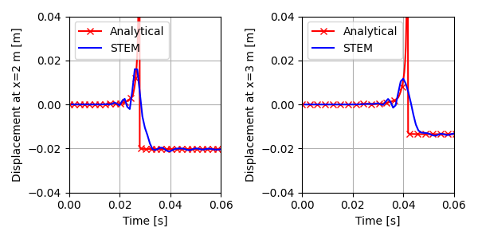
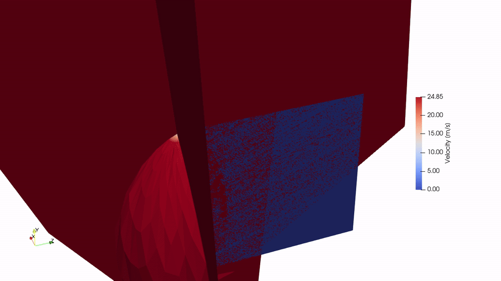

.. _tutorial1:

Lamb's problem in 3D
====================

Overview
--------
This tutorial shows how to set up and run a 3D Lamb problem. The Lamb problem
consists of the application of a point load on the surface of an elastic half-space,
and computing the wave propagation towards the free field.
To avoid reflections at the model edges, absorbing boundary conditions are used.

Imports and setup
-----------------
First the necessary packages are imported and the input folder is defined.

.. code-block:: python

    input_files_dir = "lamb"

    from stem.model import Model
    from stem.soil_material import OnePhaseSoil, LinearElasticSoil, SoilMaterial, SaturatedBelowPhreaticLevelLaw
    from stem.load import PointLoad
    from stem.boundary import DisplacementConstraint, AbsorbingBoundary
    from stem.solver import AnalysisType, SolutionType, TimeIntegration, DisplacementConvergenceCriteria, \
        StressInitialisationType, SolverSettings, Problem, LinearNewtonRaphsonStrategy, Cg
    from stem.output import NodalOutput, VtkOutputParameters, JsonOutputParameters
    from stem.stem import Stem

..    # END CODE BLOCK

For setting up the model, ``Model`` is imported from ``stem.model``.
For the soil material, ``OnePhaseSoil``, ``LinearElasticSoil``, ``SoilMaterial``,
and ``SaturatedBelowPhreaticLevelLaw`` are imported from ``stem.soil_material``.
In this case, a point load is applied, therefore ``PointLoad`` is imported from ``stem.load``.
Boundary conditions are set using ``DisplacementConstraint`` and ``AbsorbingBoundary``.
Solver settings are defined with classes imported from ``stem.solver``.
For output, ``NodalOutput``, ``VtkOutputParameters``, and ``JsonOutputParameters`` are imported.
Finally, ``Stem`` is imported from ``stem.stem`` to write input files and run the calculation.

Geometry and materials
----------------------
In this step, the geometry and materials are defined.
First the model dimension is set to 3 and the model is initialised.

.. code-block:: python

    ndim = 3
    model = Model(ndim)

..    # END CODE BLOCK

The soil is modelled as linear-elastic, drained, and one-phase material.
The material parameters are defined as follows.

.. code-block:: python

    DENSITY_SOLID = 2000
    POROSITY = 0
    YOUNG_MODULUS = 30e6
    POISSON_RATIO = 0.2

    soil_formulation = OnePhaseSoil(ndim, IS_DRAINED=True, DENSITY_SOLID=DENSITY_SOLID, POROSITY=POROSITY)
    constitutive_law = LinearElasticSoil(YOUNG_MODULUS=YOUNG_MODULUS, POISSON_RATIO=POISSON_RATIO)
    retention_parameters = SaturatedBelowPhreaticLevelLaw()
    material = SoilMaterial("soil", soil_formulation, constitutive_law, retention_parameters)

..    # END CODE BLOCK

A rectangular soil domain is created in the x-y plane and extruded in z-direction.
The layer coordinates are defined and the soil layer is added to the model.

.. code-block:: python

    x_max = 10
    y_max = 5
    z_max = 10

    layer_coordinates = [(0.0, 0.0, 0.0), (x_max, 0.0, 0.0), (x_max, y_max, 0.0), (0.0, y_max, 0.0)]
    model.extrusion_length = z_max

    model.add_soil_layer_by_coordinates(layer_coordinates, material, "soil")

..    # END CODE BLOCK

Load
----
A point load is applied at the surface corner (x=0, y=y_max, z=0), acting in the negative y-direction.
The load consists of a step function with amplitude of :math:`10^6` N.

.. code-block:: python

    force = -1e6
    node_coordinates = [(0.0, y_max, 0.0)]

    point_load = PointLoad(active=[True, True, True], value=[0, force, 0])
    model.add_load_by_coordinates(node_coordinates, point_load, "point_load")

..    # END CODE BLOCK

Boundary conditions
-------------------
Below the boundary conditions are defined.
The bottom base is fully fixed in all directions.
Roller boundaries are applied on x=0 and z=0 planes.
Absorbing boundary conditions are applied on x=x_max and z=z_max planes.

.. code-block:: python

    no_displacement_parameters = DisplacementConstraint(is_fixed=[True, True, True],
                                                        value=[0, 0, 0])
    roller_displacement_parameters_x = DisplacementConstraint(is_fixed=[True, False, False],
                                                              value=[0, 0, 0])
    roller_displacement_parameters_z = DisplacementConstraint(is_fixed=[False, False, True],
                                                              value=[0, 0, 0])
    abs_boundary_parameters = AbsorbingBoundary(absorbing_factors=[1.0, 1.0], virtual_thickness=10)

    model.add_boundary_condition_on_plane([(0, 0, 0), (x_max, 0, 0), (x_max, 0, z_max)], no_displacement_parameters,
                                          "base_fixed")
    model.add_boundary_condition_on_plane([(0, 0, 0), (0, y_max, 0), (0, y_max, z_max)],
                                          roller_displacement_parameters_x, "sides_roler_x=0")
    model.add_boundary_condition_on_plane([(0, 0, 0), (x_max, 0, 0), (x_max, y_max, 0)],
                                          roller_displacement_parameters_z, "sides_roler_z=0")
    model.add_boundary_condition_on_plane([(x_max, 0, 0), (x_max, y_max, 0), (x_max, y_max, z_max)],
                                          abs_boundary_parameters, "abs_x=x_max")
    model.add_boundary_condition_on_plane([(0, 0, z_max), (x_max, 0, z_max), (x_max, y_max, z_max)],
                                          abs_boundary_parameters, "abs_z=z_max")

..    # END CODE BLOCK

Mesh
----
The mesh size and element order are defined.
After assigning geometry and conditions, the geometry is synchronised.

.. code-block:: python

    model.set_mesh_size(element_size=1)
    model.mesh_settings.element_order = 2

    model.synchronise_geometry()

..    # END CODE BLOCK

Solver settings
---------------
Now that the model is defined, the solver settings should be set.

The analysis type is set to `Mechanical` and the the time step and analyses time are set to 0.01 and 0.08, repectivelly.
The system of equations is solved with the assumption of constant stiffness matrix, mass matrix, and damping matrix.
The Linear-Newton-Raphson (Newmark explicit solver) is used as strategy and Cg as solver for the linear system of equations.

The Rayleigh damping parameters are set to :math:`\alpha = 0.248` and :math:`\beta = 7.86 \cdot 10^{-5}`, which
correspond to a damping ratio of 2% for 1 and 80 Hz.

The convergence criterion for the numerical solver are set to a relative tolerance of :math:`10^{-4}` and an absolute
tolerance of :math:`10^{-9}` for the displacements.

.. code-block:: python

    time_step = 0.01

    time_integration = TimeIntegration(start_time=0.0,
                                       end_time=0.08,
                                       delta_time=time_step,
                                       reduction_factor=1.0,
                                       increase_factor=1.0,
                                       max_delta_time_factor=1000)

    convergence_criterion = DisplacementConvergenceCriteria(displacement_relative_tolerance=1.0e-4,
                                                            displacement_absolute_tolerance=1.0e-9)

    solver_settings = SolverSettings(analysis_type=AnalysisType.MECHANICAL,
                                     solution_type=SolutionType.DYNAMIC,
                                     stress_initialisation_type=StressInitialisationType.NONE,
                                     time_integration=time_integration,
                                     is_stiffness_matrix_constant=True,
                                     are_mass_and_damping_constant=True,
                                     convergence_criteria=convergence_criterion,
                                     strategy_type=LinearNewtonRaphsonStrategy(),
                                     linear_solver_settings=Cg(),
                                     rayleigh_k=7.86e-5,
                                     rayleigh_m=0.248)

..    # END CODE BLOCK

Problem and output
------------------
The problem definition is added to the model.
The problem name is set to "Lamb", the number of threads is set to 8 and the solver settings are applied.

In this example, JSON output is requested at 2 surface points (displacements) and VTK output
is written for the full computational model part (displacements and velocities).

.. code-block:: python

    problem = Problem(problem_name="Lamb", number_of_threads=8, settings=solver_settings)
    model.project_parameters = problem

    json_output_parameters = JsonOutputParameters(time_step, [NodalOutput.DISPLACEMENT], [])

    model.add_output_settings_by_coordinates([
        (2, y_max, 0),
        (3, y_max, 0),
    ], json_output_parameters, "json_output")

    model.add_output_settings(
        output_parameters=VtkOutputParameters(
            file_format="ascii",
            output_interval=1,
            nodal_results=[NodalOutput.DISPLACEMENT, NodalOutput.VELOCITY],
            gauss_point_results=[],
            output_control_type="step"
        ),
        part_name="porous_computational_model_part",
        output_dir="output",
        output_name="vtk_output"
    )

..    # END CODE BLOCK

Run
---
Now that the model is set up, the calculation is ready to run.

Firstly the Stem class is initialised, with the model and the directory where the input files will be written to.
While initialising the Stem class, the mesh will be generated.
This is followed by writing all the input files required to run the calculation.
The calculation is run by calling ``stem.run_calculation()``.

.. code-block:: python

    stem = Stem(model, input_files_dir)
    stem.write_all_input_files()
    stem.run_calculation()

..    # END CODE BLOCK

Results
-------
Once the calculation is finished, the results can be visualised using Paraview,
or by loading the JSON output file.

This figure shows the time history of the vertical displacements at the two points along the surface
(these results have been obtained for a time step of 0.001 s, time duration of 0.15 s and with an element size of 0.25m).
The results are compared with the analytical solution of the Lamb problem.

This animation shows the vertical velocity of the soil when subjected to the pulse load.

.. seealso::

    - Next: :ref:`tutorial2`