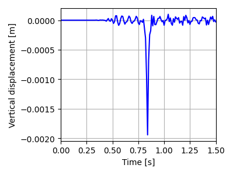

.. _tutorial2:

Moving load on an embankment in 3D
==================================

Overview
--------
This tutorial shows how to set up a moving load on top of an embankment with two soil layers underneath, in a 3D model.
The moving load is applied on top of the embankment and moves in the z-direction at constant velocity.

Imports and setup
-----------------
First the necessary packages are imported and the input folder is defined.

.. code-block:: python

    input_files_dir = "moving_load"

    from stem.model import Model
    from stem.soil_material import OnePhaseSoil, LinearElasticSoil, SoilMaterial, SaturatedBelowPhreaticLevelLaw
    from stem.load import MovingLoad
    from stem.boundary import DisplacementConstraint
    from stem.solver import AnalysisType, SolutionType, TimeIntegration, DisplacementConvergenceCriteria,\
            LinearNewtonRaphsonStrategy, NewmarkScheme, Cg, StressInitialisationType, SolverSettings, Problem
    from stem.output import NodalOutput, VtkOutputParameters, JsonOutputParameters
    from stem.stem import Stem

..    # END CODE BLOCK

For setting up the model, ``Model`` is imported from ``stem.model``.
For the soil material, ``OnePhaseSoil``, ``LinearElasticSoil``, ``SoilMaterial``,
and ``SaturatedBelowPhreaticLevelLaw`` are imported from ``stem.soil_material``.
In this case, a moving load is applied, therefore ``MovingLoad`` is imported from ``stem.load``.
Boundary conditions are set using ``DisplacementConstraint``.
Solver settings are defined with classes imported from ``stem.solver``.
For output, ``NodalOutput`` and ``VtkOutputParameters`` are imported.
Finally, ``Stem`` is imported from ``stem.stem`` to write input files and run the calculation.

Geometry and materials
----------------------
In this step, the geometry, and material parameters for the simulation are defined.
First the dimension of the model is indicated which in this case is 3.
After which the model can be initialised.

.. code-block:: python

    ndim = 3
    model = Model(ndim)

..    # END CODE BLOCK

Specification of the soil material is defined afterwards.
The bottom soil layer is defined as a material with the name "soil_1".
It is a Linear elastic material model with the solid density of 2650 kg/m3,
the Young's modulus is 30e6 Pa and the Poisson's ratio is of 0.2.
A porosity of  of 0.3 is specified.
The soil is a one-phase soil, meaning that the flow of water through the soil is not computed.

.. code-block:: python

    solid_density_1 = 2650
    porosity_1 = 0.3
    young_modulus_1 = 30e6
    poisson_ratio_1 = 0.2
    soil_formulation_1 = OnePhaseSoil(ndim, IS_DRAINED=True, DENSITY_SOLID=solid_density_1, POROSITY=porosity_1)
    constitutive_law_1 = LinearElasticSoil(YOUNG_MODULUS=young_modulus_1, POISSON_RATIO=poisson_ratio_1)
    retention_parameters_1 = SaturatedBelowPhreaticLevelLaw()
    material_soil_1 = SoilMaterial("soil_1", soil_formulation_1, constitutive_law_1, retention_parameters_1)

..    # END CODE BLOCK

The second soil layer is defined as a material with the name "soil_2".
It is a Linear elastic material model with the solid density of 2550 kg/m3,
the Young's modulus is 30e6 Pa and the Poisson's ratio is 0.2.
A porosity of 0.3 is specified.
The soil is a one-phase soil, meaning that the flow of water through the soil is not computed.

.. code-block:: python

    solid_density_2 = 2550
    porosity_2 = 0.3
    young_modulus_2 = 30e6
    poisson_ratio_2 = 0.2
    soil_formulation_2 = OnePhaseSoil(ndim, IS_DRAINED=True, DENSITY_SOLID=solid_density_2, POROSITY=porosity_2)
    constitutive_law_2 = LinearElasticSoil(YOUNG_MODULUS=young_modulus_2, POISSON_RATIO=poisson_ratio_2)
    retention_parameters_2 = SaturatedBelowPhreaticLevelLaw()
    material_soil_2 = SoilMaterial("soil_2", soil_formulation_2, constitutive_law_2, retention_parameters_2)

..    # END CODE BLOCK

The embankment layer on top is defined as a material with the name "embankment".
It is a Linear elastic material model with the solid density of 2650 kg/m3,
the Young's modulus is 10e6 Pa and the Poisson's ratio is 0.2.
A porosity of 0.3 is specified.
The soil is a one-phase soil, meaning that the flow of water through the soil is not computed.

.. code-block:: python

    solid_density_3 = 2650
    porosity_3 = 0.3
    young_modulus_3 = 10e6
    poisson_ratio_3 = 0.2
    soil_formulation_3 = OnePhaseSoil(ndim, IS_DRAINED=True, DENSITY_SOLID=solid_density_3, POROSITY=porosity_3)
    constitutive_law_3 = LinearElasticSoil(YOUNG_MODULUS=young_modulus_3, POISSON_RATIO=poisson_ratio_3)
    retention_parameters_3 = SaturatedBelowPhreaticLevelLaw()
    material_embankment = SoilMaterial("embankment", soil_formulation_3, constitutive_law_3, retention_parameters_3)

..    # END CODE BLOCK

The geometry of the model is defined afterwards. The model consists of two soil layers and an embankment on top.
Each layer is defined by a list of coordinates, defined in the x-y plane. The coordinates are defined in clockwise or
anti-clockwise order, and the first and last coordinates are not the same, since the geometry will be closed.
To generate a full 3D model, the geometry in the x-y plane is extruded in the z-direction.
In this case, the extrusion length is 50 m.

.. code-block:: python

    soil1_coordinates = [(0.0, 0.0, 0.0), (5.0, 0.0, 0.0), (5.0, 1.0, 0.0), (0.0, 1.0, 0.0)]
    soil2_coordinates = [(0.0, 1.0, 0.0), (5.0, 1.0, 0.0), (5.0, 2.0, 0.0), (0.0, 2.0, 0.0)]
    embankment_coordinates = [(0.0, 2.0, 0.0), (3.0, 2.0, 0.0), (1.5, 3.0, 0.0), (0.75, 3.0, 0.0), (0, 3.0, 0.0)]
    model.extrusion_length = 50

..    # END CODE BLOCK

The geometry is shown in the figures below.

.. image:: _static/embankment_1.png
    :align: center

.. image:: _static/embankment_2.png
    :align: center
    :alt: Overview of geometry.

The soil layers are then added to the model in the following way. It is important that all soil layers have
a unique name.

.. code-block:: python

    model.add_soil_layer_by_coordinates(soil1_coordinates, material_soil_1, "soil_layer_1")
    model.add_soil_layer_by_coordinates(soil2_coordinates, material_soil_2, "soil_layer_2")
    model.add_soil_layer_by_coordinates(embankment_coordinates, material_embankment, "embankment_layer")

..    # END CODE BLOCK

Load
-----
The moving load is modelled using the ``MovingLoad`` class.
The load is defined following a list of coordinates.
In this case, a moving load is applied along a line located at 0.75 m distance from the x-axis on top of the embankment.
The velocity of the moving load is 30 m/s and the load is -10000 N in the y-direction.
The load moves in positive z-direction and the load starts at coordinates: [0.75, 3.0, 0.0].

It is possible to use different types of loads. Please refer to :doc:`loads` for more information on the different
load types and how to define them.

.. code-block:: python

    load_coordinates = [(0.75, 3.0, 0.0), (0.75, 3.0, 50.0)]
    moving_load = MovingLoad(load=[0.0, -10000.0, 0.0], direction_signs=[1, 1, 1], velocity=30, origin=[0.75, 3.0, 0.0],
                             offset=0.0)
    model.add_load_by_coordinates(load_coordinates, moving_load, "moving_load")

..    # END CODE BLOCK

Boundary conditions
-------------------
Below the boundary conditions are defined. The base of the model is fixed in all directions with the name "base_fixed".
The roller boundary condition is applied on the sides of the embankment with the name "sides_roller".
The boundary conditions are applied on plane surfaces defined by a list of coordinates.

.. code-block:: python

    no_displacement_parameters = DisplacementConstraint(is_fixed=[True, True, True], value=[0, 0, 0])
    roller_displacement_parameters = DisplacementConstraint(is_fixed=[True, False, True], value=[0, 0, 0])

    model.add_boundary_condition_on_plane([(0.0, 0.0, 0.0), (5.0, 0.0, 0.0), (5.0, 0.0, 50)], no_displacement_parameters,
                                          "base_fixed")
    model.add_boundary_condition_on_plane([(0, 0, 0), (0, 3, 0), (0, 3, 50)],
                                          roller_displacement_parameters, "sides_roler_x=0")
    model.add_boundary_condition_on_plane([(0, 0, 0), (5, 0, 0), (5, 3, 0)],
                                          roller_displacement_parameters, "sides_roler_z=0")
    model.add_boundary_condition_on_plane([(5, 0, 0), (5, 3, 0), (5, 3, 50)],
                                          roller_displacement_parameters, "sides_roler_x=5")
    model.add_boundary_condition_on_plane([(0, 0, 50), (5, 0, 50), (5, 1, 50)],
                                          roller_displacement_parameters, "sides_roler_z=50")

..    # END CODE BLOCK

Alternatively, the boundary conditions can also be added by geometry IDs.

The roller boundary condition is active in the y-direction, meaning that the boundary conditions are added to
the model on the edge surfaces, i.e. the boundary conditions are applied to a list of surface IDs
(which can be visualised using: "model.show_geometry(show_surface_ids=True)")  with the corresponding
dimension, "2".

.. code-block:: python2

    no_displacement_parameters = DisplacementConstraint(is_fixed=[True, True, True], value=[0, 0, 0])
    roller_displacement_parameters = DisplacementConstraint(is_fixed=[True, False, True], value=[0, 0, 0])

    model.add_boundary_condition_by_geometry_ids(2, [1], no_displacement_parameters, "base_fixed")
    model.add_boundary_condition_by_geometry_ids(2, [2, 4, 5, 6, 7, 10, 11, 12, 16, 17, 18],
                                                 roller_displacement_parameters, "sides_roller")

..    # END CODE BLOCK

To inspect the geometry IDs, the geometry can be visualised using the ``model.show_geometry`` function.
This function can be used for visualisation of the geometry IDs after creation of the geometry, so that it is known
which ID belong to each boundary condition.
For visualisation of surface IDs, `show_surface_ids` should be set to `True`.
Also for visualisation of line IDs, `show_line_ids` and for visualisation of point IDs, `show_point_ids`
should be set to `True`.

.. code-block:: python

    model.synchronise_geometry()

    model.show_geometry(show_surface_ids=True)

..    # END CODE BLOCK

The geometry IDs can be seen in the pictures below.

.. image:: _static/geometry_ids.png
    :align: center
    :alt: Geometry IDs for visualisation of boundary conditions.

Mesh
----
The mesh size and element order are defined.
The element size for the mesh can be defined as a single value, which will applied to the whole model.

.. code-block:: python

    model.set_mesh_size(element_size=1.0)

..    # END CODE BLOCK

Alternatively, the element size can also be defined for each soil layer separately:

.. code-block:: python

    model.set_mesh_size(element_size=1.0)
    model.set_element_size_of_group(0.5, "soil_layer_1")
    model.set_element_size_of_group(1.5, "soil_layer_2")
    model.set_element_size_of_group(1, "embankment_layer")

..    # END CODE BLOCK

Solver settings
---------------
Now that the model is defined, the solver settings should be set.

The analysis type is set to `MECHANICAL` and the solution type to `DYNAMIC`.
The start time is set to 0.0 s and the end time is set to 1.5 s. The time step for the analysis is set to 0.01 s.
The system of equations is solved with the assumption of constant stiffness matrix, mass matrix, and damping matrix.
The Linear-Newton-Raphson (Newmark explicit solver) is used as strategy and Cg as solver for the linear system of equations.

The Rayleigh damping parameters are set to :math:`\alpha = 0.248` and :math:`\beta = 7.86 \cdot 10^{-5}`, which
correspond to a damping ratio of 2% for 1 and 80 Hz.

The convergence criterion for the numerical solver are set to a relative tolerance of :math:`10^{-4}` and an absolute
tolerance of :math:`10^{-9}` for the displacements.

.. code-block:: python

    # Set up start and end time of calculation, time step
    time_integration = TimeIntegration(start_time=0.0, end_time=1.5, delta_time=0.01, reduction_factor=1.0,
                                       increase_factor=1.0)
    convergence_criterion = DisplacementConvergenceCriteria(displacement_relative_tolerance=1.0e-4,
                                                            displacement_absolute_tolerance=1.0e-9)

    solver_settings = SolverSettings(analysis_type=AnalysisType.MECHANICAL,
                                     solution_type=SolutionType.DYNAMIC,
                                     stress_initialisation_type=StressInitialisationType.NONE,
                                     time_integration=time_integration,
                                     is_stiffness_matrix_constant=True,
                                     are_mass_and_damping_constant=True,
                                     convergence_criteria=convergence_criterion,
                                     strategy_type=LinearNewtonRaphsonStrategy(),
                                     linear_solver_settings=Cg(),
                                     rayleigh_k=7.86e-5,
                                     rayleigh_m=0.248)

..    # END CODE BLOCK

Problem and output
------------------
The problem definition is added to the model.
The problem name is set to "moving_load_on_embankment_3d",
the number of threads is set to 8 and the solver settings are applied.

.. code-block:: python

    problem = Problem(problem_name="moving_load_on_embankment_3d", number_of_threads=8,
                      settings=solver_settings)
    model.project_parameters = problem

..    # END CODE BLOCK

Before starting the calculation, it is required to specify the desired output. In this case, displacement,
and velocity are requested on the nodes and written into VTK files.
Gauss point results (stresses) are left empty.

The JSON output file is requested at a point located in the surface of the embankment, in the middle of the model,
with coordinates (0.75, 3.0, 25.0).

The output process is added to the model using the ``Model.add_output_settings`` method.
The results are written to the output directory in VTK format.
In this case, the output interval is set to 1 and the output control type is set to `step`, meaning that the
results will be written every time step.

.. code-block:: python

    json_output_parameters = JsonOutputParameters(0.01, [NodalOutput.DISPLACEMENT], [])

    model.add_output_settings_by_coordinates([
        (0.75, 3.0, 25.0)],
        json_output_parameters,
        "json_output")

    nodal_results = [NodalOutput.DISPLACEMENT, NodalOutput.VELOCITY]
    gauss_point_results = []

    model.add_output_settings(
        part_name="porous_computational_model_part",
        output_name="vtk_output",
        output_dir="output",
        output_parameters=VtkOutputParameters(
            output_interval=1,
            nodal_results=nodal_results,
            gauss_point_results=gauss_point_results,
            output_control_type="step"
        )
    )

..    # END CODE BLOCK

Run
---
Now that the model is set up, the calculation is ready to run.

Firstly the Stem class is initialised, with the model and the directory where the input files will be written to.
While initialising the Stem class, the mesh will be generated.
This is followed by writing all the input files required to run the calculation.
The calculation is run by calling ``stem.run_calculation()``.

.. code-block:: python

    stem = Stem(model, input_files_dir)
    stem.write_all_input_files()
    stem.run_calculation()

..    # END CODE BLOCK

Results
-------
Once the calculation is finished, the results can be visualised using Paraview,
or by loading the JSON output file.

This figure shows the time history of the vertical displacements at the point on the embankment surface
(these results have been obtained for a time step of 0.005 s, time duration of 1.75 s and with an element size of 0.5 m).

This animation shows the vertical displacement of the soil due to the moving load.

.. image:: _static/moving.gif
    :align: center
    :alt: Vertical displacement of the soil due to the moving load.

.. seealso::

    - Previous: :ref:`tutorial1`
    - Next: :ref:`tutorial3`