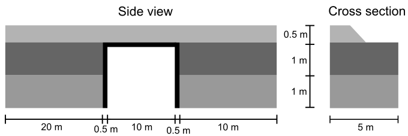
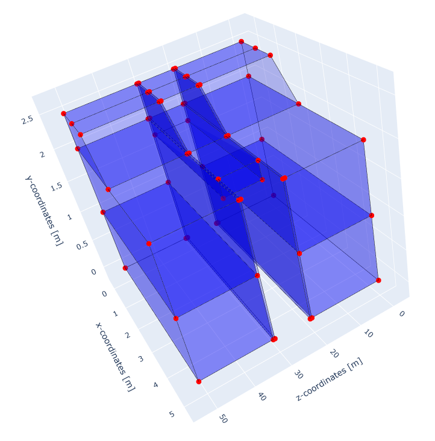

.. _tutorial3:

Embankment over bridge
======================

Overview
--------
This tutorial shows how to set up a 3D geometry where the geometry changes along the z-direction.
The geometry consists of an embankment with two soil layers underneath, with a bridge halfway the model.
A moving load is applied on top of the embankment and moves in the z-direction at constant velocity.

This figure illustrates the geometry of the model.

Imports and setup
-----------------
First the necessary packages are imported and the input folder is defined.

.. code-block:: python

    input_files_dir = "embankment_bridge"

    from stem.model import Model
    from stem.soil_material import OnePhaseSoil, LinearElasticSoil, SoilMaterial, SaturatedBelowPhreaticLevelLaw
    from stem.load import MovingLoad
    from stem.boundary import DisplacementConstraint, AbsorbingBoundary
    from stem.solver import AnalysisType, SolutionType, TimeIntegration, DisplacementConvergenceCriteria, \
        LinearNewtonRaphsonStrategy, StressInitialisationType, SolverSettings, NewmarkScheme, Cg, Problem
    from stem.output import NodalOutput, VtkOutputParameters, JsonOutputParameters
    from stem.stem import Stem

..    # END CODE BLOCK

For setting up the model, ``Model`` is imported from ``stem.model``.
For the soil material, ``OnePhaseSoil``, ``LinearElasticSoil``, ``SoilMaterial``,
and ``SaturatedBelowPhreaticLevelLaw`` are imported from ``stem.soil_material``.
In this case, a moving load is applied, therefore ``MovingLoad`` is imported from ``stem.load``.
Boundary conditions are set using ``DisplacementConstraint``.
Solver settings are defined with classes imported from ``stem.solver``.
For output, ``NodalOutput`` and ``VtkOutputParameters`` are imported.
Finally, ``Stem`` is imported from ``stem.stem`` to write input files and run the calculation.

Geometry and materials
----------------------
In this step, the geometry, and material parameters for the simulation are defined.
First the dimension of the model is indicated which in this case is 3.
After which the model can be initialised.

.. code-block:: python

    ndim = 3
    model = Model(ndim)

..    # END CODE BLOCK

In order to change the geometry along the z-direction, it is required to divide the model into groups, that will have
different extrusion lengths and reference depths.
All groups need to have an unique name, which is used to assign soil layers to the groups later on.
In this example 3 groups are created, "group_1", "group_2" and "group_3".
The first group defines the soil geometry between the z-coordinates of 0 and 20 meter,
the second group defines the bridge geometry between the z-coordinates of 20 and 30 meter,
and the third group defines the soil geometry between the z-coordinates of 30 and 50 meter.
The total extrusion length of the model is 50 meter.
To create the groups, the ``add_group_for_extrusion`` method of the model is used,
where the unique `name` of the group, the `reference_depth` and the `extrusion_length` are given as input:

.. code-block:: python

    model.add_group_for_extrusion("group_1", reference_depth=0.0, extrusion_length=20.0)
    model.add_group_for_extrusion("group_2", reference_depth=20.0, extrusion_length=0.5)
    model.add_group_for_extrusion("group_3", reference_depth=20.5, extrusion_length=10.0)
    model.add_group_for_extrusion("group_4", reference_depth=30.5, extrusion_length=0.5)
    model.add_group_for_extrusion("group_5", reference_depth=31.0, extrusion_length=20.0)

..    # END CODE BLOCK

The soil profile consists of two layers with an embankment on top.
The material for the bridge also needs to be defined.

The bottom soil layer is defined as a material with the name “soil_1”.
It is a Linear elastic material model with the solid density of 2650 kg/m3,
the Young's modulus is 30e6 Pa and the Poisson's ratio is of 0.2.
A porosity of  of 0.3 is specified.
The soil is a one-phase soil, meaning that the flow of water through the soil is not computed.

.. code-block:: python

    solid_density_1 = 2650
    porosity_1 = 0.3
    young_modulus_1 = 30e6
    poisson_ratio_1 = 0.2
    soil_formulation_1 = OnePhaseSoil(ndim, IS_DRAINED=True, DENSITY_SOLID=solid_density_1, POROSITY=porosity_1)
    constitutive_law_1 = LinearElasticSoil(YOUNG_MODULUS=young_modulus_1, POISSON_RATIO=poisson_ratio_1)
    retention_parameters_1 = SaturatedBelowPhreaticLevelLaw()
    material_soil_1 = SoilMaterial("soil_1", soil_formulation_1, constitutive_law_1, retention_parameters_1)

..    # END CODE BLOCK

The second soil layer is defined as a material with the name "soil_2".
It's a Linear elastic material model with the solid density of 2550 kg/m3,
the Young's modulus is 30e6 Pa and the Poisson's ratio is 0.2.
A porosity of 0.3 is specified.
The soil is a one-phase soil, meaning that the flow of water through the soil is not computed.

.. code-block:: python

    solid_density_2 = 2550
    porosity_2 = 0.3
    young_modulus_2 = 30e6
    poisson_ratio_2 = 0.2
    soil_formulation_2 = OnePhaseSoil(ndim, IS_DRAINED=True, DENSITY_SOLID=solid_density_2, POROSITY=porosity_2)
    constitutive_law_2 = LinearElasticSoil(YOUNG_MODULUS=young_modulus_2, POISSON_RATIO=poisson_ratio_2)
    retention_parameters_2 = SaturatedBelowPhreaticLevelLaw()
    material_soil_2 = SoilMaterial("soil_2", soil_formulation_2, constitutive_law_2, retention_parameters_2)

..    # END CODE BLOCK

The embankment layer on top is defined as a material with the name "embankment".
It's a Linear elastic material model with the solid density of 2650 kg/m3,
the Young's modulus is 10e6 Pa and the Poisson's ratio is 0.2.
A porosity of 0.3 is specified.
The soil is a one-phase soil, meaning that the flow of water through the soil is not computed.

.. code-block:: python

    solid_density_3 = 2650
    porosity_3 = 0.3
    young_modulus_3 = 10e6
    poisson_ratio_3 = 0.2
    soil_formulation_3 = OnePhaseSoil(ndim, IS_DRAINED=True, DENSITY_SOLID=solid_density_3, POROSITY=porosity_3)
    constitutive_law_3 = LinearElasticSoil(YOUNG_MODULUS=young_modulus_3, POISSON_RATIO=poisson_ratio_3)
    retention_parameters_3 = SaturatedBelowPhreaticLevelLaw()
    material_embankment = SoilMaterial("embankment", soil_formulation_3, constitutive_law_3, retention_parameters_3)

..    # END CODE BLOCK

The bridge layer is defined as a material with the name "bridge".
It is a Linear elastic material model with the solid density of 2400 kg/m3,
the Young's modulus is 30e9 Pa and the Poisson's ratio is 0.2.
A porosity of 0.3 is specified.
The soil is a one-phase soil, meaning that the flow of water through the soil is not computed.

.. code-block:: python

    solid_density_4 = 2400
    porosity_4 = 0.3
    young_modulus_4 = 30e9
    poisson_ratio_4 = 0.2
    soil_formulation_4 = OnePhaseSoil(ndim, IS_DRAINED=True, DENSITY_SOLID=solid_density_4, POROSITY=porosity_4)
    constitutive_law_4 = LinearElasticSoil(YOUNG_MODULUS=young_modulus_4, POISSON_RATIO=poisson_ratio_4)
    retention_parameters_4 = SaturatedBelowPhreaticLevelLaw()
    material_bridge = SoilMaterial("bridge", soil_formulation_4, constitutive_law_4, retention_parameters_4)

..    # END CODE BLOCK

The geometry of the model is defined afterwards.
Each layer is defined by a list of coordinates, defined in the x-y plane. The coordinates are defined in clockwise or
anti-clockwise order, and the first and last coordinates are not the same, since the geometry will be closed.

The model consists of two soil layers and an embankment on top for "group_1" and "group_3", and a bridge for "group_2".
This means that the geometry of "group_1" and "group_3" is the same, but the geometry of "group_2" is different.
When assigning the geometry into the model, it is necessary to assign the layers into groups.
The soil layers are added to "group_1" and "group_3", and the bridge layer is added to "group_2".

.. code-block:: python

    # definition of the geometry layers for group 1
    soil1_coordinates_1 = [(0.0, 0.0, 0.0), (5.0, 0.0, 0.0), (5.0, 1.0, 0.0), (0.0, 1.0, 0.0)]
    soil2_coordinates_1 = [(0.0, 1.0, 0.0), (5.0, 1.0, 0.0), (5.0, 2.0, 0.0), (0.0, 2.0, 0.0)]
    embankment_coordinates_1 = [(0.0, 2.0, 0.0), (2.5, 2.0, 0.0), (1.5, 2.5, 0.0), (0.75, 2.5, 0.0), (0, 2.5, 0.0)]

    wall_coordinates_1 = [(0.0, 0.0, 20.0), (5.0, 0.0, 20.0), (5.0, 2.0, 20.0), (0.0, 2.0, 20.0)]
    embankment_coordinates_wall_1 = [(0.0, 2.0, 20.0), (2.5, 2.0, 20.0), (1.5, 2.5, 20.0), (0.75, 2.5, 20.0), (0, 2.5, 20.0)]

    # definition of the geometry for group 2
    bridge_coordinates = [(0.0, 1.75, 20.5), (4.0, 1.75, 20.5), (4.0, 2.0, 20.5), (0., 2.0, 20.5)]
    embankment_coordinates_bridge = [(0.0, 2.0, 20.5), (2.5, 2.0, 20.5), (1.5, 2.5, 20.5), (0.75, 2.5, 20.5), (0, 2.5, 20.5)]

    wall_coordinates_2 = [(0.0, 0.0, 30.5), (5.0, 0.0, 30.5), (5.0, 2.0, 30.5), (0.0, 2.0, 30.5)]
    embankment_coordinates_wall_2 = [(0.0, 2.0, 30.5), (2.5, 2.0, 30.5), (1.5, 2.5, 30.5), (0.75, 2.5, 30.5), (0, 2.5, 30.5)]

    # definition of the geometry for group 3
    soil1_coordinates_2 = [(0.0, 0.0, 31.0), (5.0, 0.0, 31.0), (5.0, 1.0, 31.0), (0.0, 1.0, 31.0)]
    soil2_coordinates_2 = [(0.0, 1.0, 31.0), (5.0, 1.0, 31.0), (5.0, 2.0, 31.0), (0.0, 2.0, 31.0)]
    embankment_coordinates_2 = [(0.0, 2.0, 31.0), (2.5, 2.0, 31.0), (1.5, 2.5, 31.0), (0.75, 2.5, 31.0), (0, 2.5, 31.0)]

    # assign materials to geometry and add to model for group 1
    model.add_soil_layer_by_coordinates(soil1_coordinates_1, material_soil_1, "soil1_group_1", "group_1")
    model.add_soil_layer_by_coordinates(soil2_coordinates_1, material_soil_2, "soil2_group_1", "group_1")
    model.add_soil_layer_by_coordinates(embankment_coordinates_1, material_embankment, "embankment_group_1", "group_1")

    # assign materials to geometry and add to model for group 2
    model.add_soil_layer_by_coordinates(wall_coordinates_1, material_bridge, "bridge_group_2", "group_2")
    model.add_soil_layer_by_coordinates(embankment_coordinates_wall_1, material_embankment, "embankment_group_2", "group_2")

    # assign materials to geometry and add to model for group 3
    model.add_soil_layer_by_coordinates(bridge_coordinates, material_bridge, "bridge_group_3", "group_3")
    model.add_soil_layer_by_coordinates(embankment_coordinates_bridge, material_embankment, "embankment_group_3", "group_3")

    # assign materials to geometry and add to model for group 4
    model.add_soil_layer_by_coordinates(wall_coordinates_2, material_bridge, "bridge_group_4", "group_4")
    model.add_soil_layer_by_coordinates(embankment_coordinates_wall_2, material_embankment, "embankment_group_4", "group_4")

    # assign materials to geometry and add to model for group 5
    model.add_soil_layer_by_coordinates(soil1_coordinates_2, material_soil_1, "soil1_group_5", "group_5")
    model.add_soil_layer_by_coordinates(soil2_coordinates_2, material_soil_2, "soil2_group_5", "group_5")
    model.add_soil_layer_by_coordinates(embankment_coordinates_2, material_embankment, "embankment_group_5", "group_5")

..    # END CODE BLOCK

The geometry of the model is shown in this figure.

Load
----
The moving load is modelled using the ``MovingLoad`` class.
The load is defined following a list of coordinates.
In this case, a moving load is applied along a line located at 0.75 m distance from the x-axis on top of the embankment.
The velocity of the moving load is 50 m/s and the load is -10000 N in the y-direction.
The load moves in positive z-direction and the load starts at coordinates: [0.75, 2.5, 0.0].

It is possible to use different types of loads. Please refer to :doc:`loads` for more information on the different
load types and how to define them.

.. code-block:: python

    load_coordinates = [(0.75, 2.5, 0.0), (0.75, 2.5, 51.0)]
    moving_load = MovingLoad(load=[0.0, -10000.0, 0.0], direction_signs=[1, 1, 1], velocity=50, origin=[0.75, 2.5, 0.0],
                                offset=0.0)
    model.add_load_by_coordinates(load_coordinates, moving_load, "moving_load")

..    # END CODE BLOCK

Boundary conditions
-------------------
Below the boundary conditions are defined. In this model the boundary conditions consist of a fixed base,
allong the symmetry plane, and absorbing boundaries on the sides of the model to prevent reflections.

The base of the model is fixed in all directions with the name "base_fixed".
For the surface at the symmetry plane, roller boundary condition is applied with the name "sides_roller".
To prevent reflections from the sides of the model, absorbing boundaries are applied with virtual thickness of 10 m.
The boundary conditions are added to the model on the edge surfaces.
The boundary conditions are applied on plane surfaces defined by a list of coordinates.

.. code-block:: python

    no_displacement_parameters = DisplacementConstraint(is_fixed=[True, True, True], value=[0, 0, 0])
    roller_displacement_parameters = DisplacementConstraint(is_fixed=[True, False, True], value=[0, 0, 0])
    absorbing_boundaries_parameters = AbsorbingBoundary(absorbing_factors=[1.0, 1.0], virtual_thickness=10.0)

    model.add_boundary_condition_on_plane([(0, 0, 0), (0, 0, 51), (5, 0, 0)], no_displacement_parameters,"base_fixed")
    model.add_boundary_condition_on_plane([(0, 0, 0), (0, 0, 51), (0, 3, 0)], roller_displacement_parameters, "sides_roller")

    model.add_boundary_condition_on_plane([(0, 0, 0), (5, 0, 0), (5, 3, 0)],absorbing_boundaries_parameters, "abs_z=0")
    model.add_boundary_condition_on_plane([(0, 0, 51), (5, 0, 51), (5, 3, 51)],absorbing_boundaries_parameters, "abs_z=51")
    model.add_boundary_condition_on_plane([(5, 0, 0), (5, 3, 0), (5, 0, 51)], absorbing_boundaries_parameters, "abs_x=5")

..    # END CODE BLOCK

Alternatively, the boundary conditions can also be added by geometry IDs. Please see :ref:`tutorial2` for more
information on how to add boundary conditions by geometry IDs.

Mesh
----
The mesh size and element order are defined.
The element size for the mesh can be defined as a single value, which will applied to the whole model.

.. code-block:: python

    model.set_mesh_size(element_size=2.0)

..    # END CODE BLOCK

Alternatively, the element size can also be defined for each soil layer separately.
In this case "bridge_group_2", "bridge_group_3" and "bridge_group_4" have an element size of 0.5,
while "embankment_group_2" has an element size of 0.5. All the remaining groups have an element size of 2.0,
which is defined as the default element size for the model.

.. code-block:: python2

    model.set_mesh_size(element_size=2.0)

    model.set_element_size_of_group(element_size=0.5, group_name="bridge_group_2")
    model.set_element_size_of_group(element_size=0.5, group_name="bridge_group_3")
    model.set_element_size_of_group(element_size=0.5, group_name="bridge_group_4")
    model.set_element_size_of_group(element_size=0.5, group_name="embankment_group_2")

..    # END CODE BLOCK

Solver settings
---------------
Now that the model is defined, the solver settings should be set.
The analysis type is set to `MECHANICAL` and the solution type is set to `DYNAMIC`.

Then the start time is set to 0.0 s and the end time is set to 1.0 s. The time step for the analysis is set to 0.01 s.
Furthermore, the reduction factor and increase factor are set to 1.0, such that the time step size is constant throughout
the simulation. Displacement convergence criteria is set to 1.0e-4 for the relative tolerance and 1.0e-9 for the
absolute tolerance.
Since the problem is linear elastic, `Linear-Newton-Raphson` is used as a solving strategy (Newmark explicit solver).
`Cg` is used as a linear solver. Stresses are not initialised since the `stress_initialisation_type` is set to `NONE`.
Other options are `StressInitialisationType.GRAVITY_LOADING` and `StressInitialisationType.K0_PROCEDURE`.
Since the problem is linear elastic, the stiffness matrix is constant and the mass and damping matrices are constant,
defining the matrices as constant will speed up the computation.

The Rayleigh damping parameters are set to :math:`\alpha = 0.248` and :math:`\beta = 7.86 \cdot 10^{-5}`, which
correspond to a damping ratio of 2% for 1 and 80 Hz.

.. code-block:: python

    analysis_type = AnalysisType.MECHANICAL
    solution_type = SolutionType.DYNAMIC
    # Set up start and end time of calculation, time step
    time_integration = TimeIntegration(start_time=0.0, end_time=1.0, delta_time=0.01, reduction_factor=1.0,
                                       increase_factor=1.0)
    convergence_criterion = DisplacementConvergenceCriteria(displacement_relative_tolerance=1.0e-4,
                                                            displacement_absolute_tolerance=1.0e-9)
    strategy_type = LinearNewtonRaphsonStrategy()
    scheme_type = NewmarkScheme()
    linear_solver_settings = Cg()
    stress_initialisation_type = StressInitialisationType.NONE
    solver_settings = SolverSettings(analysis_type=analysis_type, solution_type=solution_type,
                                        stress_initialisation_type=stress_initialisation_type,
                                        time_integration=time_integration,
                                        is_stiffness_matrix_constant=True, are_mass_and_damping_constant=True,
                                        convergence_criteria=convergence_criterion,
                                        strategy_type=strategy_type, scheme=scheme_type,
                                        linear_solver_settings=linear_solver_settings,
                                        rayleigh_k=7.86e-5,
                                        rayleigh_m=0.248)

..    # END CODE BLOCK

Problem and output
------------------
The problem definition is added to the model.
The problem name is set to "bridge",
the number of threads is set to 8 and the solver settings are applied.

.. code-block:: python

    problem = Problem(problem_name="bridge", number_of_threads=8,
                      settings=solver_settings)
    model.project_parameters = problem

..    # END CODE BLOCK

Before starting the calculation, it is required to specify the desired output. In this case, displacement,
and velocity are requested on the nodes and written into VTK files.
Gauss point results (stresses) are left empty.

The JSON output file is requested at two points located in the surface of the embankment, along the path of the
moving load. One point is located before the bridge (0.75, 2.5, 10.0), and another point in the middle of the bridge
(0.75, 2.5, 25).

The output process is added to the model using the ``Model.add_output_settings`` method.
The results are written to the output directory in VTK format.
In this case, the output interval is set to 1 and the output control type is set to `step`, meaning that the
results will be written every time step.

.. code-block:: python

    json_output_parameters = JsonOutputParameters(0.01, [NodalOutput.DISPLACEMENT], [])

    model.add_output_settings_by_coordinates([
        (0.75, 2.5, 10.0),
        (0.75, 2.5, 25.0)
        ],
        json_output_parameters,
        "json_output")

    nodal_results = [NodalOutput.DISPLACEMENT, NodalOutput.VELOCITY]
    gauss_point_results = []

     model.add_output_settings(
        part_name="porous_computational_model_part",
        output_name="vtk_output",
        output_dir="output",
        output_parameters=VtkOutputParameters(
            output_interval=1,
            nodal_results=nodal_results,
            gauss_point_results=gauss_point_results,
            output_control_type="step"
        )
    )

..    # END CODE BLOCK

Run
---
Now that the model is set up, the calculation is ready to run.

Firstly the Stem class is initialised, with the model and the directory where the input files will be written to.
While initialising the Stem class, the mesh will be generated.
This is followed by writing all the input files required to run the calculation.
The calculation is run by calling ``stem.run_calculation()``.

.. code-block:: python

    stem = Stem(model, input_files_dir)
    stem.write_all_input_files()
    stem.run_calculation()

..    # END CODE BLOCK

Results
-------
Once the calculation is finished, the results can be visualised using Paraview,
or by loading the JSON output file.

.. seealso::

    - Previous: :ref:`tutorial2`
    - Next: :ref:`tutorial4`