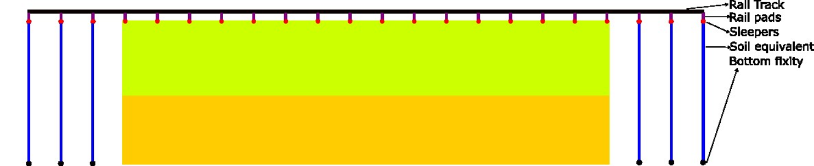
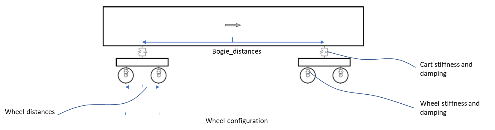

STEM tutorials
==============

.. _tutorial3:

Train model (UVEC) on track and embankment in 3D with irregularities
--------------------------------------------------------------------
This tutorial shows step by step guide on how to set up a train model
on top of track on an embankment with two soil layers underneath, in a 3D model.
The UVEC (User defined VEhiCle model) is a model used to represent a train as dynamic loads on the system, and
the irregularities in the contact between the wheel and the rail are modelled using the UVEC.

In order to use the UVEC you need to import the UVEC package, together with all the remaining packages.

.. code-block:: python

    input_files_dir = "uvec_train_model"
    results_dir = "output_uvec_train_model"

    import UVEC.uvec_ten_dof_vehicle_2D as uvec
    from stem.model import Model
    from stem.soil_material import OnePhaseSoil, LinearElasticSoil, SoilMaterial, SaturatedBelowPhreaticLevelLaw
    from stem.structural_material import ElasticSpringDamper, NodalConcentrated
    from stem.default_materials import DefaultMaterial
    from stem.load import MovingLoad, UvecLoad
    from stem.boundary import DisplacementConstraint, AbsorbingBoundary
    from stem.additional_processes import ParameterFieldParameters
    from stem.field_generator import RandomFieldGenerator
    from stem.solver import AnalysisType, SolutionType, TimeIntegration, DisplacementConvergenceCriteria,\
         LinearNewtonRaphsonStrategy, NewmarkScheme, Cg, StressInitialisationType, SolverSettings, Problem
    from stem.output import NodalOutput, VtkOutputParameters, Output, JsonOutputParameters
    from stem.stem import Stem

    # END CODE BLOCK

For setting up the model, Model class is imported from stem.model. And for setting up the soil material, OnePhaseSoil,
LinearElasticSoil, SoilMaterial, SaturatedBelowPhreaticLevelLaw classes are imported.
In this tutorial, a train model load (modelled using the UVEC) is used on top of a track.
For this purpose, the ElasticSpringDamper and NodalConcentrated classes are imported from stem.structural_material,
the UvecLoad class is imported from stem.load.

To define the default rail properties, the DefaultMaterial class is imported.
As for setting the boundary conditions, the DisplacementConstraint class and the AbsorbingBoundary class are imported
from stem.boundary. For setting up the solver settings, necessary classes are imported from stem.solver.
Classes needed for the output, are NodalOutput, VtkOutputParameters and Output which are imported from stem.output.
Lastly, the Stem class is imported from stem.stem, in order to run the simulation.

In this tutorial, a random field is also added on the soil layers. For this the classes ParameterFieldParameters is
imported from stem.additional_processes and RandomFieldGenerator is imported from stem.field_generator.

In this step, the geometry, conditions, and material parameters for the simulation are defined.
Firstly the dimension of the model is indicated which in this case is 3. After which the model can be initialised.

.. code-block:: python

    ndim = 3
    model = Model(ndim)

    # END CODE BLOCK

Specification of the soil material is defined afterwards.
The bottom soil layer is defined as a material with the name "soil_1".
It's a Linear elastic material model with the solid density (rho) of 2650 kg/m3,
the Young's modulus is 30e6 Pa and the Poisson's ratio is 0.2.
The soil is dry above the phreatic level and wet below the phreatic level. A porosity of 0.3 is specified.
The soil is a one-phase soil, meaning that the flow of water through the soil is not computed.

.. code-block:: python

    solid_density_1 = 2650
    porosity_1 = 0.3
    young_modulus_1 = 30e6
    poisson_ratio_1 = 0.2
    soil_formulation_1 = OnePhaseSoil(ndim, IS_DRAINED=True, DENSITY_SOLID=solid_density_1, POROSITY=porosity_1)
    constitutive_law_1 = LinearElasticSoil(YOUNG_MODULUS=young_modulus_1, POISSON_RATIO=poisson_ratio_1)
    retention_parameters_1 = SaturatedBelowPhreaticLevelLaw()
    material_soil_1 = SoilMaterial("soil_1", soil_formulation_1, constitutive_law_1, retention_parameters_1)

    # END CODE BLOCK

The second soil layer is defined as a material with the name "soil_2".
It's a Linear elastic material model with the solid density (rho) of 2550 kg/m3,
the Young's modulus is 30e6 Pa and the Poisson's ratio is 0.2.
The soil is dry above the phreatic level and wet below the phreatic level. A porosity of 0.3 is specified.
The soil is a one-phase soil, meaning that the flow of water through the soil is not computed.

.. code-block:: python

    solid_density_2 = 2550
    porosity_2 = 0.3
    young_modulus_2 = 30e6
    poisson_ratio_2 = 0.2
    soil_formulation_2 = OnePhaseSoil(ndim, IS_DRAINED=True, DENSITY_SOLID=solid_density_2, POROSITY=porosity_2)
    constitutive_law_2 = LinearElasticSoil(YOUNG_MODULUS=young_modulus_2, POISSON_RATIO=poisson_ratio_2)
    retention_parameters_2 = SaturatedBelowPhreaticLevelLaw()
    material_soil_2 = SoilMaterial("soil_2", soil_formulation_2, constitutive_law_2, retention_parameters_2)

    # END CODE BLOCK

The embankment layer on top is defined as a material with the name "embankment".
It's a Linear elastic material model with the solid density (rho) of 2650 kg/m3,
the Young's modulus is 10e6 Pa and the Poisson's ratio is 0.2.
The soil is dry above the phreatic level and wet below the phreatic level. A porosity of 0.3 is specified.
The soil is a one-phase soil, meaning that the flow of water through the soil is not computed.

.. code-block:: python

    solid_density_3 = 2650
    porosity_3 = 0.3
    young_modulus_3 = 10e6
    poisson_ratio_3 = 0.2
    soil_formulation_3 = OnePhaseSoil(ndim, IS_DRAINED=True, DENSITY_SOLID=solid_density_3, POROSITY=porosity_3)
    constitutive_law_3 = LinearElasticSoil(YOUNG_MODULUS=young_modulus_3, POISSON_RATIO=poisson_ratio_3)
    retention_parameters_3 = SaturatedBelowPhreaticLevelLaw()
    material_embankment = SoilMaterial("embankment", soil_formulation_3, constitutive_law_3, retention_parameters_3)

    # END CODE BLOCK

For the rails, default properties of a  54E1 rail profile are used.
Other rail profiles for which default material properties are provided are: the 46E3 and 60E1 rail profiles.
The rail pads are modelled by means of elastic spring dampers while the sleepers are modelled using nodal concentrated
masses.

.. code-block:: python

    rail_parameters = DefaultMaterial.Rail_54E1_3D.value.material_parameters
    rail_pad_parameters = ElasticSpringDamper(NODAL_DISPLACEMENT_STIFFNESS=[0, 750e6, 0],
                                              NODAL_ROTATIONAL_STIFFNESS=[0, 0, 0],
                                              NODAL_DAMPING_COEFFICIENT=[0, 750e3, 0], # damping coefficient [Ns/m]
                                              NODAL_ROTATIONAL_DAMPING_COEFFICIENT=[0, 0, 0])
    sleeper_parameters = NodalConcentrated(NODAL_DISPLACEMENT_STIFFNESS=[0, 0, 0],
                                           NODAL_MASS=140,
                                           NODAL_DAMPING_COEFFICIENT=[0, 0, 0])

    # END CODE BLOCK

The coordinates of the model are defined in the following way. Each of the layers are defined by a list of coordinates,
defined in th x-y plane. For 3D models, the x-y plane can be extruded in the z-direction. In this case, the extrusion
length is 50 m in the z-direction.

.. code-block:: python

    soil1_coordinates = [(0.0, 0.0, 0.0), (5.0, 0.0, 0.0), (5.0, 1.0, 0.0), (0.0, 1.0, 0.0)]
    soil2_coordinates = [(0.0, 1.0, 0.0), (5.0, 1.0, 0.0), (5.0, 2.0, 0.0), (0.0, 2.0, 0.0)]
    embankment_coordinates = [(0.0, 2.0, 0.0), (3.0, 2.0, 0.0), (1.5, 3.0, 0.0), (0.75, 3.0, 0.0), (0, 3.0, 0.0)]
    model.extrusion_length = 50

    # END CODE BLOCK

The geometry is shown in the figures below.

.. image:: _static/embankment_1.png

.. image:: _static/embankment_2.png

The soil layers are then added to the model in the following way. It is important that all soil layers have
a unique name.

.. code-block:: python

    model.add_soil_layer_by_coordinates(soil1_coordinates, material_soil_1, "soil_layer_1")
    model.add_soil_layer_by_coordinates(soil2_coordinates, material_soil_2, "soil_layer_2")
    model.add_soil_layer_by_coordinates(embankment_coordinates, material_embankment, "embankment_layer")

    # END CODE BLOCK

Generating the train track
--------------------------

STEM provides two options to generate a straight track:

1. A straight track with rails, sleepers and rail pads. This track is placed on top of the 2D or 3D geometry.

2. A straight track with rails, sleepers, rail pads and an extension of the track outside the 2D or 3D geometry. This extension is placed on 1D elements which simulate the soil behaviour.

**Option 1: Straight track with rails, sleepers and rail pads**

The tracks are added by specifying the origin point of the track and the direction for the extrusion that creates
the rail as well as rail pads and sleepers. Important is that the origin point and the end of the track lie on
geometry edges. In this tutorial, a straight track is generated parallel to the z-axis at 0.75 m distance from the x-axis,
on top of the embankment. To do this, the origin point of the track is set with coordinates [0.75, 3.0, 0.0] and the
extrusion is done parallel to the positive z-axis, i.e. with a direction vector of [0, 0, 1].
The length of the track is defined by the number of sleepers and their spacing.
In this tutorial, 101 sleepers are placed which are connected by to the rail by 0.025m thick railpads. The sleepers
are spaced 0.5m from each others which results in a 50m straight track, with part name "rail_track_1."

.. code-block:: python

    origin_point = [0.75, 3.0, 0.0]
    direction_vector = [0, 0, 1]
    number_of_sleepers = 101
    sleeper_spacing = 0.5
    rail_pad_thickness = 0.025

    model.generate_straight_track(sleeper_spacing, number_of_sleepers, rail_parameters,
                                  sleeper_parameters, rail_pad_parameters,
                                  rail_pad_thickness, origin_point,
                                  direction_vector, "rail_track_1")

    # END CODE BLOCK

**Option 2: Extended straight track with rails, sleepers, rail pads and 1D soil elements.**

When applying a moving train load to the track, we are often interested in the dynamic response of a specific area of
the track. This requires the generated geometry to be large enough to ensure that the initial train load has not yet
reached or influenced the area of interest. However, this results in a significantly larger geometry, which, in turn,
increases computational cost.

To reduce the computational cost, an alternative approach can be used with STEM. The area of interest is still modelled
as described above but is extended with a soil-equivalent section that simulates soil behavior using 1D elements.
The equivalent geometry consists of the following parts:

- The extended track outside the soil domain (this is the same as on the soil domain).
- Soil equivalent 1D elements.
  With extra boundary conditions that makes sure that these elements can only move vertically.
- Bottom fixity.

The equivalent soil part is added to the model in the following way. Note that:

- The origin point is moved 25m in the negative z-direction. Such that the track starts 25m away from the 3D domain.
- The number of sleepers is increased to 190, such that 90 sleepers are added outside the 3D domain.
- The length of the soil equivalent element is set to 3m. Which means that the equivalent soil part extends 3m in y-direction ( in depth).
- The soil equivalent parameters are defined as ElasticSpringDamper. These parameters should be defined by the user
   to ensure that the displacements in the extended part of the track closely match those in the section of the track
   located above the 3D domain. This minimises boundary effects when the train transitions from the extended part to the
   3D domain.

The following parameters can be defined in this tutorial:

- NODAL_DISPLACEMENT_STIFFNESS=[0, 8163265.143, 0]
- NODAL_ROTATIONAL_STIFFNESS=[0, 0, 0]
- NODAL_DAMPING_COEFFICIENT=[0, 1, 0]
- NODAL_ROTATIONAL_DAMPING_COEFFICIENT=[0, 0, 0]

.. code-block:: python2

    origin_point = [0.75, 3.0, -25.0]
    direction_vector = [0, 0, 1]
    sleeper_spacing = 0.5
    rail_pad_thickness = 0.025
    number_of_sleepers = 190
    length_soil_equivalent_element = 3

    soil_equivalent_parameters = ElasticSpringDamper(NODAL_DISPLACEMENT_STIFFNESS=[0, 8163265.143, 0],
                                                     NODAL_ROTATIONAL_STIFFNESS=[0, 0, 0],
                                                     NODAL_DAMPING_COEFFICIENT=[0, 1, 0],
                                                     NODAL_ROTATIONAL_DAMPING_COEFFICIENT=[0, 0, 0])

    # create a straight track with rails, sleepers, rail pads and a 1D soil extension
    model.generate_extended_straight_track(sleeper_distance=sleeper_spacing,
                                           n_sleepers=number_of_sleepers,
                                           rail_parameters=rail_parameters,
                                           sleeper_parameters=sleeper_parameters,
                                           rail_pad_parameters=rail_pad_parameters,
                                           rail_pad_thickness=rail_pad_thickness,
                                           origin_point=origin_point,
                                           soil_equivalent_parameters=soil_equivalent_parameters,
                                           length_soil_equivalent_element=length_soil_equivalent_element,
                                           direction_vector=direction_vector,
                                           name="rail_track_1")

    # END CODE BLOCK

Visualising the geometry, the track and the equivalent soil part are shown in the figure below.

.. image:: _static/embankment_extended.png

The UVEC model is then defined using the UvecLoad class. The train moves in positive direction from the origin, this is
defined in `direction=[1, 1, 1]`, values greater than 0 indicate positive direction, values smaller than 0 indicate
negative direction. The velocity of the train is 40 m/s. The train starts moving from the origin point, which has to be
located on top of the track, that includes an extra thickness of the rail-pad, as shown above in `rail_pad_thickness`.
The wheel configuration is defined as a list of distances from the origin point to the wheels. The `uvec_model` is the
imported UVEC train model. The `uvec_parameters` parameter is a dictionary which contains the parameters of the
UVEC model. The UVEC load is added on top of the previously defined track with the name "rail_track_1". And the name
of the load is set to "train_load". The user can also define a custom made UVEC model. In order to achieve this, it
needs to provide the `uvec_file` and `uvec_function_name` as parameters in the UvecLoad class. The `uvec_file` is the
path to the UVEC model file and the `uvec_function_name` is the name of the function in the UVEC model file.
The `static_initialisation` parameter is set to False, which means that the UVEC model is not statically initialised,
but rather dynamically initialised. It is important to choose the right initialisation method in accordance to the
desired solver (quasi-static or dynamic).
To apply irregularities to the UVEC model, the user can define the `irr_parameters` key with parameters `Av` and `seed`.
The `Av` parameter is the amplitude of the irregularities and the `seed` parameter is used for reproducibility of the
random process. The irregularities are modelled following :cite:`Zhang_2001`, and the parameter `Av` can be estimated
based on the track quality :cite:`Lei_Noda_2002`.
In case that irregularities are not required, the `irr_parameters` key must be omitted.

.. table:: Track quality classification and corresponding Av values
    :widths: 50 50

    +-----------------+------------------------+
    | Line grade      | Av Value (m² rad / m)  |
    +=================+========================+
    | 1 (very poor)   | 1.2107e-4              |
    +-----------------+------------------------+
    | 2               | 1.0181e-4              |
    +-----------------+------------------------+
    | 3               | 0.6816e-4              |
    +-----------------+------------------------+
    | 4               | 0.5376e-4              |
    +-----------------+------------------------+
    | 5               | 0.2095e-4              |
    +-----------------+------------------------+
    | 6 (very good)   | 0.0339e-4              |
    +-----------------+------------------------+

A schematisation of the UVEC model as defined in this tutorial, is shown below.

Below the uvec parameters are defined.

.. code-block:: python

    wheel_configuration = [0.0, 2.5, 19.9, 22.4] # distances of the wheels from the origin point [m]
    velocity = 40  # velocity of the UVEC [m/s]
    # define uvec parameters
    uvec_parameters = {"n_carts": 1, # number of carts [-]
                       "cart_inertia": (1128.8e3) / 2, # inertia of the cart [kgm2]
                       "cart_mass": (50e3) / 2, # mass of the cart [kg]
                       "cart_stiffness": 2708e3, # stiffness between the cart and bogies [N/m]
                       "cart_damping": 64e3, # damping coefficient between the cart and bogies [Ns/m]
                       "bogie_distances": [-9.95, 9.95], # distances of the bogies from the centre of the cart [m]
                       "bogie_inertia": (0.31e3) / 2, # inertia of the bogie [kgm2]
                       "bogie_mass": (6e3) / 2, # mass of the bogie [kg]
                       "wheel_distances": [-1.25, 1.25], # distances of the wheels from the centre of the bogie [m]
                       "wheel_mass": 1.5e3, # mass of the wheel [kg]
                       "wheel_stiffness": 4800e3, # stiffness between the wheel and the bogie [N/m]
                       "wheel_damping": 0.25e3, # damping coefficient between the wheel and the bogie [Ns/m]
                       "gravity_axis": 1, # axis on which gravity works [x =0, y = 1, z = 2]
                       "contact_coefficient": 9.1e-7, # Hertzian contact coefficient between the wheel and the rail [N/m]
                       "contact_power": 1.0, # Hertzian contact power between the wheel and the rail [-]
                       "static_initialisation": False, # True if the analysis of the UVEC is static
                       "wheel_configuration": wheel_configuration, # initial position of the wheels [m]
                       "velocity": velocity, # velocity of the UVEC [m/s]
                       "irr_parameters": {
                                "Av": 2.095e-05,
                                "seed": 14
                                },
                       }

    # define the UVEC load
    uvec_load = UvecLoad(direction=[1, 1, 1], velocity=velocity, origin=[0.75, 3+rail_pad_thickness, 5],
                         wheel_configuration=wheel_configuration,
                         uvec_model=uvec,
                         uvec_parameters=uvec_parameters)

    # add the load on the tracks
    model.add_load_on_line_model_part("rail_track_1", uvec_load, "train_load")

    # END CODE BLOCK

Additionally, a random field can be generated for one of the defined model part. The random field is generated by
means of the RandomFieldGenerator class. Firstly, the generator object is created. In this tutorial a
Gaussian model is used with 10\% coefficient of variation (cov) and a scale of fluctuation of 1m in the vertical
direction and 20m in the horizontal direction (anisotropy=20) without inclination (angle=0).
For consistency of the random process, the seed for the random generator is fixed to 14.

Subsequently, the field parameters are generated using the ParameterFieldParameters class. In this tutorial, the random
field is applied to the Young's modulus by creating a json file that is read by Kratos Multiphysics (the FEM solver).

Finally, we add the field to the model part of interest. Here the random field is applied to the "soil_layer_2".
The mean of the property is automatically obtained from the material property already defined above (`material_soil_2`).

.. code-block:: python

    random_field_generator = RandomFieldGenerator(
        cov=0.1, v_scale_fluctuation=1,
        anisotropy=[20.0], angle=[0],
        model_name="Gaussian", seed=14
    )

    field_parameters_json = ParameterFieldParameters(
        property_names=["YOUNG_MODULUS"],
        function_type="json_file",
        field_generator=random_field_generator
    )
    # add the random field to the model
    model.add_field(part_name="soil_layer_2", field_parameters=field_parameters_json)

    # END CODE BLOCK

The boundary conditions are defined on geometry ids, which are created by gmsh when making the geometry. Gmsh will
assign an id to each of the points, lines, surfaces and volumes created.
The geometry ids can be seen after using the show_geometry function.

This function is only used for visualisation of the geometry ids after creation of the geometry, to be able to see the
geometry ids issued by gmsh, and to know which ids belong to each boundary conditions.
For visualisation of surface ids, "show_surface_ids" should be set to "True".
For visualisation of line ids, "show_line_ids" and for visualisation of point ids, "show_point_ids"
should be set to "True".

.. code-block:: python

    model.show_geometry(show_surface_ids=True)

    # END CODE BLOCK

Below the boundary conditions are defined. The base of the model is fixed in all directions with the name "base_fixed".
For the surfaces at the symmetry plane, roller boundary condition is applied with the name "sides_roller".
To prevent reflections from the sides of the model, absorbing boundaries are applied with virtual thickness of 40 meters.
The boundary conditions are added to the model on the edge surfaces, i.e. the boundary conditions are applied to a list
of surface ids (which can be visualised using: "model.show_geometry(show_surface_ids=True)")  with the corresponding
surface-dimension, "2".

.. code-block:: python

    no_displacement_parameters = DisplacementConstraint(active=[True, True, True],
                                                        is_fixed=[True, True, True], value=[0, 0, 0])
    roller_displacement_parameters = DisplacementConstraint(active=[True, True, True],
                                                            is_fixed=[True, False, True], value=[0, 0, 0])
    absorbing_boundaries_parameters = AbsorbingBoundary(absorbing_factors=[1.0, 1.0], virtual_thickness=40.0)

    model.add_boundary_condition_by_geometry_ids(2, [1], no_displacement_parameters, "base_fixed")
    model.add_boundary_condition_by_geometry_ids(2, [4, 10, 16], roller_displacement_parameters, "sides_roller")
    model.add_boundary_condition_by_geometry_ids(2, [2, 5, 6, 7, 11, 12, 15, 17, 18], absorbing_boundaries_parameters, "abs")

    # END CODE BLOCK

After which the mesh size can be set. The mesh will be generated when the Stem class is initialised.

.. code-block:: python

    model.set_mesh_size(element_size=1.0)

    # END CODE BLOCK

Now that the geometry is defined, the solver settings of the model has to be set.
The analysis type is set to "MECHANICAL" and the solution type is set to "DYNAMIC".
Then the start time is set to 0.0 second and the end time is set to 0.2 second, note that for the sake of this
tutorial, the end time is kept low, such that the calculation does not take too long. The time step size is set to
0.001 second.Note that in this tutorial, the contact between the uvec and the rails is non-linear, therefore a small
time step size is required, otherwise, the calculation will diverge. Furthermore, the reduction factor and increase
factor are set to 1.0, such that the time step size is constant throughout the simulation. Displacement convergence
criteria is set to 1.0e-4 for the relative tolerance and 1.0e-12 for the
absolute tolerance. Since the problem is linear elastic, Linear-Newton-Raphson is used as a solving strategy.
And Newmark is used for the time integration. Cg is used as a linear solver. Stresses are not initialised since the
"stress_initialisation_type" is set to "NONE". Other options are "StressInitialisationType.GRAVITY_LOADING" and
"StressInitialisationType.K0_PROCEDURE". Since the problem is linear elastic, the stiffness matrix is constant and the mass and
damping matrices are constant, defining the matrices as constant will speed up the computation. Rayleigh damping is
assumed, with a damping coefficient of 0.0002 for the stiffness matrix and 0.6 for the mass matrix.

.. code-block:: python

    end_time = 0.2
    delta_time = 1e-03
    analysis_type = AnalysisType.MECHANICAL
    solution_type = SolutionType.DYNAMIC

    time_integration = TimeIntegration(start_time=0.0, end_time=end_time, delta_time=delta_time,
                                   reduction_factor=1, increase_factor=1, max_delta_time_factor=1000)

    convergence_criterion = DisplacementConvergenceCriteria(displacement_relative_tolerance=1.0e-4,
                                                        displacement_absolute_tolerance=1.0e-12)

    strategy_type = LinearNewtonRaphsonStrategy()
    scheme_type = NewmarkScheme()
    linear_solver_settings = Cg()
    stress_initialisation_type = StressInitialisationType.NONE
    solver_settings = SolverSettings(analysis_type=analysis_type, solution_type=solution_type,
                                     stress_initialisation_type=stress_initialisation_type,
                                     time_integration=time_integration,
                                     is_stiffness_matrix_constant=True, are_mass_and_damping_constant=True,
                                     convergence_criteria=convergence_criterion,
                                     strategy_type=strategy_type, scheme=scheme_type,
                                     linear_solver_settings=linear_solver_settings, rayleigh_k=0.0002,
                                     rayleigh_m=0.6)

    # END CODE BLOCK

Now the problem data should be set up. The problem should be given a name, in this case it is
"calculate_uvec_on_embankment_with_absorbing_boundaries". Then the solver settings are added to the problem.

.. code-block:: python

    # Set up problem data
    problem = Problem(problem_name="calculate_uvec_on_embankment_with_absorbing_boundaries", number_of_threads=4,
                      settings=solver_settings)
    model.project_parameters = problem

    # END CODE BLOCK

Before starting the calculation, it is required to specify which output is desired. In this case, displacement,
velocity and acceleration are given on the nodes and written to the output files. In this test case, gauss point results
are left empty.

.. code-block:: python

    nodal_results = [NodalOutput.DISPLACEMENT, NodalOutput.VELOCITY, NodalOutput.ACCELERATION]
    gauss_point_results = []

    # END CODE BLOCK

The output process is added to the model using the `Model.add_output_settings` method. The results will be then
written to the output directory in vtk format. In this case, the output interval is set to 1 and the output control
type is set to "step", meaning that the results will be written every time step.

.. code-block:: python

     model.add_output_settings(
        part_name="porous_computational_model_part",
        output_dir=results_dir,
        output_name="vtk_output",
        output_parameters=VtkOutputParameters(
            file_format="ascii",
            output_interval=1,
            nodal_results=nodal_results,
            gauss_point_results=gauss_point_results,
            output_control_type="step"
        )
    )

    # END CODE BLOCK

Additionally, nodal output can be retrieved on given coordinates, however it is required that these coordinates are
placed on an existing surface within the model. For this tutorial, output is given on a few points perpendicular to
the track. The results will be stored in a json file in the output folder. For json output it is required that the
output interval is defined in seconds.

.. code-block:: python

    desired_output_points = [
    (0.0, 3.0, 25.0), (0.75, 3.0, 25.0), (1.5, 3.0, 25.0),
    (3, 2.0, 25.0), (4, 2.0, 25.0),
    (5, 2.0, 25.0)
    ]

    model.add_output_settings_by_coordinates(
        part_name="subset_outputs",
        output_dir=results_dir,
        output_name="json_output",
        coordinates=desired_output_points,
        output_parameters=JsonOutputParameters(
            output_interval=delta_time,
            nodal_results=nodal_results,
            gauss_point_results=gauss_point_results
        )
    )

    # END CODE BLOCK

When adding output settings by coordinates, the geometry is altered. The new geometry can again be visualised by
calling the `Model.show_geometry` method.

.. code-block:: python

    model.show_geometry()

    # END CODE BLOCK

Now that the model is set up, the calculation is almost ready to be run.

Firstly the Stem class is initialised, with the model and the directory where the input files will be written to.
While initialising the Stem class, the mesh will be generated.

.. code-block:: python

    stem = Stem(model, input_files_dir)

    # END CODE BLOCK

The Kratos input files are then written. The project settings and output definitions are written to
ProjectParameters_stage_1.json file. The mesh is written to the .mdpa file and the material parameters are
written to the MaterialParameters_stage_1.json file.
All of the input files are then written to the input files directory.

.. code-block:: python

    stem.write_all_input_files()

    # END CODE BLOCK

The calculation is then ran by calling the run_calculation function within the stem class.

.. code-block:: python

    stem.run_calculation()

    # END CODE BLOCK

.. seealso::

    - Previous: :ref:`tutorial2`
    - Next: :ref:`tutorial4`