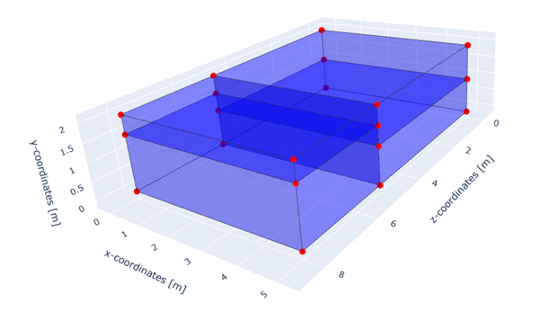
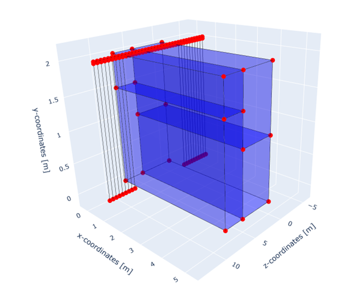

STEM tutorials
==============

.. _tutorial4:

Variation in the Z-direction
-----------------------------
This tutorial shows a step by step guide on how to set up a 3D geometry where the soil layers vary in both Y and Z
directions. Furthermore, a track is defined which lays on top of the soil and extends outside of the soil domain. The
problem will be calculated in a multistage analysis.

First the necessary packages are imported and paths are defined.

.. code-block:: python

    input_files_dir = "variation_z"
    results_dir = "output"

    from stem.model import Model
    from stem.soil_material import OnePhaseSoil, LinearElasticSoil, SoilMaterial, SaturatedBelowPhreaticLevelLaw
    from stem.structural_material import ElasticSpringDamper, NodalConcentrated
    from stem.default_materials import DefaultMaterial
    from stem.load import MovingLoad
    from stem.boundary import DisplacementConstraint, AbsorbingBoundary
    from stem.solver import AnalysisType, SolutionType, TimeIntegration, DisplacementConvergenceCriteria, \
        LinearNewtonRaphsonStrategy, StressInitialisationType, SolverSettings, Problem, Cg
    from stem.output import NodalOutput, VtkOutputParameters
    from stem.stem import Stem

    # END CODE BLOCK

For setting up the model, Model class is imported from stem.model. And for setting up the soil material, OnePhaseSoil,
LinearElasticSoil, SoilMaterial, SaturatedBelowPhreaticLevelLaw classes are imported.
For the structural elements, the ElasticSpringDamper and NodalConcentrated classes are imported. The rail material will
be retrieved from the DefaultMaterial class. In this case, there is a moving load on top a track. MovingLoad class is
imported from stem.load. As for setting the boundary conditions, DisplacementConstraint class and the AbsorbingBoundary
are imported from stem.boundary. For setting up the solver settings, necessary classes are imported from stem.solver.
Classes needed for the output, are NodalOutput, VtkOutputParameters and Output which are imported from stem.output.
Lastly, Stem class is imported from stem.stem, in order to run the simulation.

First the dimension of the model is indicated which in this case is 3. After which the model can be initialised.

.. code-block:: python

    ndim = 3
    model = Model(ndim)

    # END CODE BLOCK

In this tutorial, different soil layers will be added in the vertical direction and in the extruded out of plane
direction. In order to extrude different parts of the geometry differently, it is required to divide the model in groups.
Below, two groups with unique names are created. Later on, soil layers will be added to these groups. For the creation
of the groups, the 'reference_depth' (reference out of plane coordinate) and the extrusion length have to be given. In
this case, "group_1" has a reference z-coordinate of 0.0 and is extruded for 5 meter along the z-axis; "group_2" starts
at a reference z-coordinate of 5.0 and is extruded for 3 meter. In total, the soil domain will be extruded for 8 meter.

.. code-block:: python

    model.add_group_for_extrusion("group_1", reference_depth=0.0, extrusion_length=5.0)
    model.add_group_for_extrusion("group_2", reference_depth=5.0, extrusion_length=3.0)

    # END CODE BLOCK

Specification of the soil material is defined afterwards.
The bottom soil layer is defined as a material with the name "soil_1".
It's a Linear elastic material model with the solid density (rho) of 2650 kg/m3,
the Young's modulus is 30e6 Pa and the Poisson's ratio is 0.2.
The soil is dry above the phreatic level and wet below the phreatic level. A porosity of 0.3 is specified.
The soil is a one-phase soil, meaning that the flow of water through the soil is not computed.

.. code-block:: python

    solid_density_1 = 2650
    porosity_1 = 0.3
    young_modulus_1 = 30e6
    poisson_ratio_1 = 0.2
    soil_formulation_1 = OnePhaseSoil(ndim, IS_DRAINED=True, DENSITY_SOLID=solid_density_1, POROSITY=porosity_1)
    constitutive_law_1 = LinearElasticSoil(YOUNG_MODULUS=young_modulus_1, POISSON_RATIO=poisson_ratio_1)
    retention_parameters_1 = SaturatedBelowPhreaticLevelLaw()
    material_soil_1 = SoilMaterial("soil_1", soil_formulation_1, constitutive_law_1, retention_parameters_1)

    # END CODE BLOCK

The second soil layer is defined as a material with the name "soil_2".
It's a Linear elastic material model with the solid density (rho) of 2550 kg/m3,
the Young's modulus is 30e6 Pa and the Poisson's ratio is 0.2.
The soil is dry above the phreatic level and wet below the phreatic level. A porosity of 0.3 is specified.
The soil is a one-phase soil, meaning that the flow of water through the soil is not computed.

.. code-block:: python

    solid_density_2 = 2550
    porosity_2 = 0.3
    young_modulus_2 = 30e6
    poisson_ratio_2 = 0.2
    soil_formulation_2 = OnePhaseSoil(ndim, IS_DRAINED=True, DENSITY_SOLID=solid_density_2, POROSITY=porosity_2)
    constitutive_law_2 = LinearElasticSoil(YOUNG_MODULUS=young_modulus_2, POISSON_RATIO=poisson_ratio_2)
    retention_parameters_2 = SaturatedBelowPhreaticLevelLaw()
    material_soil_2 = SoilMaterial("soil_2", soil_formulation_2, constitutive_law_2, retention_parameters_2)

    # END CODE BLOCK

The coordinates of the model are defined in the following way. Each of the layers are defined by a list of coordinates,
defined on an x-y plane. For 3D models, x-y planes are extruded in the z-direction. Since in this case, two groups are
created, the soil layers are added to "group_1" and "group_2". It is important that all soil layers have a unique name.

.. code-block:: python

    soil_bottom_coordinates = [(0.0, 0.0, 0.0), (5.0, 0.0, 0.0), (5.0, 1.0, 0.0), (0.0, 1.0, 0.0)]
    soil_top_coordinates = [(0.0, 1.0, 0.0), (5.0, 1.0, 0.0), (5.0, 2.0, 0.0), (0.0, 2.0, 0.0)]

    second_section_bottom_coordinates = [(0.0, 1.5, 5.0), (5.0, 1.5, 5.0), (5.0, 2.0, 5.0), (0.0, 2.0, 5.0)]
    second_section_top_coordinates=  [(0.0, 0.0, 5.0), (5.0, 0.0, 5.0), (5.0, 1.5, 5.0), (0.0, 1.5, 5.0)]

    model.add_soil_layer_by_coordinates(soil_bottom_coordinates, material_soil_1, "soil_layer_1", "group_1")
    model.add_soil_layer_by_coordinates(soil_top_coordinates, material_soil_2, "soil_layer_2", "group_1")

    model.add_soil_layer_by_coordinates(second_section_bottom_coordinates, material_soil_1, "soil_layer_1_group_2", "group_2")
    model.add_soil_layer_by_coordinates(second_section_top_coordinates, material_soil_2, "soil_layer_2_group_2", "group_2")

    # END CODE BLOCK

The geometry is shown in the figures below.

Now that the soil layers are defined, the track will be defined. The track consists of a rail, railpads and sleepers.
Furthermore, the track is extended outside of the 3D soil domain. On the extended part of the track, the track is supported
by 1D elastic spring damper elements which simulate the soil behaviour. The rail parameters are retrieved from the
DefaultMaterial class, where default properties are given to a beam element. The railpad parameters are defined as an
ElasticSpringDamper with a nodal displacement stiffness of 750e6 N/m, a nodal damping coefficient of 750e3 Ns/m.
The sleeper parameters are defined as a NodalConcentrated with a nodal mass of 140 kg. The soil equivalent parameters
are defined as an ElasticSpringDamper with a nodal displacement stiffness of 8e6 N/m and a nodal damping coefficient
of 1 Ns/m.

.. code-block:: python

    rail_parameters = DefaultMaterial.Rail_54E1_3D.value.material_parameters

    rail_pad_parameters = ElasticSpringDamper(NODAL_DISPLACEMENT_STIFFNESS=[0, 750e6, 0],
                                              NODAL_ROTATIONAL_STIFFNESS=[0, 0, 0],
                                              NODAL_DAMPING_COEFFICIENT=[0, 750e3, 0],
                                              NODAL_ROTATIONAL_DAMPING_COEFFICIENT=[0, 0, 0])

    sleeper_parameters = NodalConcentrated(NODAL_DISPLACEMENT_STIFFNESS=[0, 0, 0],
                                           NODAL_MASS=140,
                                           NODAL_DAMPING_COEFFICIENT=[0, 0, 0])

    soil_equivalent_parameters = ElasticSpringDamper(NODAL_DISPLACEMENT_STIFFNESS=[0, 8e6, 0],
                                                     NODAL_ROTATIONAL_STIFFNESS=[0, 0, 0],
                                                     NODAL_DAMPING_COEFFICIENT=[0, 1, 0],
                                                     NODAL_ROTATIONAL_DAMPING_COEFFICIENT=[0, 0, 0])

    # END CODE BLOCK

Now that the track materials are defined, the track can be added to the model. The track has equal distance between the
sleepers of 0.5 meters. The number of sleepers is calculated based on the distance between the sleepers and the total
length of the track. The rail pad thickness is set to 0.025 meters. The track has an origin point at coordinates [0.75, 2.0, -5.0].
From this point, the track follows the direction of the 'direction_vector' [0, 0, 1] (following the z-axis). The extension
is supported with 1D soil equivalent elements with a length of 2 meters.

.. code-block:: python

    sleeper_distance =0.5
    total_length = 18
    n_sleepers = int(total_length/sleeper_distance)
    rail_pad_thickness = 0.025

    # create a straight track with rails, sleepers, rail pads and a 1D soil extension
    model.generate_extended_straight_track(sleeper_distance=0.5,
                                           n_sleepers=n_sleepers,
                                           rail_pad_thickness=0.025,
                                           origin_point=[0.75, 2.0, -5.0],
                                           direction_vector=[0, 0, 1],
                                           rail_parameters=rail_parameters,
                                           sleeper_parameters=sleeper_parameters,
                                           rail_pad_parameters=rail_pad_parameters,
                                           soil_equivalent_parameters=soil_equivalent_parameters,
                                           length_soil_equivalent_element=2,
                                           name="rail_track_1")

    # END CODE BLOCK

The new geometry is shown in the figure below.

For the moving load, MovingLoad class is called. The load has a value of -10000 N in the y-direction and is applied on the
track. When the load starts moving, the load follows a positive x,y,z trajectory. However, in this tutorial, a multistage
analysis is performed. In the first stage, the load should be stationary. Therefore, the velocity is set to 0. The load has
an origin point at coordinates [0.75, 2.025, -3.0] (on top of the track, 2 meter away from the end).

.. code-block:: python

    # define the moving load
    moving_load = MovingLoad(load=[0,-10000,0], direction=[1, 1, 1], velocity=0, origin=[0.75, 2 + rail_pad_thickness, -3])

    # add the load on the track
    model.add_load_on_line_model_part("rail_track_1", moving_load, "moving_load")

    # END CODE BLOCK

Below the boundary conditions are defined. The base of the model is fixed in all directions with the name "base_fixed".
The roller boundary condition is applied along the symmetry side of the domain with the name "sides_roller". On all other
sides, absorbing boundary conditions are applied with the name "abs". In this tutorial, contrary to the previous tutorials,
the boundary conditions are applied to planes defined by 3 points.

.. code-block:: python

    no_displacement_parameters = DisplacementConstraint(active=[True, True, True],
                                                        is_fixed=[True, True, True], value=[0, 0, 0])
    roller_displacement_parameters = DisplacementConstraint(active=[True, True, True],
                                                            is_fixed=[True, False, True], value=[0, 0, 0])
    absorbing_boundaries_parameters = AbsorbingBoundary(absorbing_factors=[1.0, 1.0], virtual_thickness=3.0)

    # add the boundary conditions to the model
    model.add_boundary_condition_on_plane([(0,0,0), (0,0,1), (1,0,0)],no_displacement_parameters,"base_fixed")
    model.add_boundary_condition_on_plane([(0,0,0), (0,1,0), (0,0,1)], roller_displacement_parameters, "sides_roller")

    model.add_boundary_condition_on_plane([(0,0,0), (1,0,0), (0,1,0)],absorbing_boundaries_parameters,"abs")
    model.add_boundary_condition_on_plane([(0,0,8), (1,0,8), (0,1,8)],absorbing_boundaries_parameters,"abs")
    model.add_boundary_condition_on_plane([(5,0,0), (5,1,0), (5,0,1)], absorbing_boundaries_parameters, "abs")

    # END CODE BLOCK

Now that the geometry is generated, materials, loads and boundary conditions are assigned. The mesh specifications can
be defined. In this case, the general element size is set to 1.0 and the element size of the soil layer "soil_layer_1_group_2"
is set to 0.2.

.. code-block:: python

    model.set_mesh_size(element_size=1.0)
    model.set_element_size_of_group(element_size=0.2, group_name="soil_layer_1_group_2")

    # END CODE BLOCK

Below it is shown how the solver settings are defined. The analysis type is set to "MECHANICAL" and the solution type of
the first stage is set to "QUASI_STATIC". The start time is set to 0.0 second and the end time is set to 0.1 second. The
time step size is set to 0.025 second. Furthermore, the reduction factor and increase factor are set to 1.0, such that the
time step size is constant throughout the simulation. Displacement convergence criteria is set to 1.0e-4 for the relative
tolerance and 1.0e-12 for the absolute tolerance. No stress initialisation is used. Furthemore, all matrices are assumed
to be constant. Cg is used as a linear solver. Further solver settings are set to the default settings.

.. code-block:: python

    # set time integration parameters
    end_time = 0.1
    delta_time = 0.025
    time_integration = TimeIntegration(start_time=0.0, end_time=end_time, delta_time=delta_time,
                                       reduction_factor=1, increase_factor=1, max_delta_time_factor=1000)

    # set convergence criteria
    convergence_criterion = DisplacementConvergenceCriteria(displacement_relative_tolerance=1.0e-4,
                                                            displacement_absolute_tolerance=1.0e-12)

    # set solver settings
    solver_settings = SolverSettings(analysis_type=AnalysisType.MECHANICAL,
                                     solution_type=SolutionType.QUASI_STATIC,
                                     stress_initialisation_type=StressInitialisationType.NONE,
                                     time_integration=time_integration,
                                     is_stiffness_matrix_constant=True, are_mass_and_damping_constant=True,
                                     convergence_criteria=convergence_criterion,
                                     linear_solver_settings=Cg())

    # END CODE BLOCK

Now the problem data should be set up. The problem should be given a name, in this case it is
"variation_z". The problem will be solved on 4 threads. Then the solver settings are added to the problem. And the problem
definition is added to the model.

.. code-block:: python

    # Set up problem data
    problem = Problem(problem_name="variation_z", number_of_threads=4,
                      settings=solver_settings)
    model.project_parameters = problem

    # END CODE BLOCK

Before starting the calculation, it is required to specify why output is desired. In this case, displacement,
velocity and acceleration is given on the nodes and written to the output file. In this test case, gauss point results
are left empty.

.. code-block:: python

    nodal_results = [NodalOutput.DISPLACEMENT, NodalOutput.VELOCITY, NodalOutput.ACCELERATION]
    gauss_point_results = []

    # END CODE BLOCK

The output process is added to the model using the `Model.add_output_settings` method. The results will be then written to the output directory in vtk
format. In this case, the output interval is set to 1 and the output control type is set to "step", meaning that the
results will be written every time step. The vtk files will be written in binary format in order to save space.

.. code-block:: python

    model.add_output_settings(
        part_name="porous_computational_model_part",
        output_dir=results_dir,
        output_name="vtk_output",
        output_parameters=VtkOutputParameters(
            file_format="binary",
            output_interval=1,
            nodal_results=nodal_results,
            gauss_point_results=gauss_point_results,
            output_control_type="step"
        )
    )

    # END CODE BLOCK

Now that the the first stage is set up, the calculation is almost ready to be ran.

Firstly the Stem class is initialised, with the model and the directory where the input files will be written to.
While initialising the Stem class, the mesh will be generated.

.. code-block:: python

    stem = Stem(model, input_files_dir)

    # END CODE BLOCK

The second stage can easily be created  by calling the "create_new_stage" function, this function requires the delta time
and the duration of the stage, for the rest, the latest added stage is coppied. In the second stage, the solution type is
set to "DYNAMIC" and the Rayleigh damping coefficients are set to 0.0002 for the stiffness matrix and 0.6 for the mass
matrix. Since the problem is linear elastic, the Linear-Newton-Raphson strategy is used. Furthermore, the velocity of the
moving load is set to move with a velocity of 18 m/s. After the stage is created, and the settings are set, the stage is
added to the calculation.

.. code-block:: python

    delta_time_stage_2 = 0.01
    duration_stage_2 = 1.0
    stage2 = stem.create_new_stage(delta_time_stage_2,duration_stage_2)
    stage2.project_parameters.settings.solution_type = SolutionType.DYNAMIC
    stage2.project_parameters.settings.strategy_type = LinearNewtonRaphsonStrategy()
    stage2.project_parameters.settings.rayleigh_k = 0.0002
    stage2.project_parameters.settings.rayleigh_m = 0.6
    stage2.get_model_part_by_name("moving_load").parameters.velocity = 18.0
    stem.add_calculation_stage(stage2)

    # END CODE BLOCK

The Kratos input files are then written. The project settings and output definitions are written to
ProjectParameters_stage_1.json file. The mesh is written to the .mdpa file and the material parameters are
written to the MaterialParameters_stage_1.json file.
All of the input files are then written to the input files directory.

.. code-block:: python

    stem.write_all_input_files()

    # END CODE BLOCK

The calculation is then ran by calling the run_calculation function within the stem class.

.. code-block:: python

    stem.run_calculation()

    # END CODE BLOCK

.. seealso::

    - Previous: :ref:`tutorial3`
    - Next: :ref:`tutorial5`