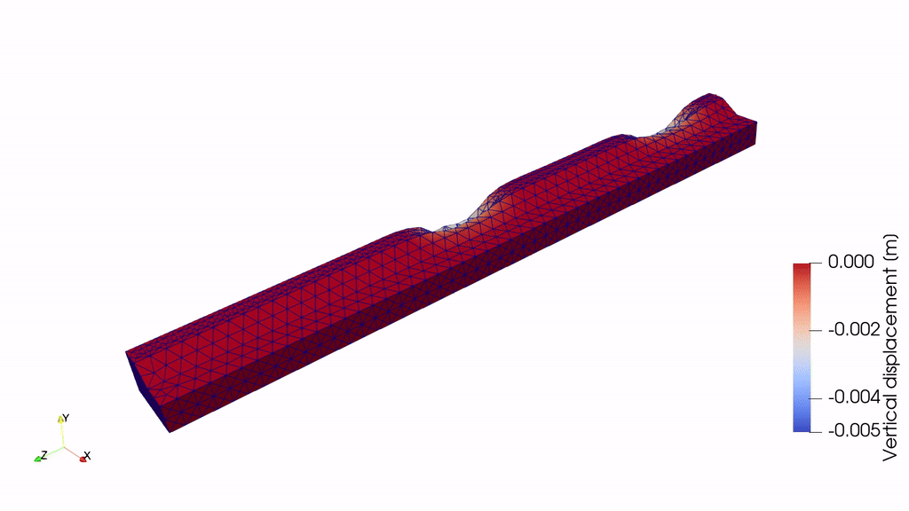

.. _tutorial4:

Train model (UVEC) on track and embankment in 3D with irregularities
====================================================================

Overview
--------
This tutorial shows  how to set up a train model on top of track on an embankment with two soil layers, in a 3D model.
The UVEC (User defined VEhiCle model) is a model used to represent a train as dynamic loads on the system, and
the irregularities in the contact between the wheel and the rail are modelled using the UVEC.
The train is  statically initiated on the track, and the dynamic response of the system is calculated when the
train moves on the track.

Imports and setup
-----------------
First the necessary packages are imported and the input folder is defined.

.. code-block:: python

    input_files_dir = "uvec_train_model"

    import UVEC.uvec_ten_dof_vehicle_2D as uvec
    from stem.model import Model
    from stem.soil_material import OnePhaseSoil, LinearElasticSoil, SoilMaterial, SaturatedBelowPhreaticLevelLaw
    from stem.structural_material import ElasticSpringDamper, NodalConcentrated
    from stem.default_materials import DefaultMaterial
    from stem.load import MovingLoad, UvecLoad
    from stem.boundary import DisplacementConstraint, AbsorbingBoundary
    from stem.additional_processes import ParameterFieldParameters
    from stem.field_generator import RandomFieldGenerator
    from stem.solver import AnalysisType, SolutionType, TimeIntegration, DisplacementConvergenceCriteria,\
         LinearNewtonRaphsonStrategy, NewmarkScheme, Cg, StressInitialisationType, SolverSettings, Problem
    from stem.output import NodalOutput, VtkOutputParameters, JsonOutputParameters
    from stem.stem import Stem

..    # END CODE BLOCK

For setting up the model, ``Model`` is imported from ``stem.model``.
For the soil material, ``OnePhaseSoil``, ``LinearElasticSoil``, ``SoilMaterial``,
and ``SaturatedBelowPhreaticLevelLaw`` are imported from ``stem.soil_material``.
Because the railway track is modelled it is required to import the ``DefaultMaterial`` class from
``stem.default_materials`` to use the default rail properties.
In order to use the UVEC the ``UvecLoad`` class is imported from ``stem.load``.
Boundary conditions are set using ``DisplacementConstraint`` and ``AbsorbingBoundary``.
Solver settings are defined with classes imported from ``stem.solver``.
For output, ``NodalOutput``, ``VtkOutputParameters``, and ``JsonOutputParameters`` are imported.
In this tutorial, a random field is also added on the soil layers.
Finally, ``Stem`` is imported from ``stem.stem`` to write input files and run the calculation.

Geometry and materials
----------------------
In this step, the geometry and materials are defined.
First the model dimension is set to 3 and the model is initialised.

.. code-block:: python

    ndim = 3
    model = Model(ndim)

..    # END CODE BLOCK

Specification of the soil material is defined afterwards.
The bottom soil layer is defined as a material with the name "soil_1".
It's a Linear elastic material model with the solid density of 2650 kg/m3,
the Young's modulus is 30e6 Pa and the Poisson's ratio is of 0.2.
A porosity of  of 0.3 is specified.
The soil is a one-phase soil, meaning that the flow of water through the soil is not computed.

.. code-block:: python

    solid_density_1 = 2650
    porosity_1 = 0.3
    young_modulus_1 = 30e6
    poisson_ratio_1 = 0.2
    soil_formulation_1 = OnePhaseSoil(ndim, IS_DRAINED=True, DENSITY_SOLID=solid_density_1, POROSITY=porosity_1)
    constitutive_law_1 = LinearElasticSoil(YOUNG_MODULUS=young_modulus_1, POISSON_RATIO=poisson_ratio_1)
    retention_parameters_1 = SaturatedBelowPhreaticLevelLaw()
    material_soil_1 = SoilMaterial("soil_1", soil_formulation_1, constitutive_law_1, retention_parameters_1)

..    # END CODE BLOCK

The second soil layer is defined as a material with the name "soil_2".
It's a Linear elastic material model with the solid density of 2550 kg/m3,
the Young's modulus is 30e6 Pa and the Poisson's ratio is 0.2.
A porosity of 0.3 is specified.
The soil is a one-phase soil, meaning that the flow of water through the soil is not computed.

.. code-block:: python

    solid_density_2 = 2550
    porosity_2 = 0.3
    young_modulus_2 = 30e6
    poisson_ratio_2 = 0.2
    soil_formulation_2 = OnePhaseSoil(ndim, IS_DRAINED=True, DENSITY_SOLID=solid_density_2, POROSITY=porosity_2)
    constitutive_law_2 = LinearElasticSoil(YOUNG_MODULUS=young_modulus_2, POISSON_RATIO=poisson_ratio_2)
    retention_parameters_2 = SaturatedBelowPhreaticLevelLaw()
    material_soil_2 = SoilMaterial("soil_2", soil_formulation_2, constitutive_law_2, retention_parameters_2)

..    # END CODE BLOCK

The embankment layer on top is defined as a material with the name "embankment".
It's a Linear elastic material model with the solid density of 2650 kg/m3,
the Young's modulus is 10e6 Pa and the Poisson's ratio is 0.2.
A porosity of 0.3 is specified.
The soil is a one-phase soil, meaning that the flow of water through the soil is not computed.

.. code-block:: python

    solid_density_3 = 2650
    porosity_3 = 0.3
    young_modulus_3 = 10e6
    poisson_ratio_3 = 0.2
    soil_formulation_3 = OnePhaseSoil(ndim, IS_DRAINED=True, DENSITY_SOLID=solid_density_3, POROSITY=porosity_3)
    constitutive_law_3 = LinearElasticSoil(YOUNG_MODULUS=young_modulus_3, POISSON_RATIO=poisson_ratio_3)
    retention_parameters_3 = SaturatedBelowPhreaticLevelLaw()
    material_embankment = SoilMaterial("embankment", soil_formulation_3, constitutive_law_3, retention_parameters_3)

..    # END CODE BLOCK

The rail is defined as a material with the name "rail", with the properties of a 54E1 rail profile.
Other rail profiles for which default material properties exits (46E3 and 60E1 rail profiles) and it is also possible
to define custom rail profiles (see :ref:`railway_track`).
The rail pads are modelled by means of elastic spring dampers while the sleepers are modelled using nodal concentrated
masses.
The sleepers can also be modelled as volume elements with specific material properties and dimensions,
instead of nodal concentrated masses (see :ref:`railway_track`).

.. code-block:: python

    rail_parameters = DefaultMaterial.Rail_54E1_3D.value.material_parameters
    rail_pad_parameters = ElasticSpringDamper(NODAL_DISPLACEMENT_STIFFNESS=[0, 750e6, 0],
                                              NODAL_ROTATIONAL_STIFFNESS=[0, 0, 0],
                                              NODAL_DAMPING_COEFFICIENT=[0, 750e3, 0], # damping coefficient [Ns/m]
                                              NODAL_ROTATIONAL_DAMPING_COEFFICIENT=[0, 0, 0])
    sleeper_parameters = NodalConcentrated(NODAL_DISPLACEMENT_STIFFNESS=[0, 0, 0],
                                           NODAL_MASS=140,
                                           NODAL_DAMPING_COEFFICIENT=[0, 0, 0])

..    # END CODE BLOCK

The geometry of the model is defined afterwards. The model consists of two soil layers and an embankment on top.
Each layer is defined by a list of coordinates, defined in the x-y plane. The coordinates are defined in clockwise or
anti-clockwise order, and the first and last coordinates are not the same, since the geometry will be closed.
To generate a full 3D model, the geometry in the x-y plane is extruded in the z-direction.
In this case, the extrusion length is 50 m.

.. code-block:: python

    soil1_coordinates = [(0.0, 0.0, 0.0), (5.0, 0.0, 0.0), (5.0, 1.0, 0.0), (0.0, 1.0, 0.0)]
    soil2_coordinates = [(0.0, 1.0, 0.0), (5.0, 1.0, 0.0), (5.0, 2.0, 0.0), (0.0, 2.0, 0.0)]
    embankment_coordinates = [(0.0, 2.0, 0.0), (3.0, 2.0, 0.0), (1.5, 3.0, 0.0), (0.75, 3.0, 0.0), (0, 3.0, 0.0)]
    model.extrusion_length = 50

..    # END CODE BLOCK

The geometry is shown in the figures below.

.. image:: _static/embankment_1.png
    :align: center

.. image:: _static/embankment_2.png
    :align: center
    :alt: Geometry of the model.

The soil layers are then added to the model in the following way. It is important that all soil layers have
a unique name.

.. code-block:: python

    model.add_soil_layer_by_coordinates(soil1_coordinates, material_soil_1, "soil_layer_1")
    model.add_soil_layer_by_coordinates(soil2_coordinates, material_soil_2, "soil_layer_2")
    model.add_soil_layer_by_coordinates(embankment_coordinates, material_embankment, "embankment_layer")

..    # END CODE BLOCK

Generating the train track
..........................
STEM provides two options to generate a straight:

1. A straight track with rails, sleepers and rail pads. This track is placed on top of the 2D or 3D geometry.

2. A straight track with rails, sleepers, rail pads and an extension of the track outside the 2D or 3D geometry.
   This extension is placed on 1D elements which simulate the soil behaviour.

In this tutorial the track will be modelled on top of the embankment layer, which means that the first option is used.
The second option please see :ref:`railway_track`.

The tracks are added by specifying the origin point of the track and the direction for the extrusion that creates
the rail as well as rail pads and sleepers.
Important is that the origin point and the end of the track lie on geometry edges.
In this tutorial, a straight track is generated along the z-axis at 0.75 m distance from the x-axis,
on top of the embankment. To do this, the origin point of the track is set with coordinates [0.75, 3.0, 0.0] and the
extrusion is done parallel to the positive z-axis, i.e. with a direction vector of [0, 0, 1].
The length of the track is defined by the number of sleepers and their spacing.
In this tutorial, 101 sleepers are placed which are connected by to the rail by 0.025 m thick railpads. The sleepers
are spaced 0.5 m from each others which results in a 50 m straight track, with part name "rail_track_1."

.. code-block:: python

    origin_point = [0.75, 3.0, 0.0]
    direction_vector = [0, 0, 1]
    number_of_sleepers = 101
    sleeper_spacing = 0.5
    rail_pad_thickness = 0.025

    model.generate_straight_track(sleeper_spacing, number_of_sleepers, rail_parameters,
                                  sleeper_parameters, rail_pad_parameters,
                                  rail_pad_thickness, origin_point,
                                  direction_vector, "rail_track_1")

..    # END CODE BLOCK

Load
----
The train load is added by means of the UVEC model. The train consists of a 10 dof model, as schematised in the figure
below. More information about the train and train-track interaction model can be found in :ref:`railway_track`.

.. image:: _static/figure_uvec.png
    :align: center
    :alt: Schematisation of the UVEC model

In order to use the UVEC model, it is necessary to import the UVEC package (see the import section above):

.. code-block:: python

    import UVEC.uvec_ten_dof_vehicle_2D as uvec

The UVEC model requires the definition of the train parameters, such as the wheel configuration, velocity,
and irregularity parameters.

The `uvec_parameters` is a dictionary which contains the parameters of the UVEC model.
It contains the values for the masses, damping and stiffness of the different components of the train,
such as the cart, bogies and wheels, as well as the information about the wheel configuration,
velocity and irregularity parameters.

The uvec is modelled using the `UvecLoad` class.
The `uvec_load` is defined by specifying the `direction_signs` which indicate the direction of the movement of the
train, the `velocity` of the train, the `origin` point from which the train starts moving,
the `wheel_configuration` which is a list of distances from the origin point to the wheels,
the `uvec_model` which is the imported UVEC train model,
and the `uvec_parameters` which is a dictionary containing the parameters of the UVEC model.

To define irregularities in the track, the `irr_parameters` key is added to the `uvec_parameters` dictionary,
with parameters `Av` and `seed`. The `Av` parameter is the amplitude of the irregularities and the `seed` parameter
is used for reproducibility of the random process.
In case that irregularities are not required, the `irr_parameters` key must be omitted.
More information about the irregularity parameters can be found in :ref:`irregularities_track`.

The static initialisation of the train is done by setting the `static_initialisation` parameter to True in the
`uvec_parameters` dictionary, and the train velocity is set to zero, so that the train does not move
during the static initialisation stage.

.. code-block:: python

    wheel_configuration = [0.0, 2.5, 19.9, 22.4] # distances of the wheels from the origin point [m]
    velocity = 0  # velocity of the UVEC [m/s]
    # define uvec parameters
    uvec_parameters = {"n_carts": 1, # number of carts [-]
                       "cart_inertia": 564.4e3, # inertia of the cart [kgm2]
                       "cart_mass": 25e3, # mass of the cart [kg]
                       "cart_stiffness": 2708e3, # stiffness between the cart and bogies [N/m]
                       "cart_damping": 64e3, # damping coefficient between the cart and bogies [Ns/m]
                       "bogie_distances": [-9.95, 9.95], # distances of the bogies from the centre of the cart [m]
                       "bogie_inertia": 0.155e3, # inertia of the bogie [kgm2]
                       "bogie_mass": 3e3, # mass of the bogie [kg]
                       "wheel_distances": [-1.25, 1.25], # distances of the wheels from the centre of the bogie [m]
                       "wheel_mass": 1.5e3, # mass of the wheel [kg]
                       "wheel_stiffness": 4800e3, # stiffness between the wheel and the bogie [N/m]
                       "wheel_damping": 0.25e3, # damping coefficient between the wheel and the bogie [Ns/m]
                       "gravity_axis": 1, # axis on which gravity works [x =0, y = 1, z = 2]
                       "contact_coefficient": 9.1e-7, # Hertzian contact coefficient between the wheel and the rail [N/m]
                       "contact_power": 1.0, # Hertzian contact power between the wheel and the rail [-]
                       "static_initialisation": True, # True if the analysis of the UVEC is static
                       "wheel_configuration": wheel_configuration, # initial position of the wheels [m]
                       "velocity": velocity, # velocity of the UVEC [m/s]
                       "irr_parameters": {
                                "Av": 2.095e-05,
                                "seed": 14
                                },
                       }

    # define the UVEC load
    uvec_load = UvecLoad(direction_signs=[1, 1, 1], velocity=velocity, origin=[0.75, 3+rail_pad_thickness, 5],
                         wheel_configuration=wheel_configuration,
                         uvec_model=uvec,
                         uvec_parameters=uvec_parameters)

    # add the load on the tracks
    model.add_load_on_line_model_part("rail_track_1", uvec_load, "train_load")

Boundary conditions
-------------------
Below the boundary conditions are defined. In this model the boundary conditions consist of a fixed base,
allong the symmetry plane, and absorbing boundaries on the sides of the model to prevent reflections.

The base of the model is fixed in all directions with the name "base_fixed".
For the surface at the symmetry plane, roller boundary condition is applied with the name "sides_roller".
To prevent reflections from the sides of the model, absorbing boundaries are applied with virtual thickness of 40 m.
The boundary conditions are added to the model on the edge surfaces.
The boundary conditions are applied on plane surfaces defined by a list of coordinates.

.. code-block:: python

    no_displacement_parameters = DisplacementConstraint(is_fixed=[True, True, True], value=[0, 0, 0])
    roller_displacement_parameters = DisplacementConstraint(is_fixed=[True, False, True], value=[0, 0, 0])
    absorbing_boundaries_parameters = AbsorbingBoundary(absorbing_factors=[1.0, 1.0], virtual_thickness=40.0)

    model.add_boundary_condition_on_plane([(0, 0, 0), (0, 0, 50), (5, 0, 0)], no_displacement_parameters,"base_fixed")
    model.add_boundary_condition_on_plane([(0, 0, 0), (0, 0, 50), (0, 3, 0)], roller_displacement_parameters, "sides_roller")

    model.add_boundary_condition_on_plane([(0, 0, 0), (5, 0, 0), (5, 3, 0)],absorbing_boundaries_parameters, "abs_z=0")
    model.add_boundary_condition_on_plane([(0, 0, 50), (5, 0, 50), (5, 3, 50)],absorbing_boundaries_parameters, "abs_z=50")
    model.add_boundary_condition_on_plane([(5, 0, 0), (5, 3, 0), (5, 0, 50)], absorbing_boundaries_parameters, "abs_x=5")

..    # END CODE BLOCK

Alternatively, the boundary conditions can also be added by geometry IDs. Please see :ref:`tutorial2` for more
information on how to add boundary conditions by geometry IDs.

Mesh
----
The mesh size and element order are defined.
The element size for the mesh can be defined as a single value, which will applied to the whole model.

.. code-block:: python

    model.set_mesh_size(element_size=1.0)

..    # END CODE BLOCK

Alternatively, the element size can also be defined for each soil layer separately (see e.g. :ref:`tutorial2`).

Solver settings
---------------
Now that the model is defined, the solver settings should be set.
In this tutorial, the model in defined in two stages:

1. Static initialisation of the train load
2. Dynamic analysis of the train moving on the track

The first stage is used to statically initialise the train load on the track.
This means that the train is placed on the track and the static response of the system is calculated.
This is done by setting the `static_initialisation` parameter to "True" in the `uvec_parameters` dictionary (see above),
and the solution type is set to `QUASI_STATIC`.

The start time is set to 0.0 s and the end time is set to 0.5 s with a time step size of 0.1 s.
This means that the static initialisation is done in 5 steps.
The system of equations is solved with the assumption of constant stiffness matrix, mass matrix, and damping matrix.
The Linear-Newton-Raphson (Newmark explicit solver) is used as strategy and Cg as solver for the linear system of equations.

The Rayleigh damping parameters are set `None`, since the analysis is static.

The convergence criterion for the numerical solver are set to a relative tolerance of :math:`10^{-4}` and an absolute
tolerance of :math:`10^{-9}` for the displacements.

.. code-block:: python

    end_time = 0.5
    delta_time = 0.1
    time_integration = TimeIntegration(start_time=0.0, end_time=end_time, delta_time=delta_time,
                                   reduction_factor=1, increase_factor=1, max_delta_time_factor=1000)

    convergence_criterion = DisplacementConvergenceCriteria(displacement_relative_tolerance=1.0e-4,
                                                        displacement_absolute_tolerance=1.0e-12)

    solver_settings = SolverSettings(analysis_type=AnalysisType.MECHANICAL,
                                     solution_type=SolutionType.QUASI_STATIC,
                                     stress_initialisation_type=StressInitialisationType.NONE,
                                     time_integration=time_integration,
                                     is_stiffness_matrix_constant=True,
                                     are_mass_and_damping_constant=True,
                                     convergence_criteria=convergence_criterion,
                                     strategy_type=LinearNewtonRaphsonStrategy(),
                                     linear_solver_settings=Cg(),
                                     rayleigh_k=None,
                                     rayleigh_m=None)

..    # END CODE BLOCK

Problem and output
------------------
The problem definition is added to the model.
The problem name is set to "UVEC_embankment_3D",
the number of threads is set to 8 and the solver settings are applied.

.. code-block:: python

    problem = Problem(problem_name="UVEC_embankment_3D", number_of_threads=8,
                      settings=solver_settings)
    model.project_parameters = problem

..    # END CODE BLOCK

Before starting the calculation, it is required to specify the desired output. In this case, displacement,
and velocity are requested on the nodes and written into VTK files.
Gauss point results (stresses) are left empty.

The output process is added to the model using the ``Model.add_output_settings`` method.
The results are written to the output directory in VTK format.
In this case, the output interval is set to 1 and the output control type is set to `step`, meaning that the
results will be written every time step.

.. code-block:: python

    nodal_results = [NodalOutput.DISPLACEMENT, NodalOutput.VELOCITY]
    gauss_point_results = []

    model.add_output_settings(
        part_name="porous_computational_model_part",
        output_name="vtk_output",
        output_dir="output",
        output_parameters=VtkOutputParameters(
            output_interval=1,
            nodal_results=nodal_results,
            gauss_point_results=gauss_point_results,
            output_control_type="step"
        )
    )

..    # END CODE BLOCK

Second stage
------------
Now that the first stage of the model is set up, the ``Stem`` class needs to be initialised,
with the model and the directory where the input files will be written to.
While initialising the Stem class, the mesh will be generated.

.. code-block:: python

    stem = Stem(model, input_files_dir)

To create a new stage for the dynamic analysis, the ``create_new_stage`` method is called with the time step size
and the duration of the stage as argument.

.. code-block:: python

    delta_time_stage_2 = 1e-3
    duration_stage_2 = 0.5
    stage2 = stem.create_new_stage(delta_time_stage_2, duration_stage_2)

In the second stage the goal is to compute the dynamic response of the moving train.
Therefore, the solution type needs to be set to `DYNAMIC`` and the Rayleigh damping coefficients adjusted
(:math:`\alpha = 0.248` and :math:`\beta = 7.86 \cdot 10^{-5}`, which correspond to a damping ratio of
2% for 1 and 80 Hz.)

The train velocity also needs to be adjusted to 40 m/s, and the static initialisation of the UVEC
needs to be set to False, so that the train moves on the track and the dynamic response of the system is calculated.
This adjustment needs to be done on the `train_load` parameters and on the UVEC parameters.

.. code-block:: python

    velocity = 40
    stage2.project_parameters.settings.solution_type = SolutionType.DYNAMIC
    stage2.project_parameters.settings.rayleigh_k = 7.86e-5
    stage2.project_parameters.settings.rayleigh_m = 0.248
    stage2.get_model_part_by_name("train_load").parameters.velocity = velocity
    stage2.get_model_part_by_name("train_load").parameters.uvec_parameters["velocity"] = velocity
    stage2.get_model_part_by_name("train_load").parameters.uvec_parameters["static_initialisation"] = False

Run
---
Now that the model is set up, the calculation is ready to run.

The new stage is added to the calculation by calling the ``add_calculation_stage`` method.
This is followed by writing all the input files required to run the calculation.
The calculation is run by calling ``stem.run_calculation()``.

.. code-block:: python

    stem.add_calculation_stage(stage2)
    stem.write_all_input_files()
    stem.run_calculation()

..    # END CODE BLOCK

Results
-------
Once the calculation is finished, the results can be visualised using Paraview.

This animation shows the vertical displacement of the track and soil due to the moving train.

.. seealso::

    - Previous: :ref:`tutorial3`
    - Next: :ref:`tutorial5`