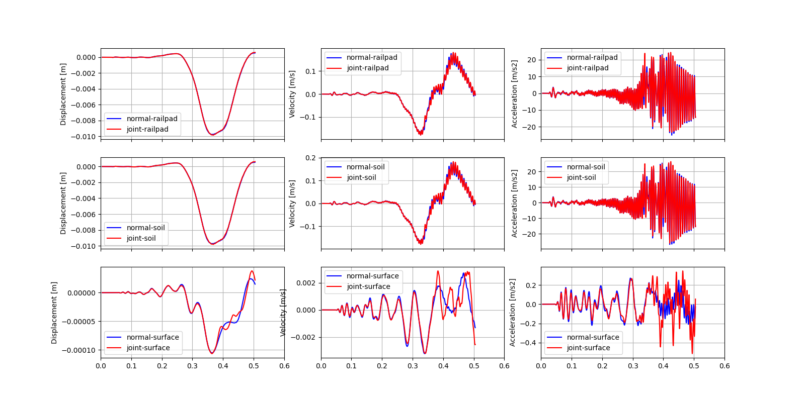

STEM tutorials
==============

.. _tutorial5:

Train model (UVEC) with rail joint and static initialisation
------------------------------------------------------------
This tutorial shows step by step guide on how to set up a train model on top of track on an embankment with
two soil layers underneath, in a 3D model, on a railway track with a rail joint.
The UVEC (User defined VEhiCle model) is a model used to represent a train as dynamic loads on the system.

The calculation is performed in two stages.
The first stage is a static initialisation of the model, where the static load of the train is applied to the model.
The second stage is a dynamic analysis of the model, where the train moves over the track.
The UVEC model is used to represent the train. The UVEC model is a user defined vehicle model that can be used to
represent a train as a dynamic load on the system.

First we import the necessary packages.

.. code-block:: python

    import UVEC.uvec_ten_dof_vehicle_2D as uvec
    from stem.model import Model
    from stem.additional_processes import HingeParameters
    from stem.soil_material import OnePhaseSoil, LinearElasticSoil, SoilMaterial, SaturatedBelowPhreaticLevelLaw
    from stem.structural_material import ElasticSpringDamper, NodalConcentrated
    from stem.default_materials import DefaultMaterial
    from stem.load import UvecLoad
    from stem.boundary import DisplacementConstraint, AbsorbingBoundary
    from stem.solver import AnalysisType, SolutionType, TimeIntegration, DisplacementConvergenceCriteria,\
        LinearNewtonRaphsonStrategy, NewmarkScheme, Cg, StressInitialisationType, SolverSettings, Problem
    from stem.output import NodalOutput, VtkOutputParameters, JsonOutputParameters
    from stem.stem import Stem

    # END CODE BLOCK

For setting up the model, Model class is imported from stem.model. And for setting up the soil material, OnePhaseSoil,
LinearElasticSoil, SoilMaterial, SaturatedBelowPhreaticLevelLaw classes are imported.
In this tutorial, a train model load (modelled using the UVEC) is used on top of a track.
For this purpose, the ElasticSpringDamper and NodalConcentrated classes are imported from stem.structural_material,
the UvecLoad class is imported from stem.load.

To define the default rail properties, the DefaultMaterial class is imported.
As for setting the boundary conditions, the DisplacementConstraint class and the AbsorbingBoundary class are imported
from stem.boundary. For setting up the solver settings, necessary classes are imported from stem.solver.
Classes needed for the output, are NodalOutput, VtkOutputParameters and Output which are imported from stem.output.
Lastly, the Stem class is imported from stem.stem, in order to run the simulation.

In this step, the geometry, conditions, and material parameters for the simulation are defined.
Firstly the dimension of the model is indicated which in this case is 3. After which the model can be initialised.

.. code-block:: python

    ndim = 3
    model = Model(ndim)

    # END CODE BLOCK

Specification of the soil material is defined afterwards.
The bottom soil layer is defined as a material with the name "soil_1".
It's a Linear elastic material model with the solid density (rho) of 2650 kg/m3,
the Young's modulus is 30e6 Pa and the Poisson's ratio is 0.2.
The soil is dry above the phreatic level and wet below the phreatic level. A porosity of 0.3 is specified.
The soil is a one-phase soil, meaning that the flow of water through the soil is not computed.

.. code-block:: python

    solid_density_1 = 2650
    porosity_1 = 0.3
    young_modulus_1 = 30e6
    poisson_ratio_1 = 0.2
    soil_formulation_1 = OnePhaseSoil(ndim, IS_DRAINED=True, DENSITY_SOLID=solid_density_1, POROSITY=porosity_1)
    constitutive_law_1 = LinearElasticSoil(YOUNG_MODULUS=young_modulus_1, POISSON_RATIO=poisson_ratio_1)
    retention_parameters_1 = SaturatedBelowPhreaticLevelLaw()
    material_soil_1 = SoilMaterial("soil_1", soil_formulation_1, constitutive_law_1, retention_parameters_1)

    # END CODE BLOCK

The second soil layer is defined as a material with the name "soil_2".
It's a Linear elastic material model with the solid density (rho) of 2550 kg/m3,
the Young's modulus is 30e6 Pa and the Poisson's ratio is 0.2.
The soil is dry above the phreatic level and wet below the phreatic level. A porosity of 0.3 is specified.
The soil is a one-phase soil, meaning that the flow of water through the soil is not computed.

.. code-block:: python

    solid_density_2 = 2550
    porosity_2 = 0.3
    young_modulus_2 = 30e6
    poisson_ratio_2 = 0.2
    soil_formulation_2 = OnePhaseSoil(ndim, IS_DRAINED=True, DENSITY_SOLID=solid_density_2, POROSITY=porosity_2)
    constitutive_law_2 = LinearElasticSoil(YOUNG_MODULUS=young_modulus_2, POISSON_RATIO=poisson_ratio_2)
    retention_parameters_2 = SaturatedBelowPhreaticLevelLaw()
    material_soil_2 = SoilMaterial("soil_2", soil_formulation_2, constitutive_law_2, retention_parameters_2)

    # END CODE BLOCK

The embankment layer on top is defined as a material with the name "embankment".
It's a Linear elastic material model with the solid density (rho) of 2650 kg/m3,
the Young's modulus is 10e6 Pa and the Poisson's ratio is 0.2.
The soil is dry above the phreatic level and wet below the phreatic level. A porosity of 0.3 is specified.
The soil is a one-phase soil, meaning that the flow of water through the soil is not computed.

.. code-block:: python

    solid_density_3 = 2650
    porosity_3 = 0.3
    young_modulus_3 = 10e6
    poisson_ratio_3 = 0.2
    soil_formulation_3 = OnePhaseSoil(ndim, IS_DRAINED=True, DENSITY_SOLID=solid_density_3, POROSITY=porosity_3)
    constitutive_law_3 = LinearElasticSoil(YOUNG_MODULUS=young_modulus_3, POISSON_RATIO=poisson_ratio_3)
    retention_parameters_3 = SaturatedBelowPhreaticLevelLaw()
    material_embankment = SoilMaterial("embankment", soil_formulation_3, constitutive_law_3, retention_parameters_3)

    # END CODE BLOCK

For the rails, default properties of a  54E1 rail profile are used.
Other rail profiles for which default material properties are provided are: the 46E3 and 60E1 rail profiles.
The rail pads are modelled by means of elastic spring dampers while the sleepers are modelled using nodal concentrated
masses.

.. code-block:: python

    rail_parameters = DefaultMaterial.Rail_54E1_3D.value.material_parameters
    rail_pad_parameters = ElasticSpringDamper(NODAL_DISPLACEMENT_STIFFNESS=[0, 750e6, 0],
                                              NODAL_ROTATIONAL_STIFFNESS=[0, 0, 0],
                                              NODAL_DAMPING_COEFFICIENT=[0, 750e3, 0], # damping coefficient [Ns/m]
                                              NODAL_ROTATIONAL_DAMPING_COEFFICIENT=[0, 0, 0])
    sleeper_parameters = NodalConcentrated(NODAL_DISPLACEMENT_STIFFNESS=[0, 0, 0],
                                           NODAL_MASS=140,
                                           NODAL_DAMPING_COEFFICIENT=[0, 0, 0])

    # END CODE BLOCK

The coordinates of the model are defined in the following way. Each of the layers are defined by a list of coordinates,
defined in th x-y plane. For 3D models, the x-y plane can be extruded in the z-direction. In this case, the extrusion
length is 50 m in the z-direction.

.. code-block:: python

    extrusion_length = 50
    soil1_coordinates = [(0.0, 0.0, 0.0), (5.0, 0.0, 0.0), (5.0, 1.0, 0.0), (0.0, 1.0, 0.0)]
    soil2_coordinates = [(0.0, 1.0, 0.0), (5.0, 1.0, 0.0), (5.0, 2.0, 0.0), (0.0, 2.0, 0.0)]
    embankment_coordinates = [(0.0, 2.0, 0.0), (3.0, 2.0, 0.0), (1.5, 3.0, 0.0), (0.75, 3.0, 0.0), (0, 3.0, 0.0)]
    model.extrusion_length = extrusion_length

    # END CODE BLOCK

The geometry is shown in the figure below.

The soil layers are then added to the model in the following way. It is important that all soil layers have
a unique name.

.. code-block:: python

    model.add_soil_layer_by_coordinates(soil1_coordinates, material_soil_1, "soil_layer_1")
    model.add_soil_layer_by_coordinates(soil2_coordinates, material_soil_2, "soil_layer_2")
    model.add_soil_layer_by_coordinates(embankment_coordinates, material_embankment, "embankment_layer")

    # END CODE BLOCK

Generating the train track
--------------------------
STEM provides two options to generate a straight track (see :doc:`Tutorial 3 </tutorial3>`).
In this tutorial the track is generated on top of the embankment layer.

The track is added by specifying the origin point of the track and the direction for the extrusion that creates
the rail as well as rail pads and sleepers. Important is that the origin point and the end of the track lie on
geometry edges.

In this tutorial, a straight track is generated parallel to the z-axis at 0.75 m distance from the x-axis,
on top of the embankment. To do this, the origin point of the track is set with coordinates [0.75, 3.0, 0.0] and the
extrusion is done parallel to the positive z-axis, i.e. with a direction vector of [0, 0, 1].
The length of the track is defined by the number of sleepers and their spacing.
In this tutorial, 101 sleepers are placed which are connected by to the rail by 0.025m thick railpads. The sleepers
are spaced 0.5m from each others which results in a 50m straight track, with part name "rail_track".

.. code-block:: python

    origin_point = [0.75, 3.0, 0.0]
    direction_vector = [0, 0, 1]
    number_of_sleepers = 101
    sleeper_spacing = 0.5
    rail_pad_thickness = 0.025

    model.generate_straight_track(sleeper_spacing, number_of_sleepers, rail_parameters,
                                  sleeper_parameters, rail_pad_parameters,
                                  rail_pad_thickness, origin_point,
                                  direction_vector, "rail_track")

    # END CODE BLOCK

The rail joint is modelled by adding a hinge on the rail track.
The hinge requires the definition of the distance to the joint, starting from the origin point of the track and
the rotational stiffness in the y and z direction.
The hinge is added to the model by specifying the name of the track (in this case "rail_track"), the coordinates
of the joint, the hinge parameters and the name of the hinge.

.. code-block:: python

    # set hinge rotation stiffness
    distance_joint = 35.75
    hinge_stiffness_y = 37.8e7
    hinge_stiffness_z = 37.8e7

    model.add_hinge_on_beam("rail_track", [(0.75, 3 + rail_pad_thickness, distance_joint)],
                            HingeParameters(hinge_stiffness_y, hinge_stiffness_z), "hinge")

    # END CODE BLOCK

The UVEC model is then defined using the UvecLoad class. The train moves in positive direction from the origin, this is
defined in `direction=[1, 1, 1]`, values greater than 0 indicate positive direction, values smaller than 0 indicate
negative direction.

In this tutorial the train is statically initialised therefore the velocity is set to 0 m/s.
This means that the train is not moving, but the static load of the train is applied to the model, on top of the track,
that includes an extra thickness of the rail-pad, as shown above in `rail_pad_thickness`.

The wheel configuration is defined as a list of distances from the origin point to the wheels. The `uvec_model` is the
imported UVEC train model. The `uvec_parameters` parameter is a dictionary which contains the parameters of the
UVEC model. The UVEC load is added on top of the previously defined track with the name "rail_track".
And the name of the load is set to "train_load".
Because a rail joint is present in the model, the "joint_parameters" key needs to be defined in the `uvec_parameters`
dictionary. If not, the joint will not be taken into account in the UVEC model.
The joint is modelled following the model of dipped joint :cite:`Kabo_2006`, and the parameters are defined as a
dictionary with the following keys:

- "location_joint": the distance from the origin point to the joint in meters
- "depth_joint": the depth of the joint in meters
- "width_joint": the width of the joint in meters.

A schematisation of the UVEC model and the rail joint as defined in this tutorial, is shown below.

.. |uvec_model| image:: _static/figure_uvec.png
    :width: 60%

|uvec_model| |joint_model|

Below the uvec parameters are defined.

.. code-block:: python

    # define uvec parameters
    wheel_configuration=[0.0, 2.5, 19.9, 22.4] # wheel configuration [m]
    velocity = 0 # velocity of the UVEC [m/s]
    uvec_parameters = {"n_carts": 1, # number of carts [-]
                       "cart_inertia": (1128.8e3) / 2, # inertia of the cart [kgm2]
                       "cart_mass": (50e3) / 2, # mass of the cart [kg]
                       "cart_stiffness": 2708e3, # stiffness between the cart and bogies [N/m]
                       "cart_damping": 64e3, # damping coefficient between the cart and bogies [Ns/m]
                       "bogie_distances": [-9.95, 9.95], # distances of the bogies from the centre of the cart [m]
                       "bogie_inertia": (0.31e3) / 2, # inertia of the bogie [kgm2]
                       "bogie_mass": (6e3) / 2, # mass of the bogie [kg]
                       "wheel_distances": [-1.25, 1.25], # distances of the wheels from the centre of the bogie [m]
                       "wheel_mass": 1.5e3, # mass of the wheel [kg]
                       "wheel_stiffness": 4800e3, # stiffness between the wheel and the bogie [N/m]
                       "wheel_damping": 0.25e3, # damping coefficient between the wheel and the bogie [Ns/m]
                       "gravity_axis": 1, # axis on which gravity works [x =0, y = 1, z = 2]
                       "contact_coefficient": 9.1e-7, # Hertzian contact coefficient between the wheel and the rail [N/m]
                       "contact_power": 1.0, # Hertzian contact power between the wheel and the rail [-]
                       "static_initialisation": True, # True if the analysis of the UVEC is static
                       "wheel_configuration": wheel_configuration,
                       "velocity": velocity,
                       "joint_parameters": {"location_joint": distance_joint,  # joint location [m]
                                            "depth_joint": 0.01,  # depth of the joint [m]
                                            "width_joint": 0.25},  # width of the joint [m]
                       }

    # define the UVEC load
    uvec_load = UvecLoad(direction=[1, 1, 1], velocity=velocity, origin=[0.75, 3+rail_pad_thickness, 0],
                         wheel_configuration=wheel_configuration,
                         uvec_model=uvec,
                         uvec_parameters=uvec_parameters)

    # add the load on the tracks
    model.add_load_on_line_model_part("rail_track", uvec_load, "train_load")

    # END CODE BLOCK

The boundary conditions are defined on planes using "DisplacementConstraint" and "AbsorbingBoundary" classes.
The base of the model is fixed in all directions with the name "base_fixed".
For the surfaces at the symmetry plane, roller boundary condition is applied with the name "sides_roller".
To prevent reflections from the sides of the model, absorbing boundaries are applied with virtual thickness of 40 meters.
The boundary conditions are added to the model on the edge surfaces, i.e. the boundary conditions are applied to a list
of surface ids (which can be visualised using: "model.show_geometry(show_surface_ids=True)")  with the corresponding
surface-dimension, "2".

.. code-block:: python

    # define BC
    no_displacement_parameters = DisplacementConstraint(active=[True, True, True],
                                                        is_fixed=[True, True, True], value=[0, 0, 0])
    roller_displacement_parameters = DisplacementConstraint(active=[True, True, True],
                                                            is_fixed=[True, False, True], value=[0, 0, 0])
    absorbing_boundaries_parameters = AbsorbingBoundary(absorbing_factors=[1.0, 1.0], virtual_thickness=40.0)

    model.add_boundary_condition_on_plane([(0, 0, 0), (0, 0, extrusion_length), (5, 0, 0)], no_displacement_parameters,"base_fixed")
    model.add_boundary_condition_on_plane([(0, 0, 0), (0, 0, extrusion_length), (0, 3, 0)], roller_displacement_parameters, "sides_roller")
    #
    model.add_boundary_condition_on_plane([(0, 0, 0), (5, 0, 0), (5, 3, 0)],absorbing_boundaries_parameters,"abs")
    model.add_boundary_condition_on_plane([(0, 0, extrusion_length), (5, 0, extrusion_length), (5, 3, extrusion_length)],absorbing_boundaries_parameters,"abs")
    model.add_boundary_condition_on_plane([(5, 0, 0), (5, 3, 0), (5, 0, extrusion_length)], absorbing_boundaries_parameters, "abs")

    # END CODE BLOCK

After which the mesh size can be set. The mesh will be generated when the Stem class is initialised.

.. code-block:: python

    model.set_mesh_size(element_size=1.0)

    # END CODE BLOCK

Now that the geometry is defined, the solver settings of the model has to be set.
The analysis type is set to "MECHANICAL" and the solution type is set to "QUASI_STATIC".
Then the start time is set to 0.0 second and the end time is set to 1e-2 second. This is enought to perform the static
initialisation of the model. The time step size is set to 0.001 second.
Since the problem is linear elastic, Linear-Newton-Raphson is used as a solving strategy.
The Newmark scheme is used for the time integration.
Because the problem is quasi-static in reality the integration method falls into Euler-Backward, but this is taken care
of in STEM. The user can proceed with the Newmark scheme, which is convenient for the next stage that it is dynamic.
Stresses are not initialised since the "stress_initialisation_type" is set to "NONE".
Since the problem is linear elastic, the stiffness matrix is constant and the mass and
damping matrices are constant, defining the matrices as constant will speed up the computation. Because
the problem is quasi-static the Rayleigh damping is coefficients are set to 0.

.. code-block:: python

    end_time = 1e-1
    delta_time = 1e-2
    analysis_type = AnalysisType.MECHANICAL
    solution_type = SolutionType.QUASI_STATIC

    time_integration = TimeIntegration(start_time=0.0, end_time=end_time, delta_time=delta_time,
                                       reduction_factor=1, increase_factor=1, max_delta_time_factor=1000)

    convergence_criterion = DisplacementConvergenceCriteria(displacement_relative_tolerance=1.0e-4,
                                                        displacement_absolute_tolerance=1.0e-12)

    strategy_type = LinearNewtonRaphsonStrategy()
    scheme_type = NewmarkScheme()
    linear_solver_settings = Cg()
    stress_initialisation_type = StressInitialisationType.NONE
    solver_settings = SolverSettings(analysis_type=analysis_type, solution_type=solution_type,
                                    stress_initialisation_type=stress_initialisation_type,
                                    time_integration=time_integration,
                                    is_stiffness_matrix_constant=True, are_mass_and_damping_constant=True,
                                    convergence_criteria=convergence_criterion,
                                    strategy_type=strategy_type, scheme=scheme_type,
                                    linear_solver_settings=linear_solver_settings, rayleigh_k=0,
                                    rayleigh_m=0)

    # END CODE BLOCK

Now the problem data should be set up. The problem should be given a name, in this case it is
"compute_train_with_joint". Then the solver settings are added to the problem.

.. code-block:: python

    # Set up problem data
    problem = Problem(problem_name="compute_train_with_joint", number_of_threads=8,
                      settings=solver_settings)
    model.project_parameters = problem

    # END CODE BLOCK

Before starting the calculation, it is required to specify which output is desired. In this case, displacement,
velocity and acceleration are given on the nodes and written to the output files. In this test case, gauss point results
are left empty.
For this stage the velocity and acceleration are zero, since the calculations is quasi-static.

.. code-block:: python

    nodal_results = [NodalOutput.DISPLACEMENT, NodalOutput.VELOCITY, NodalOutput.ACCELERATION]
    gauss_point_results = []

    # END CODE BLOCK

The output process is added to the model using the `Model.add_output_settings` method. The results will be then
written to the output directory in vtk format. In this case, the output interval is set to 1 and the output control
type is set to "step", meaning that the results will be written every time step.
The output directory is set to "results".

.. code-block:: python

    results_dir = "results"
    model.add_output_settings(
        part_name="porous_computational_model_part",
        output_dir=results_dir,
        output_name="vtk_output",
        output_parameters=VtkOutputParameters(
            file_format="ascii",
            output_interval=1,
            nodal_results=nodal_results,
            gauss_point_results=gauss_point_results,
            output_control_type="step"
        )
    )

    # END CODE BLOCK

Additionally, nodal output can be retrieved on given coordinates, however it is required that these coordinates are
placed on an existing surface within the model. In this tutorial the output is given on three points located
next to the rail joint, at the rail, embankment and at the top layer.
For json output it is required that the output interval is defined in seconds.

.. code-block:: python

    desired_output_points = [
                             (0.75, 3.0, 36),
                             (0.75, 3.0 + rail_pad_thickness, 36),
                             (3, 2.0, 36),
                             ]

    model.add_output_settings_by_coordinates(
        part_name="subset_outputs",
        output_dir=results_dir,
        output_name="json_output",
        coordinates=desired_output_points,
        output_parameters=JsonOutputParameters(
            output_interval=delta_time,
            nodal_results=nodal_results,
            gauss_point_results=gauss_point_results
        )
    )

    # END CODE BLOCK

Now that the first stage of the model is set up, the Stem class needs to be  initialised,
with the model and the directory where the input files will be written to.

.. code-block:: python

    input_files_dir = "compute_train_with_joint"
    stem = Stem(model, input_files_dir)

    # END CODE BLOCK

The second stage can easily be created  by calling the "create_new_stage" function.
This copies the entire stage into stage 2. The new stage requires the definition of a duration and a time step.

.. code-block:: python

    delta_time_stage_2 = 1e-3
    duration_stage_2 = 0.5
    stage2 = stem.create_new_stage(delta_time_stage_2, duration_stage_2)

    # END CODE BLOCK

In the second stage we want to compute the dynamic response of the moving train.
Therefore, the solution type needs to be set to "DYNAMIC" and the Rayleigh damping coefficients adjusted
(0.0002 for the stiffness matrix and 0.6 for the mass matrix).
Since the problem is linear elastic, the Linear-Newton-Raphson strategy is used.
The train velocity also needs to be adjusted to 40 m/s. This adjustment needs to be done on the train load parameters
and on the UVEC parameters.
The static initialisation in the UVEC, needs to be set to False to model the dynamic behaviour of the vehicle.

.. code-block:: python

    velocity = 40
    stage2.project_parameters.settings.solution_type = SolutionType.DYNAMIC
    stage2.project_parameters.settings.strategy_type = LinearNewtonRaphsonStrategy()
    stage2.project_parameters.settings.rayleigh_k = 0.0002
    stage2.project_parameters.settings.rayleigh_m = 0.6
    stage2.get_model_part_by_name("train_load").parameters.velocity = velocity
    stage2.get_model_part_by_name("train_load").parameters.uvec_parameters["velocity"] = velocity
    stage2.get_model_part_by_name("train_load").parameters.uvec_parameters["static_initialisation"] = False

    # END CODE BLOCK

After the stage is created, and the settings are set, the stage is added to the calculation.
The calculation is then ran by calling the run_calculation function within the stem class.

.. code-block:: python

    stem.add_calculation_stage(stage2)
    stem.write_all_input_files()
    stem.run_calculation()

    # END CODE BLOCK

Once the calculation is finished, the results can be visualised using Paraview, or by loading the json output file.

This figure shows the results for the three nodes that were defined in the model.
The figure compares the results of the model with rail joint and without rail joint.
The analysis for this results have been obtained with an element size of 0.25m, time step of 5e-4s and a
duration of 5e-3s for stage 1 and 0.5s for stage 2.
For the sake of a quick tutorial, the element size and time step in this tutorial are set to large values.

This animation shows the vertical velocity of the model with rail joint.

.. image:: _static/field_rail_joint.gif
   :alt: Vertical velocity

.. seealso::
    - Previous: :ref:`tutorial4`