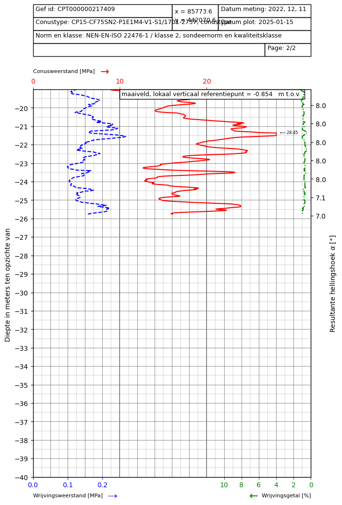

.. _tutorial5:

Conditional Random Field
------------------------
This tutorial shows a step by step guide on how to set up a 3D geometry where the soil layers are obtained
from Conditional Random Fields based on CPT data.

First the necessary packages are imported and paths are defined.

.. code-block:: python

    import os
    from stem.model import Model
    from stem.soil_material import OnePhaseSoil, LinearElasticSoil, SoilMaterial, SaturatedBelowPhreaticLevelLaw
    from stem.load import PointLoad
    from stem.boundary import DisplacementConstraint
    from stem.solver import AnalysisType, SolutionType, TimeIntegration, DisplacementConvergenceCriteria,\
         LinearNewtonRaphsonStrategy, NewmarkScheme, Amgcl, StressInitialisationType, SolverSettings, Problem
    from stem.output import NodalOutput, VtkOutputParameters, Output, GaussPointOutput
    from stem.stem import Stem
    from stem.additional_processes import ParameterFieldParameters
    from random_fields.geostatistical_cpt_interpretation import ElasticityFieldsFromCpt, RandomFieldProperties

    # END CODE BLOCK

The conditional Random Fields need to be assigned to a single soil layer.
It is possible to create additional soil layers with different properties, but the conditional random fields
are only assigned to a single soil layer.

In this example we create a single soil layer with a Young modulus and solid density of 0.
These will be later assigned by the ramdom field.

.. code-block:: python

    ndim = 3
    model = Model(ndim)

    solid_density_1 = 0
    porosity_1 = 0.3
    young_modulus_1 = 0.
    poisson_ratio_1 = 0.2
    soil_formulation_1 = OnePhaseSoil(ndim, IS_DRAINED=True, DENSITY_SOLID=solid_density_1, POROSITY=porosity_1)
    constitutive_law_1 = LinearElasticSoil(YOUNG_MODULUS=young_modulus_1, POISSON_RATIO=poisson_ratio_1)
    retention_parameters_1 = SaturatedBelowPhreaticLevelLaw()
    material_soil_1 = SoilMaterial("soil_1", soil_formulation_1, constitutive_law_1, retention_parameters_1)
    soil1_coordinates = [( 0.0, -25.0, -25.0),
                         ( 20.0, -25.0, -25.0),
                         ( 20.0,  -1.0, -25.0),
                         ( 1.0,  -1.0, -25.0),
                         ( 0.0,  -1.0, -25.0)]

    model.extrusion_length = 50.

    model.set_mesh_size(element_size=1.)

    model.add_soil_layer_by_coordinates(soil1_coordinates, material_soil_1, "soil_layer_1")

    # END CODE BLOCK

Now we define the loading and boundary conditions. The load consists of a point load.

.. code-block:: python

    load_coordinates = [(1., -1.0, 25)]
    point_load = PointLoad(active=[False, True, False], value=[0, -10000, 0])
    model.add_load_by_coordinates(load_coordinates, point_load, "line_load")
    model.set_element_size_of_group(0.5,'point_load')
    model.show_geometry(show_surface_ids=True)

    no_displacement_parameters = DisplacementConstraint(active=[True, True, True],
                                                        is_fixed=[True, True, True], value=[0, 0, 0])
    roller_displacement_parameters = DisplacementConstraint(active=[True, True, True],
                                                            is_fixed=[True, False, True], value=[0, 0, 0])

    model.add_boundary_condition_by_geometry_ids(2, [2], no_displacement_parameters, "base_fixed")
    model.add_boundary_condition_by_geometry_ids(2, [1, 7], roller_displacement_parameters, "sides_roller")

The CPTs used for the analysis can be found `here <https://github.com/StemVibrations/STEM/tests/CPTs>`_.
The CPT profiles are shown below:

.. image:: _static/CPT000000217406.png
    :scale: 15%

The location of the CPTs is shown in the figure below:

The figure shows that all the CPTs are located along the railway track.

The random field generator is set up as follows: using only `y` and `z` coordinates for the calibration,
because the CPTs are all on one line along the track (z-axis).
The length scale for the z-axis will be used for the x-axis as well.
The orientation of the x-axis is set to 75 degrees, to match the CPTs with the orientation of the z-axis.

.. code-block:: python
    cpt_folder = r'./tests/test_data/CPTs'
    orientation_x_axis = 75

    elastic_field_generator_cpt = ElasticityFieldsFromCpt(
        cpt_file_folder=cpt_folder,
        based_on_midpoint=True,
        max_conditioning_points=1000,
        orientation_x_axis=orientation_x_axis,
        poisson_ratio=material_soil_1.constitutive_law.POISSON_RATIO,
        porosity=material_soil_1.POROSITY,
        water_density=material_soil_1.fluid_properties.DENSITY_FLUID,
        return_property=[RandomFieldProperties.YOUNG_MODULUS,
        RandomFieldProperties.DENSITY_SOLID],
    )

    calibration y and z richting
    vertical richting
    elastic_field_generator_cpt.calibrate_geostat_model(calibration_indices=[True, True, False], v_dim=1)

    CPT index vertical = 2

    field_parameters_json = ParameterFieldParameters(
                property_name=["YOUNG_MODULUS", "DENSITY_SOLID"],
                function_type="json_file",
                field_generator=elastic_field_generator_cpt)

    # END CODE BLOCK

Now we define the problem type and solver strategy and settings.

The analysis type is set to "MECHANICAL" and the solution type is set to "DYNAMIC".
Then the start time is set to 0.0 second and the end time is set to 1.0 seconds.
The time step size is set to 0.1 seconds.
The reduction factor and increase factor are set to 1.0, such that the time step size is constant throughout the
simulation. Displacement convergence criteria is set to 1.0e-4 for the relative tolerance and 1.0e-12 for the
absolute tolerance.
The Linear Newton-Raphson is used as a solving strategy. And the Newmark method is used for the time integration.
Amgcl is used as a linear solver. Stresses are not initialised since the "stress_initialisation_type" is set to "NONE".
Since the problem is linear elastic, the stiffness matrix is constant and the mass and
damping matrices are constant, defining the matrices as constant will speed up the computation. Rayleigh damping is
assumed, with a damping coefficient of 0.012 for the stiffness matrix and 0.0001 for the mass matrix.

.. code-block:: python
    end_time = 1.
    delta_time = 0.1
    analysis_type = AnalysisType.MECHANICAL
    solution_type = SolutionType.DYNAMIC

    # Set up start and end time of calculation, time step and etc
    time_integration = TimeIntegration(start_time=0.0, end_time=1., delta_time=0.25, reduction_factor=1.0,
                                       increase_factor=1.0)
    convergence_criterion = DisplacementConvergenceCriteria(displacement_relative_tolerance=1.0e-4,
                                                            displacement_absolute_tolerance=1.0e-12)
    strategy_type = LinearNewtonRaphsonStrategy()
    scheme_type = NewmarkScheme()
    linear_solver_settings = Amgcl()
    stress_initialisation_type = StressInitialisationType.NONE
    solver_settings = SolverSettings(analysis_type=analysis_type, solution_type=solution_type,
                                     stress_initialisation_type=stress_initialisation_type,
                                     time_integration=time_integration,
                                     is_stiffness_matrix_constant=True,
                                     are_mass_and_damping_constant=True,
                                     convergence_criteria=convergence_criterion,
                                     strategy_type=strategy_type,
                                     scheme=scheme_type,
                                     linear_solver_settings=linear_solver_settings,
                                     rayleigh_k=0.012,
                                     rayleigh_m=0.0001)

    # END CODE BLOCK

Now the problem data should be set up. The problem should be given a name, in this case it is
"calculate_load_on_spatially_variable_embankment_3d". Then the solver settings are added to the problem.

.. code-block:: python

    problem = Problem(problem_name="calculate_load_on_spatially_variable_embankment_3d", number_of_threads=1,
                      settings=solver_settings)

    model.project_parameters = problem

    # END CODE BLOCK

Now we define the output for the calculation. In this case, displacement are given on the nodes and written to
the output files. Note that to visualise the random fields, here the Young modulus and solid density are
set as a variable to include in the output. This is done at the Gauss points.

.. code-block:: python
    nodal_results = [NodalOutput.DISPLACEMENT]
    gauss_point_results = [GaussPointOutput.YOUNG_MODULUS, GaussPointOutput.DENSITY_SOLID]

    model.add_output_settings(
        part_name="porous_computational_model_part",
        output_dir=results_dir,
        output_name="vtk_output",
        output_parameters=VtkOutputParameters(
            file_format="ascii",
            output_interval=1,
            nodal_results=nodal_results,
            gauss_point_results=gauss_point_results,
            output_control_type="step"
        )
    )

    # END CODE BLOCK

Now that the model is set up, the calculation is almost ready to be run.
Firstly the Stem class is initialised, with the model and the directory where the input files will be written to.
While initialising the Stem class, the mesh will be generated.

.. code-block:: python
    stem = Stem(model, input_files_dir)
    stem.write_all_input_files()
    stem.run_calculation()

Visualisation in Paraview provides the following view of Young modulus values at 3 of the 5 CPTs and a block of soil in
which the conditioned random field represents a field of Young modulus values in the domain: